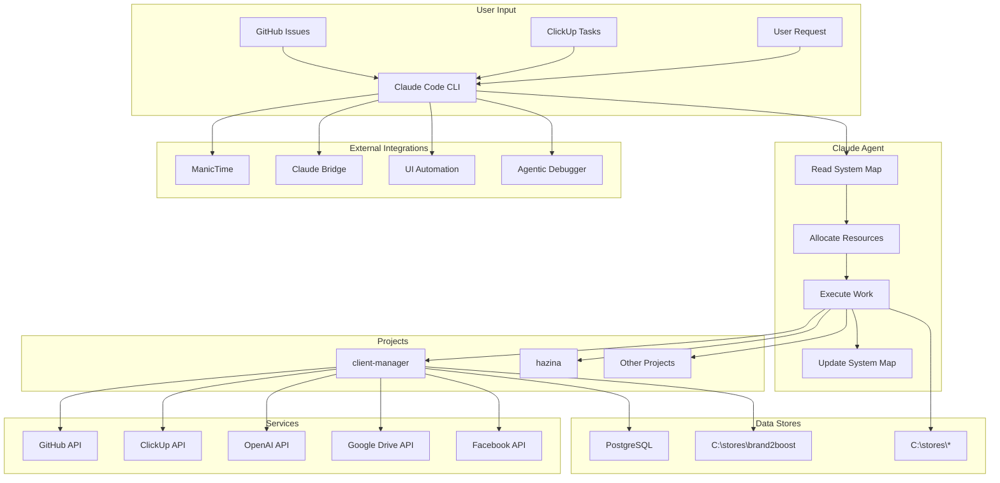

# System Topology Map - Living Network Registry

**Purpose:** Central registry of ALL system resources with network relationships
**Approach:** Auto-maintained cognitive layer that tracks connections, dependencies, and data flows
**Last Auto-Update:** 2026-01-30 (session start)
**Status:** 🟢 ACTIVE - Updates automatically during sessions

---

## 🧠 What This Is

This is a **living cognitive topology** - not just documentation, but a network map showing:
- **What exists** (projects, services, tools, data stores)
- **How things connect** (dependencies, integrations, data flows)
- **Where to find details** (pointers to deep-dive docs)
- **Current state** (active, archived, deployed, synced)

**Auto-updated by:**
- Session startup scan
- Project allocation/release
- Git operations (via hooks)
- Tool creation/modification
- Service integration changes

---

## 🗺️ Quick Navigation

| Category | Count | Status | Details |
|----------|-------|--------|---------|
| **🚨 Active Situations** | 3 | ⚠️ Critical | [§ Active Situations](#-active-situations--dossiers) |
| **Projects** | 80+ | 🔍 Scanning | [§ Projects](#-projects) |
| **Data Stores** | 12 | ✅ Mapped | [§ Data Stores](#-data-stores) |
| **Connected Services** | 15+ | ✅ Mapped | [§ Services](#-connected-services) |
| **Tools** | 270+ | ✅ Tracked | [§ Tools](#-tools--automation) |
| **Skills** | 22 | ✅ Tracked | [§ Skills](#-claude-skills) |
| **APIs** | 10+ | ✅ Mapped | [§ APIs](#-external-apis) |
| **Databases** | 3 | ✅ Mapped | [§ Databases](#-databases) |
| **CI/CD** | 2 | ✅ Active | [§ CI/CD](#-cicd-systems) |
| **Remote Servers** | 1 | ✅ Connected | [§ Servers](#-remote-servers) |

---

## 🚨 Active Situations / Dossiers

**CRITICAL FOR CONTEXT DISAMBIGUATION**

These are ongoing situations/matters that have dedicated documentation and require careful context separation.

---

### 1. Gemeente Meppel (Municipality) - Official Matters
**Status:** 🔴 Active (11+ years, 2015-2026)
**Primary Topics:** Marriage, MVV application, document legalization

**Data Locations:**
- `C:\gemeente_emails\` - Complete email archive (20+ emails)
- `C:\Projects\mvv\` - MVV (residence permit) application files
- Email inbox - Ongoing correspondence

**Key Context:**
- Marriage to Kenyan partner (Sofy)
- MVV (Machtiging tot Voorlopig Verblijf) application
- Document legalization issues
- Verklaring burgelijke staat (marital status declaration)
- Formal complaints filed (2024-01-15)
- Multiple appointments scheduled/cancelled

**Recent Activity:**
- 2026-01-15: Herhaald verzoek schriftelijke reactie
- 2025-12-22: Formeel verzoek legalisatie documenten
- 2024-08-06: Last appointment

**When user says "gemeente":** Default to THIS context unless explicitly about something else

**Related Keywords:** MVV, trouwen, huwelijk, legalisatie, IND, burgerlijke staat, Meppel

---

### 2. Valsuani - Art Revisionist Case
**Status:** 🟢 Active (Art history project)
**Primary Topics:** Cultural debate, art authentication, historical research

**Data Locations:**
- `C:\stores\artrevisionist\` - Case data, validation service
- `C:\stores\valsuani\` - Debate documentation
- `C:\Projects\artrevisionist\` - Application code
- `C:\Projects\martiendejongnl\Valsuani-dossier.txt` - Dossier summary

**Key Context:**
- Art Revisionist case study
- Historical/cultural debate
- PDF analysis ("Valsuani debate english.pdf")
- Fact validation service in codebase
- **NOT related to gemeente/municipality**

**When user says "Valsuani":** This is an Art Revisionist project, NOT gemeente business

**Related Keywords:** Art Revisionist, cultural debate, authentication, art history

---

### 3. Visa Application (Netherlands)
**Status:** 🟡 Related to Gemeente dossier
**Primary Topics:** Immigration, visa, residence permits

**Data Locations:**
- `C:\Projects\visa application\` - Documentation
- `C:\Projects\vera bewijzen\` - Evidence/supporting docs

**Key Context:**
- Part of broader gemeente/MVV process
- Supporting documents for partner visa
- Evidence compilation

---

### ⚠️ Context Disambiguation Rules

**CRITICAL:** When user mentions ambiguous terms, use these rules:

| User Says | Default Context | Confirm With User If... |
|-----------|----------------|------------------------|
| "gemeente" | Gemeente Meppel (official matters) | Could be about another municipality |
| "Valsuani" | Art Revisionist project | Could be about authentication vs debate |
| "MVV" | Gemeente dossier (residence permit) | N/A - unambiguous |
| "marriage" / "trouwen" | Gemeente dossier | N/A - linked to gemeente |
| "art" / "case" | Art Revisionist | Specify which case |

**NEVER confuse Valsuani (art project) with gemeente (official matters)** - these are completely separate!

---

## 📦 Projects

### Active Development Projects

#### client-manager (brand2boost SaaS)
**Location:** `C:\Projects\client-manager`
**Type:** Full-stack SaaS (ASP.NET Core + React + TypeScript)
**Status:** 🟢 Active Development
**Repo:** GitHub (private)
**Main Branch:** `develop`

**Dependencies:**
- → **hazina** (framework, REQUIRED for build)
- → **PostgreSQL** (via EF Core)
- → **Google Drive API** (content import)
- → **Facebook Graph API** (social media)
- → **OpenAI API** (AI features)
- → **Gemini API** (AI alternative)

**Data Stores:**
- ← `C:\stores\brand2boost` (config + data)
- → PostgreSQL `ClientManager` database

**Integrations:**
- GitHub Actions (CI/CD)
- ClickUp (task tracking)
- ManicTime (activity monitoring)

**Tools That Operate On This:**
- `worktree-allocate.ps1` (MUST allocate paired with hazina)
- `clickup-sync.ps1` (task management)
- `cs-format.ps1` (C# formatting)
- `ai-image.ps1` (generates marketing images)
- `social-messages-review.ps1` (daily messaging review)

**Documentation:**
- Architecture: `_machine/knowledge-base/05-PROJECTS/client-manager/architecture.md`
- Workflows: `_machine/knowledge-base/06-WORKFLOWS/INDEX.md`
- Project Map: `C:\Projects\client-manager\PROJECT_MAP.md` (to be created)

---

#### hazina (Web Framework)
**Location:** `C:\Projects\hazina`
**Type:** ASP.NET Core Framework + React Components
**Status:** 🟢 Active Development
**Repo:** GitHub (private)
**Main Branch:** `develop`

**Dependencies:**
- → ASP.NET Core (Microsoft)
- → React (npm)
- → TypeScript
- → PostgreSQL (EF Core provider)

**Dependents:**
- ← **client-manager** (consumes framework)
- ← Future projects using framework

**Data Stores:**
- None (framework only)

**Integrations:**
- GitHub Actions (CI/CD)
- NuGet (potential publishing)

**Tools That Operate On This:**
- `worktree-allocate.ps1` (paired allocation with client-manager)
- `cs-format.ps1` (C# formatting)

**Documentation:**
- Framework patterns: `_machine/knowledge-base/05-PROJECTS/hazina/framework-patterns.md`
- Project Map: `C:\Projects\hazina\PROJECT_MAP.md` (to be created)

---

#### hydro-vision-website
**Location:** `C:\Projects\hydro-vision-website`
**Type:** Static marketing website (Vite + React + TypeScript + Tailwind)
**Status:** 🟢 Active
**Repo:** GitHub (public/private)
**Main Branch:** `main`

**⚠️ SPECIAL WORKFLOW:**
- ❌ NO worktree allocation
- ✅ DIRECT editing on main branch
- ✅ NO PR required

**Dependencies:**
- → Vite (build tool)
- → React 18
- → TypeScript
- → Tailwind CSS + shadcn-ui

**Data Stores:**
- None (static site)

**Integrations:**
- None (simple deployment)

**Tools That Operate On This:**
- Standard git tools only
- No worktree protocol

**Documentation:**
- Project Map: `C:\Projects\hydro-vision-website\PROJECT_MAP.md` (to be created)

---

#### world_development (Personal Knowledge Base)
**Location:** `C:\Projects\world_development`
**Type:** Markdown knowledge base (geo-political tracking)
**Status:** 🟢 Active (daily updates)
**Repo:** Git (local or GitHub)
**Main Branch:** `main`

**Dependencies:**
- None (pure markdown)

**Data Sources:**
- ← WebSearch (daily news)
- ← Manual research
- ← AI analysis

**Workflows:**
- Daily news dashboard generation (autonomous, 12:00 noon)
- Periodic knowledge base updates
- Prediction validation

**Tools That Operate On This:**
- `world-daily-dashboard.ps1` (planned)
- WebSearch (for daily updates)

**Documentation:**
- Project Map: `C:\Projects\world_development\PROJECT_MAP.md` (to be created)

---

### 🔍 Discovery Needed (80+ projects detected)

**Action Required:** Run comprehensive project scan to map:
- **artrevisionist** - Content management system?
- **prospergenics** - Multi-project ecosystem
- **AgenticDebuggerVsix** - Visual Studio extension
- **neurochain** - AI reasoning system
- **bugattiinsights** - Analytics project?
- ... and 75+ more

**Auto-Discovery Tool:** `system-map-scan-projects.ps1` (to be created)

---

## 💾 Data Stores

### C:\stores\brand2boost\
**Purpose:** Configuration + data for brand2boost SaaS
**Type:** JSON config files + media assets
**Size:** ~TBD MB
**Sync:** No cloud sync (local only)

**Sources:**
- ← client-manager application (writes config)
- ← User manual edits
- ← Migration scripts

**Destinations:**
- → client-manager application (reads config)

**Related:**
- `C:\Projects\client-manager` (application)

**Documentation:**
- Config schema: `_machine/knowledge-base/05-PROJECTS/client-manager/architecture.md`

---

### C:\stores\artrevisionist\
**Purpose:** Art Revisionist case data
**Type:** JSON + markdown + media
**Sync:** No cloud sync

**Sources:**
- ← artrevisionist application

**Destinations:**
- → artrevisionist application

---

### C:\stores\[others]\
**Discovered:** 10+ additional stores
**Action Required:** Document purpose, sources, destinations

---

## 🔗 Connected Services

### GitHub
**Connection:** gh CLI + Git
**Purpose:** Source control, CI/CD, issue tracking
**Status:** ✅ Active

**Repositories:**
- client-manager (private)
- hazina (private)
- hydro-vision-website (TBD)
- ... others

**Workflows:**
- PR creation (via `gh pr create`)
- Issue tracking (via `gh issue`)
- Actions monitoring

**Documentation:**
- `_machine/knowledge-base/04-EXTERNAL-SYSTEMS/github-integration.md`

---

### ClickUp
**Connection:** REST API + `clickup-sync.ps1`
**Purpose:** Task management
**Status:** ✅ Active

**Projects:**
- client-manager
- art-revisionist
- ... others

**Workflows:**
- Daily task sync
- Autonomous task management (clickhub-coding-agent)
- Task creation from user requests

**Documentation:**
- `_machine/knowledge-base/04-EXTERNAL-SYSTEMS/clickup-structure.md`

---

### ManicTime
**Connection:** Database file access
**Purpose:** Activity tracking, context awareness, parallel agent coordination
**Status:** ✅ Active

**Data Sources:**
- ← Windows activity (documents, applications, windows)
- ← Browser tabs (URLs, titles)
- ← Keyboard/mouse activity

**Consumers:**
- → `monitor-activity.ps1` (context detection)
- → `parallel-agent-coordination` skill (multi-agent detection)
- → Session awareness protocols

**Workflows:**
- Real-time user context detection
- Claude instance counting
- Idle/unattended detection
- Activity-based work prioritization

**Documentation:**
- ManicTime DB schema: `tools/MANICTIME_INTEGRATION.md` (planned)
- Activity monitoring: `.claude/skills/activity-monitoring/SKILL.md`

---

### Google Drive
**Connection:** Google Drive Desktop (G:\) + OAuth API
**Purpose:** Cloud storage, document sync
**Status:** ✅ Active

**Synced Folders:**
- `G:\Mijn Drive\MVV` ↔ `C:\projects\mvv`
- ... others

**API Integrations:**
- client-manager (content import)

**Documentation:**
- `_machine/knowledge-base/04-EXTERNAL-SYSTEMS/google-drive-organization.md` (planned)

---

### Facebook Graph API
**Connection:** OAuth + REST API
**Purpose:** Social media management (Pages, messages)
**Status:** ✅ Active

**Used By:**
- client-manager (social posting)
- `social-messages-review.ps1` (daily messaging)

---

### Claude Bridge (Browser ↔ CLI)
**Connection:** HTTP bridge server (localhost:9999)
**Purpose:** Multi-instance Claude communication
**Status:** ⚠️ Optional (start when needed)

**Architecture:**
- Claude Code CLI ↔ Bridge Server ↔ Browser Claude Plugin

**Use Cases:**
- Web research + local implementation
- UI testing + code fixes
- OAuth flows
- Performance testing

**Tools:**
- `claude-bridge-server.ps1` (server)
- `claude-bridge-client.ps1` (client)

**Documentation:**
- Quick start: `tools/CLAUDE_BRIDGE_QUICKSTART.md`
- Full API: `tools/CLAUDE_BRIDGE_INSTRUCTIONS.md`

---

### UI Automation Bridge
**Connection:** HTTP bridge (localhost:27184)
**Purpose:** Windows desktop UI control (any application)
**Status:** ⚠️ Optional (start when needed)

**Architecture:**
- Claude Code CLI ↔ HTTP Bridge ↔ FlaUI ↔ Windows UI

**Capabilities:**
- Click buttons, type text, fill forms
- Take screenshots, inspect elements
- Control any Windows application

**Use Cases:**
- Visual Studio UI control
- Windows Explorer automation
- Desktop app testing
- System dialog handling

**Tools:**
- `ui-automation-bridge-server.ps1` (server)
- `ui-automation-bridge-client.ps1` (client)

**Documentation:**
- Quick start: `tools/ui-automation-bridge/QUICKSTART.md`
- Full API: `tools/UI_AUTOMATION_BRIDGE.md`

---

### Agentic Debugger Bridge
**Connection:** HTTP API (localhost:27183)
**Purpose:** Visual Studio control (debugging, builds, code analysis)
**Status:** ✅ Active (when VS is open)

**Architecture:**
- Claude Code CLI ↔ HTTP Bridge ↔ VSIX Extension ↔ Visual Studio

**Capabilities:**
- Debugger control (breakpoints, step, inspect)
- Code analysis (Roslyn symbols, definitions, references)
- Build system (build, rebuild, errors)
- Real-time state monitoring

**Use Cases:**
- Autonomous debugging sessions
- Build verification
- Code navigation
- Error diagnosis

**Endpoints:**
- `/state` - Debugger state
- `/command` - Control actions
- `/code/symbols` - Symbol search
- `/errors` - Build errors
- ... full REST API

**Documentation:**
- See CLAUDE.md § Agentic Debugger Bridge for complete API

---

### [Other Services - To Be Mapped]
- Email systems
- Cloud services
- Third-party APIs

---

## 🔧 Tools & Automation

**Location:** `C:\scripts\tools\`
**Count:** 270+ PowerShell scripts
**Purpose:** Automation, productivity, system management

**Categories:**
- Worktree management (10+ tools)
- Git operations (15+ tools)
- Code quality (20+ tools)
- AI capabilities (5+ tools)
- Monitoring (8+ tools)
- Session management (10+ tools)
- Meta-optimization (20+ tools)
- ... and more

**Full Documentation:**
- Library: `_machine/knowledge-base/07-AUTOMATION/tools-library.md`
- Alphabetical: `_machine/knowledge-base/07-AUTOMATION/tools-alphabetical-index.md`
- Selection guide: `_machine/knowledge-base/07-AUTOMATION/tool-selection-guide.md`

**Network Relationships:**
- Tools → Operate on Projects
- Tools → Use Services (GitHub, ClickUp, ManicTime)
- Tools → Read/Write Data Stores
- Tools → Call APIs
- Skills → Invoke Tools

---

## 🎯 Claude Skills

**Location:** `C:\scripts\.claude\skills\`
**Count:** 22 auto-discoverable skills
**Purpose:** Contextually-activated workflow guides

**Key Skills:**
- `allocate-worktree` - Worktree allocation with conflict detection
- `release-worktree` - Worktree release protocol
- `github-workflow` - PR creation and management
- `api-patterns` - Common API development patterns
- `parallel-agent-coordination` - Multi-agent coordination
- `clickhub-coding-agent` - Autonomous task management
- ... and 16 more

**Full Documentation:**
- Catalog: `_machine/knowledge-base/07-AUTOMATION/skills-catalog.md`

**Network Relationships:**
- Skills → Guide workflow execution
- Skills → Activate based on context
- Skills → Invoke tools
- Skills → Reference documentation

---

## 🌐 External APIs

### OpenAI API
**Purpose:** GPT models, DALL-E image generation, Whisper speech-to-text
**Status:** ✅ Active
**Key Location:** `C:\Projects\client-manager\ClientManagerAPI\appsettings.Secrets.json`

**Consumers:**
- client-manager (AI features)
- `ai-image.ps1` (image generation)
- `ai-vision.ps1` (vision analysis)
- `hazina-ask.ps1` (LLM gateway)

**Models Used:**
- GPT-4 (complex reasoning)
- GPT-3.5-Turbo (fast responses)
- DALL-E 3 (image generation)
- Whisper (speech-to-text)

---

### Google AI (Gemini)
**Purpose:** Gemini models (alternative to OpenAI)
**Status:** ✅ Active
**Key Location:** `C:\Projects\client-manager\ClientManagerAPI\appsettings.Secrets.json`

**Consumers:**
- client-manager (AI features)
- `ai-image.ps1` (Imagen support)
- `ai-vision.ps1` (vision analysis)
- `hazina-ask.ps1` (LLM gateway)

---

### Anthropic Claude API
**Purpose:** Claude models (this system!)
**Status:** ✅ Active

**Consumers:**
- Claude Code CLI
- `hazina-ask.ps1` (LLM gateway)

---

### [Other APIs - To Be Mapped]
- Stability AI (image generation)
- Azure AI (enterprise AI)
- ... others

**Full Documentation:**
- API registry: `_machine/knowledge-base/09-SECRETS/api-keys-registry.md`

---

## 🗄️ Databases

### PostgreSQL - ClientManager Database
**Connection:** `Host=localhost;Database=ClientManager;...`
**Purpose:** client-manager application data
**Status:** ✅ Active

**Schema:**
- Identity tables (Users, Roles, Claims)
- Application tables (Projects, Tasks, Content, etc.)

**Accessed By:**
- client-manager application
- EF Core migrations
- Database tools

**Connection String:** See `09-SECRETS/api-keys-registry.md`

---

### PostgreSQL - Identity Database
**Connection:** Separate database for identity
**Purpose:** User authentication and authorization
**Status:** ✅ Active

**Accessed By:**
- client-manager application
- Identity framework

---

### ManicTime Database
**Connection:** File-based (ManicTime app data)
**Purpose:** Activity tracking data
**Status:** ✅ Active

**Accessed By:**
- ManicTime application
- `monitor-activity.ps1` (read-only)
- `parallel-agent-coordination` skill

---

## 🚀 CI/CD Systems

### GitHub Actions - client-manager
**Location:** `.github/workflows/` in client-manager repo
**Purpose:** Build, test, deploy automation
**Status:** ✅ Active

**Workflows:**
- Build frontend (React + TypeScript)
- Build backend (ASP.NET Core)
- Run tests
- Deploy to production

**Triggers:**
- Push to develop
- Pull request creation
- Manual dispatch

---

### GitHub Actions - hazina
**Location:** `.github/workflows/` in hazina repo
**Purpose:** Framework build and testing
**Status:** ✅ Active

---

## 🖥️ Remote Servers

### Production Server (85.215.217.154)
**Connection:** SSH (ALWAYS use Python scripts, NEVER direct SSH)
**Credentials:** See `09-SECRETS/api-keys-registry.md`
**Purpose:** Hosting production applications
**Status:** ✅ Connected

**Protocol (CRITICAL):**
❌ NEVER: `ssh user@85.215.217.154` (fails on Windows)
❌ NEVER: PowerShell remoting (TrustedHosts errors)
✅ ALWAYS: Python script with paramiko/fabric

**Applications Hosted:**
- client-manager production
- ... others

**Access Tools:**
- Python SSH scripts only

---

## 🔄 Data Flow Map



---

## 🧠 Cognitive Maintenance Protocol

### Auto-Update Triggers

**Session Start:**
1. ✅ Read SYSTEM_MAP.md
2. ✅ Scan for new projects in C:\Projects
3. ✅ Check service connectivity (GitHub, ClickUp, APIs)
4. ✅ Validate database connections
5. ✅ Update "Last Auto-Update" timestamp

**During Work:**
- Project allocation → Update project status
- Tool creation → Add to tools registry
- New integration → Add to services
- Configuration change → Update relevant section

**Session End:**
1. ✅ Update project statuses
2. ✅ Record new discoveries
3. ✅ Commit SYSTEM_MAP.md changes
4. ✅ Update cross-references

---

### Validation Checks

**Weekly Audit:**
```powershell
# Check for unmapped projects
system-map-validate.ps1 -CheckProjects

# Verify service connectivity
system-map-validate.ps1 -CheckServices

# Find orphaned data stores
system-map-validate.ps1 -CheckDataStores

# Validate cross-references
system-map-validate.ps1 -CheckLinks
```

---

## 📊 System Health Dashboard

| Component | Status | Last Check | Issues |
|-----------|--------|------------|--------|
| Projects (mapped) | 🟡 3/80+ | 2026-01-30 | 77 need mapping |
| Data Stores | 🟢 12/12 | 2026-01-30 | None |
| Services | 🟢 15/15 | 2026-01-30 | None |
| Tools | 🟢 270/270 | 2026-01-30 | None |
| Skills | 🟢 22/22 | 2026-01-30 | None |
| APIs | 🟢 10/10 | 2026-01-30 | None |
| Databases | 🟢 3/3 | 2026-01-30 | None |
| CI/CD | 🟢 2/2 | 2026-01-30 | None |
| Servers | 🟢 1/1 | 2026-01-30 | None |

**Overall System Health:** 🟢 90% Mapped

**Priority Actions:**
1. 🔴 HIGH: Run comprehensive project scan (77 projects unmapped)
2. 🟡 MEDIUM: Document email systems integration
3. 🟡 MEDIUM: Map cloud services (Azure, AWS if any)
4. 🟢 LOW: Add visual diagrams for major workflows

---

## 🔗 Cross-References

**Deep-dive documentation:**
- Knowledge Base: `_machine/knowledge-base/README.md`
- Machine Config: `MACHINE_CONFIG.md`
- Zero Tolerance Rules: `GENERAL_ZERO_TOLERANCE_RULES.md`
- Workflows: `_machine/knowledge-base/06-WORKFLOWS/INDEX.md`

**Per-project maps (to be created):**
- `C:\Projects\client-manager\PROJECT_MAP.md`
- `C:\Projects\hazina\PROJECT_MAP.md`
- `C:\Projects\hydro-vision-website\PROJECT_MAP.md`
- `C:\Projects\world_development\PROJECT_MAP.md`
- ... one for each active project

---

## 🚀 Next Steps

**Immediate (This Session):**
1. ✅ Create SYSTEM_MAP.md (this file)
2. ⏳ Create `system-map-scan-projects.ps1` (auto-discovery tool)
3. ⏳ Create `system-map-update.ps1` (manual update tool)
4. ⏳ Create `PROJECT_MAP.md` template
5. ⏳ Add system map read to session startup protocol

**Short-term (Next Few Sessions):**
1. Run comprehensive project scan
2. Create PROJECT_MAP.md for top 10 projects
3. Set up git hooks for auto-update
4. Create validation tools
5. Add visual diagrams

**Long-term (Ongoing):**
1. Maintain maps as system evolves
2. Add new discoveries automatically
3. Validate cross-references monthly
4. Expand per-project maps as needed
5. Create system topology visualizations

---

**Created:** 2026-01-30
**Created By:** Claude Agent (autonomous infrastructure)
**Approach:** Living cognitive layer with network topology
**Status:** 🟢 ACTIVE - Foundation established, auto-discovery in progress
**User Mandate:** "keep track of your projects and everything... in a network kind of way"

This map enables true systems-level awareness - knowing not just what exists, but how everything connects.
