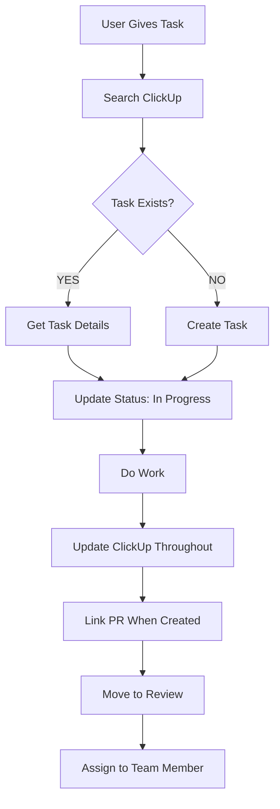
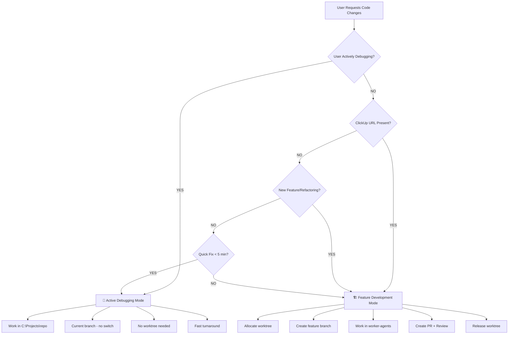
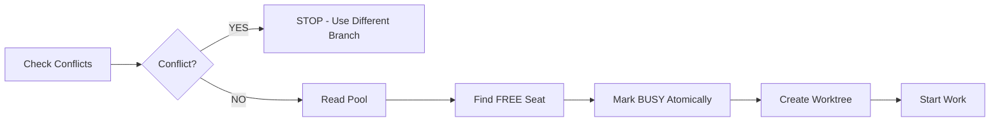
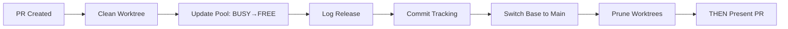
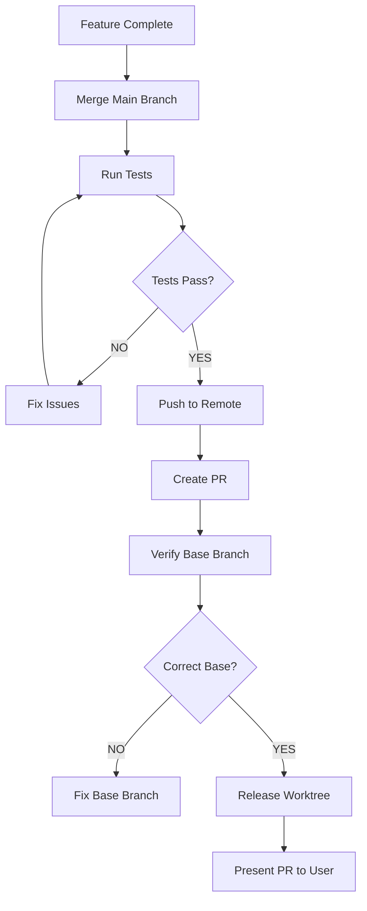
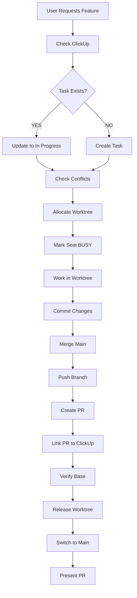
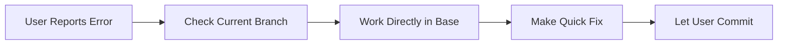
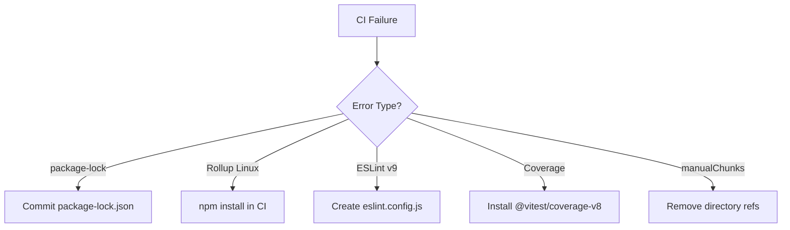
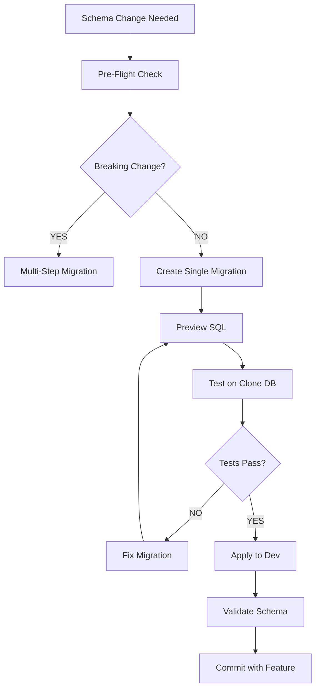
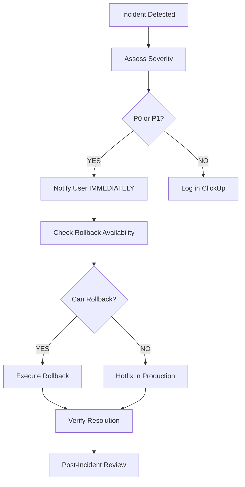

# Workflow Index - Complete Process Documentation

**Expert:** #44 - Workflow Documentation Specialist
**Created:** 2026-01-25
**Purpose:** Master index for all established workflows and procedures
**Tags:** #workflows #process #procedures #protocols

---

## 📖 Table of Contents

1. [Quick Reference Matrix](#quick-reference-matrix)
2. [ClickUp Task-First Workflow](#clickup-task-first-workflow) **← NEW (2026-01-30)**
3. [Core Development Workflows](#core-development-workflows)
4. [Worktree Protocol](#worktree-protocol)
5. [PR Creation & Management](#pr-creation--management)
6. [Feature Development Workflow](#feature-development-workflow)
7. [Active Debugging Workflow](#active-debugging-workflow)
8. [Multi-Agent Coordination](#multi-agent-coordination)
9. [CI/CD Workflows](#cicd-workflows)
10. [EF Core Migration Workflow](#ef-core-migration-workflow)
11. [Emergency Procedures](#emergency-procedures)
12. [Code Review Workflow](#code-review-workflow)
13. [Continuous Improvement Workflow](#continuous-improvement-workflow)

---

## 🎯 Quick Reference Matrix

| Task | Workflow | Decision Point | Key Document |
|------|----------|----------------|--------------|
| **New Feature** | Feature Development Mode | ClickUp task/new work | [GENERAL_DUAL_MODE_WORKFLOW.md](../../GENERAL_DUAL_MODE_WORKFLOW.md) |
| **Fix Build Error** | Active Debugging Mode | User debugging/errors | [GENERAL_DUAL_MODE_WORKFLOW.md](../../GENERAL_DUAL_MODE_WORKFLOW.md) |
| **Allocate Worktree** | Worktree Protocol | Before code edits | [GENERAL_WORKTREE_PROTOCOL.md](../../GENERAL_WORKTREE_PROTOCOL.md) |
| **Create PR** | PR Creation Process | After feature complete | [git-workflow.md](../../git-workflow.md) |
| **Database Change** | EF Migration Safety | Schema change needed | [ef-migration-safety skill](../../.claude/skills/ef-migration-safety/SKILL.md) |
| **Multiple Agents** | Parallel Coordination | AgentCount > 1 | [parallel-agent-coordination skill](../../.claude/skills/parallel-agent-coordination/SKILL.md) |
| **CI Failure** | CI/CD Troubleshooting | Build/test fails | [ci-cd-troubleshooting.md](../../ci-cd-troubleshooting.md) |
| **Production Issue** | Emergency Protocol | P0/P1 incident | [Emergency Procedures](#emergency-procedures) |
| **End of Session** | Continuous Improvement | Session complete | [continuous-improvement.md](../../continuous-improvement.md) |

---

## 📋 ClickUp Task-First Workflow

**Added:** 2026-01-30
**User Directive:** "check if the task is in click up... and then update the corresponding task and if not then you should create a task"
**Priority:** MANDATORY - Before ANY task
**Purpose:** ClickUp is the source of truth for all work tracking

### Core Principle

**EVERY task must be tracked in ClickUp BEFORE starting work.**

### Workflow



### Commands

**Search for task:**
```bash
clickup-sync.ps1 -Action list -ProjectId client-manager | grep "<keyword>"
```

**Get task details:**
```bash
clickup-sync.ps1 -Action show -TaskId <id>
```

**Create new task:**
```bash
clickup-sync.ps1 -Action create -Title "..." -Description "..." -ProjectId client-manager
```

**Update status:**
```bash
clickup-sync.ps1 -Action update -TaskId <id> -Status "in progress"
```

**Add comment/progress:**
```bash
clickup-sync.ps1 -Action comment -TaskId <id> -Comment "..."
```

### Why This Matters

| Without ClickUp Check | With ClickUp Check |
|----------------------|-------------------|
| ❌ Duplicate work across team | ✅ See if already completed |
| ❌ Lost work history | ✅ Full audit trail |
| ❌ No team visibility | ✅ Everyone sees progress |
| ❌ Chat-only tracking | ✅ Searchable in ClickUp |
| ❌ Context missing | ✅ Requirements documented |

### Integration Points

**ClickUp updates required:**
1. **Task start** → Status: "in progress" + assign to agent
2. **During work** → Comment with blockers/questions
3. **PR created** → Link PR URL in comment
4. **PR ready** → Status: "review" + assign to reviewer
5. **PR merged** → Status: "done"

### Examples

**Example 1: Fix authentication bug**
```bash
# 1. Search ClickUp
clickup-sync.ps1 -Action list -ProjectId client-manager | grep "auth"
# → Found task #869bu6m1n "Fix OAuth token refresh"

# 2. Get details
clickup-sync.ps1 -Action show -TaskId 869bu6m1n
# → Read requirements, acceptance criteria

# 3. Update status
clickup-sync.ps1 -Action update -TaskId 869bu6m1n -Status "in progress"

# 4. Do work...

# 5. Link PR
clickup-sync.ps1 -Action comment -TaskId 869bu6m1n -Comment "PR ready: https://github.com/..."

# 6. Move to review
clickup-sync.ps1 -Action update -TaskId 869bu6m1n -Status "review"
```

**Example 2: New feature request (not in ClickUp)**
```bash
# 1. Search ClickUp
clickup-sync.ps1 -Action list -ProjectId client-manager | grep "export PDF"
# → No results

# 2. Create task
clickup-sync.ps1 -Action create \
  -Title "Add PDF export to reports" \
  -Description "User requests ability to export reports as PDF" \
  -ProjectId client-manager

# 3. Continue with normal workflow...
```

### Tools

| Tool | Purpose | When to Use |
|------|---------|-------------|
| `clickup-sync.ps1 -Action list` | List all tasks | Session start, check queue |
| `clickup-sync.ps1 -Action show` | Get task details | Before starting work |
| `clickup-sync.ps1 -Action create` | Create new task | Task doesn't exist |
| `clickup-sync.ps1 -Action update` | Change status | Status transitions |
| `clickup-sync.ps1 -Action comment` | Add updates | Progress, blockers, PRs |

### Related Documentation

- **PERSONAL_INSIGHTS.md** § ClickUp Task-First Workflow (2026-01-30)
- **CLAUDE.md** § Before ANY Task - Check ClickUp First
- **clickhub-coding-agent skill** - Autonomous ClickUp task processing

---

## 🏗️ Core Development Workflows

### Decision Tree: Which Mode to Use?



### Mode Detection Tool

**ALWAYS run before starting work:**

```bash
powershell -File "C:/scripts/tools/detect-mode.ps1" -UserMessage "$userRequest" -Analyze
```

**Output:**
- Recommended mode (Feature Development or Active Debugging)
- Confidence score
- Detected signals
- Workflow to follow

---

## 🌲 Worktree Protocol

**Full Documentation:** [GENERAL_WORKTREE_PROTOCOL.md](../../GENERAL_WORKTREE_PROTOCOL.md)

### When to Use
- ✅ Feature Development Mode ONLY
- ❌ Never in Active Debugging Mode

### Pre-Flight Checklist

```
□ Am I in Feature Development Mode?
□ Have I read worktrees.pool.md?
□ Have I marked a seat BUSY?
□ Am I editing in worker-agents/agent-XXX? (NOT C:\Projects)
□ Do I know which worktree I'm using?

IF ANY ☐ = NO → STOP! ALLOCATE FIRST!
```

### Allocation Workflow



**Step-by-Step:**

1. **Conflict Detection (MANDATORY)**
   ```bash
   bash C:/scripts/tools/check-branch-conflicts.sh <repo> <branch-name>
   # Exit 0 = Safe to proceed
   # Exit 1 = CONFLICT DETECTED - STOP
   ```

2. **Read Pool Status**
   ```bash
   cat C:/scripts/_machine/worktrees.pool.md | grep "FREE"
   # Find available agent-XXX seat
   ```

3. **Atomic Allocation**
   ```bash
   # Update pool.md IMMEDIATELY (atomic lock):
   # - Status: FREE → BUSY
   # - Current repo: <repo-name>
   # - Branch: agent-XXX-<feature>
   # - Last activity: <timestamp>
   ```

4. **Create Worktree**
   ```bash
   cd C:/Projects/<repo>
   git worktree add C:/Projects/worker-agents/agent-XXX/<repo> -b agent-XXX-<feature>
   ```

5. **Verify Success**
   ```bash
   ls C:/Projects/worker-agents/agent-XXX/<repo>
   git -C C:/Projects/worker-agents/agent-XXX/<repo> branch --show-current
   # Should show: agent-XXX-<feature>
   ```

### Release Workflow

**CRITICAL: Release IMMEDIATELY after PR creation**



**Commands:**
```bash
# 1. Clean worktree
rm -rf C:/Projects/worker-agents/agent-XXX/*

# 2. Update pool
# Edit worktrees.pool.md: BUSY → FREE

# 3. Log release
echo "$(date) — release — agent-XXX — <repo> — <branch> — PR #<num>" >> C:/scripts/_machine/worktrees.activity.md

# 4. Commit tracking
cd C:/scripts
git add _machine/worktrees.pool.md _machine/worktrees.activity.md
git commit -m "docs: Release agent-XXX after PR #<num>"
git push origin main

# 5. Switch base repos
cd C:/Projects/<repo>
git checkout develop
git pull origin develop

# 6. Prune stale refs
git worktree prune

# 7. NOW present PR to user
echo "PR #<num> created: <url>"
```

### Common Mistakes

| ❌ Mistake | ✅ Fix |
|-----------|--------|
| Editing C:\Projects\<repo> directly | Work in worker-agents/agent-XXX/<repo> |
| Presenting PR before release | Release first, THEN tell user |
| Not merging main before PR | `git merge origin/develop` before push |
| Wrong PR base branch | Always `--base develop` |

---

## 📝 PR Creation & Management

**Full Documentation:** [git-workflow.md](../../git-workflow.md)

### Standard PR Workflow



### PR Creation Commands

```bash
# 1. Merge main branch FIRST (CRITICAL)
cd C:/Projects/worker-agents/agent-XXX/<repo>
git fetch origin
git merge origin/develop

# 2. Resolve any conflicts NOW (not in GitHub)

# 3. Push to remote
git push -u origin agent-XXX-<feature>

# 4. Create PR with EXPLICIT base
gh pr create \
  --base develop \
  --title "feat: <description>" \
  --body "$(cat <<'EOF'
## Summary
<1-3 bullet points>

## Test Plan
- [ ] Unit tests pass
- [ ] Manual testing complete
- [ ] No regressions

🤖 Generated with Claude Code
EOF
)"

# 5. IMMEDIATELY verify base branch
gh pr view <number> --json baseRefName
# Output MUST show: "baseRefName": "develop"
```

### Cross-Repo Dependencies

**When client-manager depends on Hazina PR:**

```markdown
## ⚠️ DEPENDENCY ALERT ⚠️

**This PR depends on the following Hazina PR(s):**
- [ ] https://github.com/martiendejong/Hazina/pull/XXX - [Description]

**Merge order:**
1. First merge the Hazina PR(s) above
2. Then merge this PR
```

**Tracking:** Update `C:\scripts\_machine\pr-dependencies.md`

```markdown
| Downstream PR | Depends On (Hazina) | Status |
|---------------|---------------------|--------|
| client-manager#45 | Hazina#2, Hazina#8 | ⏳ Waiting |
```

### PR Base Branch Rules

| Source Branch | Target Branch |
|---------------|---------------|
| feature/* | develop |
| agent-*-* | develop |
| fix/* | develop |
| develop | main |

**NEVER:** feature → main directly

### Branch Cleanup (MANDATORY)

```bash
# After PR merged - ALWAYS delete branch
gh pr merge <number> --squash --delete-branch

# Or manually:
git push origin --delete <branch-name>

# Update local repo
cd C:/Projects/<repo>
git fetch --prune
git checkout develop
git pull origin develop
```

---

## 🏗️ Feature Development Workflow

**Full Documentation:** [GENERAL_DUAL_MODE_WORKFLOW.md](../../GENERAL_DUAL_MODE_WORKFLOW.md) § Feature Development Mode

### When to Use

✅ **Use Feature Development Mode when:**
- New feature request
- Refactoring or architectural changes
- Work will result in a PR
- ClickUp task URL present
- Multiple commits expected
- NOT actively debugging

### Complete Workflow



### Step-by-Step Guide

**0. ClickUp Integration (MANDATORY - 2026-01-30)**
```bash
# Search for existing task
clickup-sync.ps1 -Action list -ProjectId client-manager | grep "<keyword>"

# If exists → update status
clickup-sync.ps1 -Action update -TaskId <id> -Status "in progress"

# If doesn't exist → create task
clickup-sync.ps1 -Action create -Title "..." -Description "..." -ProjectId client-manager
```

**Why:** ClickUp is the source of truth. Must check before starting work to avoid duplicates.

**1. Conflict Detection**
```bash
bash C:/scripts/tools/check-branch-conflicts.sh client-manager feature/new-export
```

**2. Allocate Worktree**
```bash
# See "Worktree Protocol" section above
```

**3. Develop Feature**
```bash
cd C:/Projects/worker-agents/agent-001/client-manager

# Make changes
# Write tests
# Run tests locally
dotnet test

# Commit incrementally
git add <files>
git commit -m "feat: Add export service"
```

**4. Pre-PR Validation (CRITICAL for EF Core)**
```bash
# Check for pending migrations
dotnet ef migrations has-pending-model-changes --context IdentityDbContext

# Exit code 0 = No pending changes ✅
# Exit code 1 = STOP! Create migration first ❌

# If pending changes:
dotnet ef migrations add <Name> --context IdentityDbContext
dotnet ef database update
git add Migrations/*
git commit -m "feat: Add migration for <Name>"
```

**5. Merge Main Branch**
```bash
git fetch origin
git merge origin/develop

# Resolve conflicts if any
# Re-run tests
dotnet test
```

**6. Create PR**
```bash
git push -u origin agent-001-new-export

gh pr create --base develop \
  --title "feat: Add new export functionality" \
  --body "..."
```

**7. Release Worktree**
```bash
# See "Worktree Protocol § Release" above
```

**8. Success Criteria**
- ✅ All changes in worktree (ZERO in C:\Projects\<repo>)
- ✅ Main branch merged before PR
- ✅ PR created with correct base
- ✅ Worktree released immediately
- ✅ Base repos back on develop
- ✅ Pool status accurate (FREE)

---

## 🐛 Active Debugging Workflow

**Full Documentation:** [GENERAL_DUAL_MODE_WORKFLOW.md](../../GENERAL_DUAL_MODE_WORKFLOW.md) § Active Debugging Mode

### When to Use

✅ **Use Active Debugging Mode when:**
- User pastes build errors
- User mentions "I'm debugging..."
- User shares code from current work
- Quick fixes needed
- User has IDE open and running
- Immediate help needed

### Workflow



### Key Rules

**DO:**
- ✅ Work in `C:\Projects\<repo>` directly
- ✅ Stay on user's current branch
- ✅ Make targeted fixes only
- ✅ Let user handle git operations
- ✅ Preserve user's workflow state

**DON'T:**
- ❌ Allocate worktree
- ❌ Create new branch
- ❌ Switch branches
- ❌ Create PR automatically
- ❌ Run cleanup operations

### Example Scenarios

**Scenario 1: Build Error**
```
User: "I'm getting this error:
Error CS0246: The type JsonSerializer could not be found"

Claude Action:
→ Mode: Active Debugging
→ Location: C:\Projects\client-manager
→ Branch: feature/user-profile (user's current)
→ Fix: Add missing using statement
→ Output: "Added using System.Text.Json to ProfileService.cs:5"
→ NO worktree, NO branch switch, NO PR
```

**Scenario 2: Merge Conflict Help**
```
User: "I have merge conflicts in Program.cs, can you help?"

Claude Action:
→ Mode: Active Debugging
→ Location: C:\Projects\client-manager
→ Branch: feature/auth-refactor (user's current)
→ Fix: Resolve conflict markers using --theirs + re-insert user's code
→ Output: "Resolved conflicts, ready for commit"
→ NO worktree, user commits when ready
```

### Mode Switching

**From Feature → Debug:**
```
User: "Actually, I want to test this locally first"

Claude: "Switching to Active Debugging Mode. I'll work directly in
C:\Projects\<repo> on your current branch so you can test immediately."
```

**From Debug → Feature:**
```
User: "This is working now. Let's create a PR."

Claude: "Switching to Feature Development Mode. I'll allocate a worktree
and prepare a PR with your changes."
```

---

## 🔀 Multi-Agent Coordination

**Full Documentation:** [parallel-agent-coordination skill](../../.claude/skills/parallel-agent-coordination/SKILL.md)

### When to Use

- ✅ Multiple Claude instances detected (`monitor-activity.ps1 -Mode context` shows agentCount > 1)
- ✅ Before ANY worktree allocation
- ✅ When coordination failures detected

### Architecture Overview

```
ManicTime (activity tracking)
    ↓
monitor-activity.ps1 (every 15s)
    ↓
Coordination Database (SQLite + WAL)
    ↓
Event Dispatcher (FileSystemWatcher)
    ↓
Claude Agents (allocation logic)
    ↓
Watchdog (validation, metrics)
```

### Coordination Protocol

**1. Agent Registration (Startup)**
```powershell
# Check for existing instance
$context = monitor-activity.ps1 -Mode context -OutputFormat object

# Register in coordination DB
Register-Agent -AgentId $AgentId -Pid $PID -Priority 100

# Clean orphaned allocations
Release-OrphanedAllocations -AgentId $AgentId

# Start heartbeat (every 10s)
Start-HeartbeatSender -AgentId $AgentId
```

**2. Worktree Allocation (Conflict-Free)**
```powershell
# Get activity context
$context = monitor-activity.ps1 -Mode context
$activeAgents = $context.ClaudeInstances.Count

# Check conflicts
$conflict = Test-BranchConflict -BranchName $branchName
if ($conflict.HasConflict) {
    Write-Warning "🚨 CONFLICT: Another agent is using branch $branchName"
    return $null
}

# Choose strategy based on contention
if ($activeAgents -lt 3) {
    # Optimistic CAS allocation (fast path)
    Try-OptimisticAllocation
} else {
    # Pessimistic lock-based allocation (slow path)
    Try-PessimisticAllocation
}

# Update legacy files (backward compatibility)
Update-InstancesMap
Update-WorktreePool
```

**3. Heartbeat (During Work)**
```powershell
# Every 10-60 seconds
Send-Heartbeat -AgentId $AgentId -Status "active" -Allocations $allocations
```

**4. Release (After PR)**
```powershell
Release-Worktree -WorktreeId $id -AgentId $AgentId
Unregister-Agent -AgentId $AgentId
Stop-HeartbeatSender
```

### Decision Trees

**Allocation Strategy:**
```
AgentCount < 3?
  └─ YES → Optimistic CAS (fast, low overhead)
  └─ NO  → Pessimistic lock (safe, high contention)
```

**Conflict Resolution:**
```
Conflict detected?
  └─ YES → Check timestamps
      └─ Other agent active < 30 min? → STOP, use different branch
      └─ Other agent stale > 2 hours? → WARN user, await decision
  └─ NO → Proceed with allocation
```

### Metrics & Validation

**Success Metrics:**
- Allocation success rate ≥ 95%
- Allocation latency (p99) < 10 seconds
- Conflict rate < 1%
- Zero coordination violations

**Validation (Every 5 minutes):**
```powershell
Invoke-CoordinationValidation
# Checks:
# - Pool.md consistent with DB
# - No duplicate allocations
# - All heartbeats fresh
# - Git reality matches state
```

---

## 🔧 CI/CD Workflows

**Full Documentation:** [ci-cd-troubleshooting.md](../../ci-cd-troubleshooting.md)

### Frontend CI Troubleshooting



**Quick Fixes:**

1. **package-lock.json Issues**
```bash
echo "!ClientManagerFrontend/package-lock.json" >> .gitignore
npm install
git add ClientManagerFrontend/package-lock.json
```

2. **Cross-Platform Rollup**
```yaml
# In .github/workflows/ci.yml
- name: Install dependencies
  run: |
    rm -rf node_modules package-lock.json
    npm install
```

3. **ESLint v9 Flat Config**
```javascript
// eslint.config.js
import js from '@eslint/js';
import globals from 'globals';
export default [
  js.configs.recommended,
  { languageOptions: { globals: { ...globals.browser } } },
];
```

### Backend CI Troubleshooting

**Common Error Patterns:**

| Error Type | Root Cause | Solution |
|-----------|-----------|----------|
| MSB3030 (File not found) | Gitignored config required | Conditional Include with template |
| NETSDK1100 (Windows targeting) | WPF on Linux | Add EnableWindowsTargeting |
| NU1605 (Package downgrade) | Transitive dependency conflict | Upgrade to highest version |

**MSB3030 Fix:**
```xml
<!-- Use actual file if exists (local) -->
<ItemGroup Condition="Exists('appsettings.json')">
  <Content Include="appsettings.json">
    <CopyToOutputDirectory>Always</CopyToOutputDirectory>
  </Content>
</ItemGroup>

<!-- Fall back to template (CI) -->
<ItemGroup Condition="!Exists('appsettings.json')">
  <Content Include="appsettings.template.json">
    <CopyToOutputDirectory>Always</CopyToOutputDirectory>
    <TargetPath>appsettings.json</TargetPath>
  </Content>
</ItemGroup>
```

### Batch PR Build Fix

**Workflow:**
```
1. Identify affected PRs (gh pr list)
2. Get build errors (gh run view --log-failed)
3. Pattern recognition (same error across PRs?)
4. Apply fixes in worktrees
5. Commit + push
6. Verify CI passes
```

---

## 🗄️ EF Core Migration Workflow

**Full Documentation:** [ef-migration-safety skill](../../.claude/skills/ef-migration-safety/SKILL.md)

### CRITICAL Rules

1. ❌ **NEVER create migrations without pre-flight check**
2. ❌ **NEVER apply breaking changes in single migration**
3. ✅ **ALWAYS preview SQL before applying**
4. ✅ **ALWAYS generate rollback script for production**
5. ✅ **ALWAYS use explicit `.ToTable("TableName")` for ALL entities**
6. ✅ **ALWAYS create migration when adding DbSet/entity**

### Migration Is Part of the Feature (CRITICAL)

**❌ WRONG:**
```csharp
// Add DbSet to DbContext
public DbSet<ChatActiveAction> ChatActiveActions { get; set; }

// Commit code
git commit -m "feat: Add chat actions"

// Tell user: "Run migration later"  ← VIOLATION!
```

**✅ CORRECT:**
```bash
# 1. Ask user to stop VS (if needed)

# 2. Add DbSet and entity config

# 3. Create migration IMMEDIATELY
dotnet ef migrations add AddChatActiveActions --context IdentityDbContext

# 4. Apply migration
dotnet ef database update

# 5. Verify table exists

# 6. Commit ALL together
git add .
git commit -m "feat: Add chat actions with migration"
```

### Complete Workflow



### Phase-by-Phase Guide

**Phase 1: Pre-Flight Check**
```bash
powershell -File "C:/scripts/tools/ef-preflight-check.ps1" \
  -Context IdentityDbContext \
  -ProjectPath C:/Projects/client-manager/ClientManagerAPI

# Checks:
# - Connection string (dev vs prod)
# - Pending migrations
# - Schema drift
# - ModelSnapshot integrity
```

**Phase 2: Determine Strategy**
```
Is this breaking?
  Column rename? → YES (multi-step)
  Drop column? → YES (multi-step)
  Add NOT NULL? → YES (multi-step)
  Type change? → YES (multi-step)
  Add column? → NO (single step)
  Add index? → NO (single step)
```

**Phase 3: Create Migration**
```bash
# Clean build
dotnet clean && dotnet build

# Create migration
dotnet ef migrations add AddUserEmailColumn --context IdentityDbContext

# Good names:
#   ✅ AddUserEmailColumn
#   ✅ MakeProductPriceRequired
#   ✅ CreateOrdersTable
# Bad names:
#   ❌ Update
#   ❌ Migration1
#   ❌ Fix
```

**Phase 4: Preview & Validate**
```bash
powershell -File "C:/scripts/tools/ef-migration-preview.ps1" \
  -Migration AddUserEmailColumn \
  -Context IdentityDbContext \
  -GenerateRollback

# Review:
# - SQL statements (CREATE, ALTER, DROP)
# - Breaking change warnings
# - Rollback script
```

**Phase 5: Test on Clone**
```bash
# Restore production backup to local
# Update connection string to clone
dotnet ef database update --context IdentityDbContext

# Smoke tests:
# - App starts?
# - Can query affected tables?
# - FK relationships intact?

# Test rollback:
dotnet ef database update <PreviousMigration> --context IdentityDbContext
```

**Phase 6: Apply Migration**
```bash
# Development:
dotnet ef database update --context IdentityDbContext

# Production:
dotnet ef migrations script --idempotent \
  --output migration_AddUserEmailColumn.sql \
  --context IdentityDbContext
```

**Phase 7: Validation**
```bash
# Verify applied
dotnet ef migrations list --context IdentityDbContext

# Validate schema
powershell -File "C:/scripts/tools/ef-validate-schema.ps1" \
  -Context IdentityDbContext

# Smoke tests
dotnet test
```

### Multi-Step Breaking Change Example

**Scenario:** Rename `DailyLimit` → `MonthlyLimit`

**Migration 1: Add New Column**
```csharp
protected override void Up(MigrationBuilder migrationBuilder)
{
    migrationBuilder.AddColumn<decimal>("MonthlyLimit", "Accounts", nullable: true);

    // Backfill data
    migrationBuilder.Sql(@"
        UPDATE Accounts
        SET MonthlyLimit = DailyLimit * 30
        WHERE MonthlyLimit IS NULL
    ");
}
```

**Deploy Code (reads from BOTH):**
```csharp
public decimal GetLimit() => MonthlyLimit ?? (DailyLimit * 30);
```

**Wait 1 week, validate**

**Migration 2: Make Required**
```csharp
migrationBuilder.AlterColumn<decimal>("MonthlyLimit", "Accounts", nullable: false);
```

**Migration 3: Drop Old Column**
```csharp
migrationBuilder.DropColumn("DailyLimit", "Accounts");
```

---

## 🚨 Emergency Procedures

### Production P0 Incident Response

**Severity Levels:**
- **P0:** Total outage, data loss, security breach
- **P1:** Major feature broken, significant user impact
- **P2:** Minor feature degraded
- **P3:** Cosmetic issue, low impact

### P0/P1 Response Workflow



### Rollback Procedures

**Application Rollback:**
```bash
# Backend
cd C:/Projects/client-manager
git checkout v1.2.3  # Last stable tag
powershell -File publish-brand2boost-backend.ps1

# Frontend
git checkout v1.2.3
powershell -File publish-brand2boost-frontend.ps1
```

**Database Rollback:**
```bash
# ONLY use prepared rollback scripts
# NEVER use dotnet ef database update in production

# Apply rollback SQL
sqlcmd -S localhost -d production_db -i rollback_AddUserEmail.sql

# Verify
sqlcmd -S localhost -d production_db -Q "SELECT COUNT(*) FROM Users"
```

### Hotfix Workflow

**When rollback not possible:**

```bash
# 1. Create hotfix branch from main
cd C:/Projects/<repo>
git checkout main
git pull origin main
git checkout -b hotfix/fix-critical-bug

# 2. Make MINIMAL fix (only affected code)

# 3. Test locally

# 4. Create PR to main (not develop!)
gh pr create --base main --title "hotfix: Fix critical bug"

# 5. Get emergency approval

# 6. Merge and deploy IMMEDIATELY
gh pr merge <num> --squash
git pull origin main
# Deploy to production

# 7. Backport to develop
git checkout develop
git merge main
git push origin develop
```

### Communication Template

```
🚨 INCIDENT ALERT 🚨

Severity: P0/P1
Component: <backend/frontend/database>
Impact: <description>
Started: <timestamp>

Actions Taken:
1. <action 1>
2. <action 2>

Status: <investigating/fixing/resolved>
ETA: <estimate>

Updates will follow every 15 minutes.
```

### Post-Incident Review

**MANDATORY within 24 hours:**

1. Timeline reconstruction
2. Root cause analysis (5 Whys)
3. Impact assessment
4. Prevention measures
5. Documentation updates
6. Reflection.log.md entry

**Template:**
```markdown
## YYYY-MM-DD HH:MM - Incident: <Title> (P0/P1)

**Timeline:**
- HH:MM - Incident detected
- HH:MM - Rollback initiated
- HH:MM - Resolution confirmed

**Root Cause:** <technical explanation>

**Impact:** <users affected, duration, data loss?>

**Prevention:**
- [ ] Add monitoring for <metric>
- [ ] Create pre-deployment check for <condition>
- [ ] Update documentation in <file>

**Learnings:**
- <lesson 1>
- <lesson 2>
```

---

## 👀 Code Review Workflow

### Self-Review Checklist (Before Creating PR)

**Code Quality:**
- [ ] No hardcoded credentials or secrets
- [ ] Error handling implemented
- [ ] Logging added where appropriate
- [ ] No magic numbers (use constants)
- [ ] No commented-out code
- [ ] No debugging console.log/Console.WriteLine
- [ ] Code formatted (cs-format.ps1 or ESLint)
- [ ] No compiler warnings

**Testing:**
- [ ] Unit tests written
- [ ] Unit tests passing
- [ ] Edge cases covered
- [ ] Manual testing completed
- [ ] No regressions detected

**Documentation:**
- [ ] Code comments for complex logic
- [ ] XML documentation for public APIs (C#)
- [ ] JSDoc for exported functions (TypeScript)
- [ ] README updated (if user-facing)

**Architecture:**
- [ ] Follows existing patterns
- [ ] No architectural violations
- [ ] Dependencies appropriate
- [ ] Single Responsibility Principle followed

**Database:**
- [ ] Migration created (if schema change)
- [ ] Migration tested
- [ ] Rollback script prepared
- [ ] No data loss risk

### Peer Review Process

**For Reviewers:**

1. **Understand Context**
   - Read PR description
   - Check linked ClickUp task
   - Understand the "why" not just the "what"

2. **Review Layers**
   - Architecture: Does it fit the system?
   - Logic: Is the code correct?
   - Security: Any vulnerabilities?
   - Performance: Any bottlenecks?
   - Maintainability: Can others understand it?

3. **Provide Feedback**
   - Blocking comments: "Must fix before merge"
   - Non-blocking suggestions: "Consider..."
   - Praise: "Nice pattern here!"
   - Questions: "Why did you choose...?"

4. **Approval Criteria**
   - All tests passing
   - No blocking comments
   - Code quality acceptable
   - Architecture sound

**Review Turnaround:**
- P0 Hotfix: < 1 hour
- P1 Bug fix: < 4 hours
- Feature: < 24 hours
- Refactoring: < 48 hours

### Claude Agent Self-Review

**After creating PR, run:**
```bash
powershell -File "C:/scripts/tools/auto-code-review.ps1" \
  -Path . \
  -PRNumber <num> \
  -PostComments
```

**Checks:**
- Code smells
- Security issues
- Performance anti-patterns
- Best practices violations
- Style inconsistencies

---

## 🔄 Continuous Improvement Workflow

**Full Documentation:** [continuous-improvement.md](../../continuous-improvement.md)

### When to Update

1. **After ANY mistake or violation**
2. **After discovering new tools/workflows**
3. **After user feedback or correction**
4. **After completing complex tasks successfully**

### What to Update

**Files to update regularly:**
- `C:\scripts\_machine\reflection.log.md` - Lessons learned
- `C:\scripts\CLAUDE.md` - Operational procedures
- `C:\scripts\tools\README.md` - Tool documentation
- `C:\scripts\.claude\skills\**\SKILL.md` - Workflow guides

### End-of-Task Protocol (MANDATORY)

```bash
# STEP 1: Update reflection.log.md
# Add new entry with date/time, pattern discovered, errors/fixes

# STEP 2: Update CLAUDE.md (if applicable)
# Add new workflow sections, process improvements

# STEP 3: Evaluate if pattern should become a Skill
# Complex workflow + frequent use → Create Skill

# STEP 4: DAILY TOOL REVIEW (2 min mandatory)
powershell -File "C:/scripts/tools/daily-tool-review.ps1"

# STEP 5: Commit and push
cd C:/scripts
git add -A
git commit -m "docs: Update learnings from <task>"
git push origin main
```

### Reflection Entry Template

```markdown
## YYYY-MM-DD HH:MM - <Title>

**Problem:** <what went wrong or challenge faced>
**Root Cause:** <technical explanation>
**Fix:** <solution applied>
**Pattern Added:** Pattern N in <file>
**Prevention:** <how to avoid in future>

**Learnings:**
- <lesson 1>
- <lesson 2>
```

### Session Compaction Recovery

**After conversation compaction:**

```bash
# Verify actual state (don't trust summary!)

# TIER 1: CRITICAL
# - Base repo branches (MUST be on develop)
# - Worktree pool allocations
# - Uncommitted changes in worktrees

# TIER 2: Important
# - PR states and CI status
# - Documentation commit status
# - Current branch in worktrees

# TIER 3: Informational
# - Recent commits
# - Open issues
```

**Quick verification:**
```bash
# Check base repo branches
cd C:/Projects/client-manager && git branch --show-current
cd C:/Projects/hazina && git branch --show-current

# Check for uncommitted changes
git status --short

# Check recent PRs
gh pr list --state all --limit 5

# Check pool status
cat C:/scripts/_machine/worktrees.pool.md | grep -E "agent|FREE|BUSY"
```

### Success Criteria

**You are self-improving ONLY IF:**
- ✅ Every mistake is logged in reflection.log.md
- ✅ Instructions are updated after every correction
- ✅ Next session would NOT make the same mistake
- ✅ Documentation grows with every session
- ✅ User never has to repeat the same correction twice
- ✅ Complex patterns become auto-discoverable Skills

---

## 📚 Related Documentation

### Core Workflows
- [GENERAL_DUAL_MODE_WORKFLOW.md](../../GENERAL_DUAL_MODE_WORKFLOW.md) - Feature vs Debug mode
- [GENERAL_WORKTREE_PROTOCOL.md](../../GENERAL_WORKTREE_PROTOCOL.md) - Complete worktree workflow
- [git-workflow.md](../../git-workflow.md) - PR dependencies, git-flow
- [continuous-improvement.md](../../continuous-improvement.md) - Self-learning protocols

### System Integration
- [SYSTEM_INTEGRATION.md](../../_machine/SYSTEM_INTEGRATION.md) - **MASTER GUIDE** - How all components work together

### Quality Standards
- [DEFINITION_OF_DONE.md](../../_machine/DEFINITION_OF_DONE.md) - **CRITICAL** - Complete DoD checklist
- [SOFTWARE_DEVELOPMENT_PRINCIPLES.md](../../_machine/SOFTWARE_DEVELOPMENT_PRINCIPLES.md) - Boy Scout Rule, code quality

### Troubleshooting
- [ci-cd-troubleshooting.md](../../ci-cd-troubleshooting.md) - Frontend/backend CI issues
- [COORDINATION_TROUBLESHOOTING.md](../../_machine/COORDINATION_TROUBLESHOOTING.md) - Multi-agent conflicts
- [ef-core-table-naming-incident.md](../../_machine/ef-core-table-naming-incident.md) - EF Core common pitfall

### Skills (Auto-Discoverable)
- [allocate-worktree](../../.claude/skills/allocate-worktree/SKILL.md) - Worktree allocation with conflict detection
- [release-worktree](../../.claude/skills/release-worktree/SKILL.md) - Worktree release protocol
- [github-workflow](../../.claude/skills/github-workflow/SKILL.md) - PR creation and lifecycle
- [ef-migration-safety](../../.claude/skills/ef-migration-safety/SKILL.md) - Safe EF Core migrations
- [parallel-agent-coordination](../../.claude/skills/parallel-agent-coordination/SKILL.md) - Multi-agent coordination

### Tools
- [tools/README.md](../../tools/README.md) - Complete tools documentation (117+ tools)

---

## 🎯 Workflow Selection Guide

**Quick Decision Matrix:**

```
What are you doing?
├─ New feature from scratch → Feature Development Workflow
├─ User has build error → Active Debugging Workflow
├─ Multiple agents running → Multi-Agent Coordination (+ primary workflow)
├─ Creating PR → PR Creation & Management
├─ Database schema change → EF Core Migration Workflow
├─ CI/CD failing → CI/CD Workflows
├─ Production outage → Emergency Procedures
├─ End of session → Continuous Improvement Workflow
└─ Unsure? → Run detect-mode.ps1 first
```

---

## ✅ Workflow Adherence Checklist

**Before starting ANY work:**
- [ ] Mode determined (Feature Development or Active Debugging)
- [ ] Conflicts checked (if multi-agent)
- [ ] Worktree allocated (if Feature Development)
- [ ] Pool status updated (if Feature Development)

**During work:**
- [ ] Working in correct location (worktree vs base repo)
- [ ] Branch correct (feature branch vs user's current)
- [ ] Tests passing
- [ ] No violations of Zero Tolerance Rules

**After work complete:**
- [ ] PR created with correct base
- [ ] Worktree released (if Feature Development)
- [ ] Base repos on develop
- [ ] Reflection.log.md updated
- [ ] Documentation updated
- [ ] All DoD criteria satisfied

---

**Last Updated:** 2026-01-25 17:40
**Maintained By:** Claude Agent + Expert #44
**Status:** Active - Living Document
**Next Review:** End of each session

**COMMITMENT:** Follow workflows exactly - they prevent costly mistakes and enable parallel operation.
