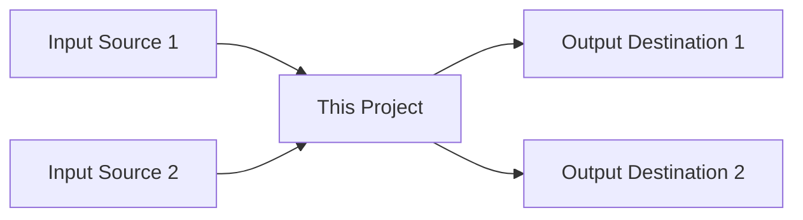

# Project Map - [PROJECT_NAME]

**Location:** `[PROJECT_PATH]`
**Last Updated:** [DATE]
**Status:** 🟢 Active | 🟡 Maintenance | 🔴 Archived

---

## 🎯 Purpose

[One-line description of what this project does]

---

## 📊 Project Overview

| Property | Value |
|----------|-------|
| **Type** | [e.g., Full-stack SaaS, Static Website, Framework, etc.] |
| **Tech Stack** | [e.g., React + TypeScript + ASP.NET Core] |
| **Repository** | [GitHub URL or "Local only"] |
| **Main Branch** | [e.g., develop, main] |
| **Current Status** | [Active Development / Stable / Archived] |
| **Team** | [Solo / Team of X] |
| **Started** | [Date] |

---

## 🔗 Dependencies (What This Project Needs)

### Direct Dependencies
- → **[Dependency 1]** - [Why needed, what it provides]
- → **[Dependency 2]** - [Why needed, what it provides]

### External Services
- → **[Service 1]** (e.g., OpenAI API) - [Purpose]
- → **[Service 2]** (e.g., PostgreSQL) - [Purpose]

### Data Sources
- ← **[Data Source 1]** (e.g., C:\stores\data) - [What data, how used]
- ← **[Data Source 2]** (e.g., External API) - [What data, how used]

---

## 🎯 Dependents (What Depends On This)

### Projects That Use This
- ← **[Project 1]** - [How they use it]
- ← **[Project 2]** - [How they use it]

### Data Outputs
- → **[Destination 1]** (e.g., PostgreSQL database) - [What data, format]
- → **[Destination 2]** (e.g., C:\stores\output) - [What data, format]

---

## 🔄 Data Flow



**Detailed Flow:**
1. [Step 1 of data flow]
2. [Step 2 of data flow]
3. [Step 3 of data flow]

---

## 🛠️ Tools That Operate On This

### Worktree Management (if applicable)
- `worktree-allocate.ps1` - [Special considerations, e.g., paired allocation]
- `worktree-release.ps1` - [Special considerations]

### Build & Deploy
- `[build-tool.ps1]` - [Purpose]
- `[deploy-tool.ps1]` - [Purpose]

### Code Quality
- `cs-format.ps1` - [If C# project]
- `[linter-tool]` - [If applicable]

### Testing
- `[test-runner.ps1]` - [Purpose]

### Other Tools
- `[tool-1.ps1]` - [Purpose]
- `[tool-2.ps1]` - [Purpose]

---

## 📁 File Structure

```
[PROJECT_NAME]/
├── [folder-1]/          ← [Description]
├── [folder-2]/          ← [Description]
├── [key-file-1]         ← [Description]
└── [key-file-2]         ← [Description]
```

**Key Files:**
- `[file-1]` - [Purpose, when to edit]
- `[file-2]` - [Purpose, when to edit]
- `[file-3]` - [Purpose, when to edit]

---

## 🔧 Configuration

### Environment Variables
- `[VAR_1]` - [Purpose, where set]
- `[VAR_2]` - [Purpose, where set]

### Config Files
- `[config-file-1]` - [Purpose, format]
- `[config-file-2]` - [Purpose, format]

### Secrets
- **Location:** [Where secrets are stored, reference to 09-SECRETS if applicable]
- **Required Keys:** [List of API keys, connection strings needed]

---

## 🚀 Workflows

### Development Workflow
1. [Step 1]
2. [Step 2]
3. [Step 3]

**Special Considerations:**
- [Exception 1, e.g., "No worktree allocation for this project"]
- [Exception 2, e.g., "Always edit on main branch"]

### Build Workflow
1. [Step 1]
2. [Step 2]
3. [Step 3]

### Deploy Workflow
1. [Step 1]
2. [Step 2]
3. [Step 3]

### Testing Workflow
1. [Step 1]
2. [Step 2]
3. [Step 3]

---

## 🔗 Integration Points

### GitHub
- **Repo:** [URL]
- **CI/CD:** [GitHub Actions workflows]
- **Branch Strategy:** [describe]

### ClickUp
- **Project ID:** [If applicable]
- **Task Sync:** [How tasks are tracked]

### External Services
- **[Service 1]:** [How integrated, endpoints]
- **[Service 2]:** [How integrated, endpoints]

---

## 🐛 Common Issues & Solutions

### Issue 1: [Problem Description]
**Solution:** [How to fix]

### Issue 2: [Problem Description]
**Solution:** [How to fix]

### Issue 3: [Problem Description]
**Solution:** [How to fix]

---

## 📚 Documentation

### Internal Docs
- Architecture: `[path/to/architecture.md]`
- API Docs: `[path/to/api-docs.md]`
- Database Schema: `[path/to/schema.md]`

### External References
- [Link 1 - Description]
- [Link 2 - Description]

### Knowledge Base
- User guide: `_machine/knowledge-base/05-PROJECTS/[project]/...`
- Patterns: `_machine/knowledge-base/08-KNOWLEDGE/...`

---

## 🎯 Success Metrics

- **Build Success Rate:** [X%]
- **Test Coverage:** [X%]
- **Deploy Frequency:** [X per week/month]
- **Bug Rate:** [X per month]

---

## 📝 Notes

[Any additional context, historical notes, future plans]

---

## 🔄 Change Log

| Date | Change | Updated By |
|------|--------|------------|
| [DATE] | Created project map | [Name/Agent] |
| [DATE] | [Description of change] | [Name/Agent] |

---

**Template Version:** 1.0
**Created:** 2026-01-30
**Purpose:** Standard project mapping format for cognitive topology layer
