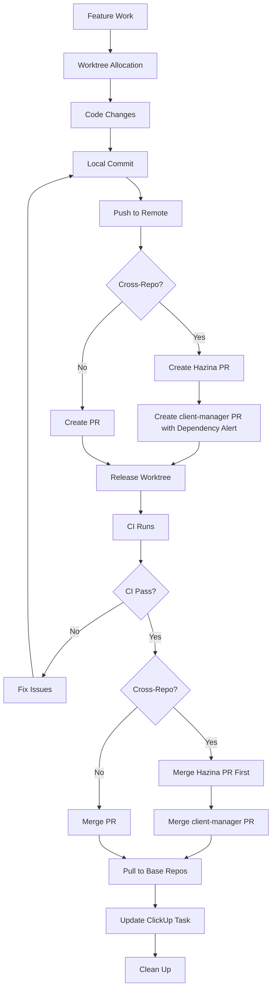

# GitHub Integration

**Tags:** #github #integration #version-control #automation #ci-cd
**Last Updated:** 2026-01-25
**Cross-References:** git-repositories.md, worktree-protocol.md, ci-cd-workflows.md

## Overview

Complete GitHub integration for martiendejong account, covering authentication, repository management, PR workflows, GitHub Actions CI/CD, and cross-repo coordination.

## Authentication

### Current Authentication Status

```bash
gh auth status
```

**Output:**
```
github.com
  ✓ Logged in to github.com account martiendejong (keyring)
  - Active account: true
  - Git operations protocol: https
  - Token: gho_************************************
  - Token scopes: 'gist', 'read:org', 'repo', 'workflow'
```

### Authentication Details

| Property | Value |
|----------|-------|
| **Account** | martiendejong |
| **User ID** | 143732 |
| **Storage** | Windows Credential Manager (keyring) |
| **Protocol** | HTTPS |
| **Token Scopes** | `gist`, `read:org`, `repo`, `workflow` |
| **Created** | 2009-10-23 |

### Token Capabilities

- ✅ **repo** - Full repository access (read/write)
- ✅ **workflow** - Manage GitHub Actions workflows
- ✅ **read:org** - Read organization membership
- ✅ **gist** - Create/edit gists

### Authentication Management

```bash
# View current authentication
gh auth status

# Login (if needed)
gh auth login

# Logout
gh auth logout

# Refresh token
gh auth refresh

# Switch accounts (if multiple)
gh auth switch
```

## Repository Overview

### Repository Statistics

- **Total Repositories:** 62+
- **Public Repositories:** 30
- **Private Repositories:** 32+
- **Followers:** 35
- **Following:** 22

### Key Repositories

#### Production Projects

| Repository | Visibility | Description | Last Updated |
|------------|-----------|-------------|--------------|
| **client-manager** | Private | Brand2Boost SaaS platform | 2026-01-25 |
| **Hazina** | Public | Framework (former DevGPT) | 2026-01-25 |
| **machine_agents** | Private | AI agent control plane | 2026-01-25 |
| **autonomous-dev-system** | Public | Agent protocols & patterns | 2026-01-11 |
| **subdomainchecker** | Public | AI subdomain reconnaissance | 2026-01-24 |

#### Client Projects

| Repository | Visibility | Description |
|------------|-----------|-------------|
| **hydro-vision-website** | Private | Client website |
| **artrevisionist** | Private | Art revision SaaS |
| **bugattiinsights-backend** | Private | Insights platform |
| **nexus-stream-74** | Private | Streaming platform |

#### WordPress Projects

| Repository | Visibility | Description |
|------------|-----------|-------------|
| **artrevisionist-wordpress** | Private | WordPress backend |
| **artrevisionist-wp-theme** | Private | Custom WP theme |
| **wreckingball-ai-theme** | Private | AI-enhanced theme |
| **wreckingball-theme** | Public | Base theme |

#### Tools & Libraries

| Repository | Visibility | Description |
|------------|-----------|-------------|
| **AgenticDebuggerVsix** | Public | VS debugger bridge |
| **devgpttools** | Private | Development tools |
| **TypeGen** | Public (fork) | C# to TypeScript generator |

### Repository Access

All repositories under `martiendejong` account are accessible with full `repo` scope:
- ✅ Read access to all repos
- ✅ Write access to all repos
- ✅ Admin access (owner)
- ✅ Create/delete repositories
- ✅ Manage collaborators

## GitHub CLI Usage

### Common Commands

#### Repository Operations

```bash
# List repositories
gh repo list --limit 100

# View repository details
gh repo view <owner>/<repo>

# Clone repository
gh repo clone <owner>/<repo>

# Create repository
gh repo create <name> --private --description "..."

# Archive repository
gh repo archive <owner>/<repo>
```

#### Pull Request Workflow

```bash
# Create PR
gh pr create --title "feat: description" --body "..."

# Create PR with base branch
gh pr create --base develop --title "..." --body "..."

# View PR
gh pr view <number> --repo <owner>/<repo>

# View PR diff
gh pr diff <number>

# View PR checks
gh pr checks <number>

# List open PRs
gh pr list --state open

# List my PRs
gh pr list --author "@me"

# Merge PR (squash)
gh pr merge <number> --squash --delete-branch

# Merge PR (merge commit)
gh pr merge <number> --merge --delete-branch

# Edit PR base branch
gh pr edit <number> --base develop

# Comment on PR
gh pr comment <number> --body "..."

# Review PR
gh pr review <number> --approve
gh pr review <number> --request-changes --body "..."
```

#### Issue Management

```bash
# List issues
gh issue list

# Create issue
gh issue create --title "..." --body "..."

# View issue
gh issue view <number>

# Close issue
gh issue close <number>

# Comment on issue
gh issue comment <number> --body "..."
```

#### GitHub Actions

```bash
# List workflows
gh workflow list --repo <owner>/<repo>

# View workflow runs
gh run list --repo <owner>/<repo>

# View specific run
gh run view <run-id>

# View run logs
gh run view <run-id> --log

# Re-run failed jobs
gh run rerun <run-id>

# Trigger workflow manually
gh workflow run <workflow-name> --repo <owner>/<repo>
```

#### API Access

```bash
# Get authenticated user
gh api user

# Get user organizations
gh api user/orgs

# Get repository info
gh api repos/<owner>/<repo>

# Get PR comments
gh api repos/<owner>/<repo>/pulls/<number>/comments

# Custom API call
gh api -X POST repos/<owner>/<repo>/issues \
  -f title="..." -f body="..."
```

## Pull Request Patterns

### PR Title Conventions

**Format:** `<type>: <description>`

**Types:**
- `feat:` - New feature
- `fix:` - Bug fix
- `refactor:` - Code restructuring
- `perf:` - Performance improvement
- `docs:` - Documentation
- `test:` - Tests
- `chore:` - Maintenance
- `style:` - Formatting

**Examples:**
```
feat: Add user token balance display
fix: Correct API path duplication in company documents
refactor: Migrate daily token terminology to monthly
```

### Standard PR Template

```markdown
## Summary
<1-3 bullet points explaining what changed and why>

## Changes
- <specific change 1>
- <specific change 2>
- <specific change 3>

## Testing
- <testing performed>
- <verification steps>

## Related Issues
Closes #<issue-number> (if applicable)

🤖 Generated by Claude Code Agent
```

### Cross-Repo Dependency PR Template

**For Hazina PR (upstream):**
```markdown
## ⚠️ DOWNSTREAM DEPENDENCIES ⚠️

**The following client-manager PR(s) depend on this:**
- https://github.com/martiendejong/client-manager/pull/YYY - [Brief description]

**Merge this PR first before the dependent PRs above.**

---

## Summary
[rest of PR description]
```

**For client-manager PR (downstream):**
```markdown
## ⚠️ DEPENDENCY ALERT ⚠️

**This PR depends on the following Hazina PR(s):**
- [ ] https://github.com/martiendejong/Hazina/pull/XXX - [Brief description]

**Merge order:**
1. First merge the Hazina PR(s) above
2. Then merge this PR

---

## Summary
[rest of PR description]
```

### PR Creation Workflow

```bash
# 1. Ensure working from worktree
cd C:/Projects/worker-agents/agent-XXX/<repo>

# 2. Commit all changes
git add .
git commit -m "feat: description"

# 3. Push to remote
git push origin <branch-name>

# 4. Create PR with proper template
gh pr create --base develop --title "feat: description" --body "$(cat <<'EOF'
## Summary
- Added feature X
- Improved performance Y
- Fixed issue Z

## Changes
- Modified service layer
- Updated frontend components
- Added tests

## Testing
- Unit tests pass
- Integration tests pass
- Manual testing completed

🤖 Generated by Claude Code Agent
EOF
)"

# 5. Verify PR created and base branch is correct
gh pr view <number> --json baseRefName

# 6. Release worktree IMMEDIATELY
powershell.exe -File "C:/scripts/tools/worktree-release-all.ps1" -AutoCommit
```

### PR Review Process

```bash
# 1. View PR details
gh pr view <number>

# 2. View changes
gh pr diff <number>

# 3. Check CI status
gh pr checks <number>

# 4. Review code locally (if needed)
gh pr checkout <number>

# 5. Approve or request changes
gh pr review <number> --approve
# OR
gh pr review <number> --request-changes --body "Please fix..."

# 6. Merge when ready
gh pr merge <number> --squash --delete-branch
```

### Merge Strategies

| Strategy | Command | Use Case |
|----------|---------|----------|
| **Squash** | `--squash` | Feature branches (PREFERRED) |
| **Merge Commit** | `--merge` | develop → main releases |
| **Rebase** | `--rebase` | Linear history needed |

**Standard practice:** Squash merge for all feature → develop PRs

## GitHub Actions Integration

### client-manager Workflows

#### Build & Test Workflows

| Workflow | Trigger | Purpose |
|----------|---------|---------|
| **Backend Build** | Manual (`workflow_dispatch`) | Build .NET API |
| **Frontend Build** | Manual | Build React app |
| **Backend Tests** | Manual | Run .NET tests |
| **Frontend Tests** | Manual | Run Jest/React tests |

**Note:** All CI workflows are manual-only to avoid billing issues.

#### Backend Build Workflow

```yaml
name: Backend Build

on:
  workflow_dispatch:
    inputs:
      reason:
        description: 'Reason for running this workflow'
        required: false
        default: 'Manual validation'

jobs:
  build:
    runs-on: ubuntu-latest
    steps:
      - name: Checkout code
        uses: actions/checkout@v6
        with:
          path: client-manager

      - name: Checkout Hazina dependency
        uses: actions/checkout@v6
        with:
          repository: martiendejong/Hazina
          path: hazina
          ref: develop

      - name: Setup .NET
        uses: actions/setup-dotnet@v5
        with:
          dotnet-version: '9.0.x'

      - name: Restore dependencies
        run: dotnet restore ClientManagerAPI/ClientManagerAPI.local.csproj
        working-directory: client-manager

      - name: Build Release
        run: dotnet build ClientManagerAPI/ClientManagerAPI.local.csproj --configuration Release --no-restore
        working-directory: client-manager

      - name: Publish
        run: dotnet publish ClientManagerAPI/ClientManagerAPI.local.csproj --configuration Release --output ./publish --no-build
        working-directory: client-manager

      - name: Upload build artifacts
        uses: actions/upload-artifact@v6
        with:
          name: backend-build
          path: client-manager/publish
          retention-days: 7
```

**Key Pattern:** Checks out BOTH client-manager AND Hazina repos (dependency).

#### Frontend Build Workflow

```yaml
name: Frontend Build

on:
  workflow_dispatch:

jobs:
  build:
    runs-on: ubuntu-latest
    defaults:
      run:
        working-directory: ClientManagerFrontend

    steps:
      - name: Checkout code
        uses: actions/checkout@v6

      - name: Setup Node.js
        uses: actions/setup-node@v6
        with:
          node-version: '20'
          cache: 'npm'
          cache-dependency-path: ClientManagerFrontend/package-lock.json

      - name: Install dependencies
        run: npm ci

      - name: Run linter
        run: npm run lint

      - name: Run type check
        continue-on-error: true  # Pre-existing errors
        run: npx tsc --noEmit

      - name: Build application
        run: npm run build

      - name: Upload build artifacts
        uses: actions/upload-artifact@v6
        with:
          name: frontend-build
          path: ClientManagerFrontend/dist
          retention-days: 7
```

**Key Pattern:** TypeScript checking with `continue-on-error` for gradual migration.

#### Security & Quality Workflows

| Workflow | Trigger | Purpose |
|----------|---------|---------|
| **CodeQL Security Analysis** | Manual | Code security scanning |
| **Dependency Security Scan** | Manual | Trivy vulnerability scan |
| **Secret Scanning** | Manual | Detect leaked secrets |
| **Authentication Integration Tests** | Manual | Auth flow testing |

#### Automation Workflows

| Workflow | Trigger | Purpose |
|----------|---------|---------|
| **Auto-Tag Stable Release** | Push to main | Tag stable releases |
| **PR Size Check** | Pull request | Warn on large PRs |
| **Deploy Documentation** | Push to main | Deploy docs site |
| **Deploy to Production** | Manual | Production deployment |
| **Docker Build & Push** | Manual | Container images |

### Hazina Workflows

#### Primary Build Pipeline

```yaml
name: Build, Test, and Security Scan

on:
  push:
    branches: [ main, develop ]
  pull_request:
    branches: [ main, develop ]
  workflow_dispatch:

jobs:
  build-and-test:
    runs-on: windows-latest
    steps:
      - name: Checkout code
        uses: actions/checkout@v6
        with:
          fetch-depth: 0  # Full history

      - name: Setup .NET
        uses: actions/setup-dotnet@v5
        with:
          dotnet-version: '9.0.x'

      - name: Cache NuGet packages
        uses: actions/cache@v5
        with:
          path: ~/.nuget/packages
          key: ${{ runner.os }}-nuget-${{ hashFiles('**/*.csproj') }}

      - name: Restore dependencies
        run: dotnet restore Hazina.sln

      - name: Build solution
        run: dotnet build Hazina.sln --configuration Release --no-restore

      - name: Run tests with coverage
        run: |
          dotnet test Hazina.sln \
            --configuration Release \
            --no-build \
            --collect:"XPlat Code Coverage" \
            --results-directory ./TestResults

      - name: Upload coverage to Codecov
        uses: codecov/codecov-action@v5
        with:
          files: '**/coverage.cobertura.xml'
          token: ${{ secrets.CODECOV_TOKEN }}

  security-scan:
    runs-on: ubuntu-latest
    needs: build-and-test
    steps:
      - name: Run Trivy vulnerability scanner
        uses: aquasecurity/trivy-action@master
        with:
          scan-type: 'fs'
          format: 'sarif'
          severity: 'CRITICAL,HIGH'

  code-quality:
    runs-on: ubuntu-latest
    needs: build-and-test
    steps:
      - name: Check code formatting
        run: dotnet format Hazina.sln --verify-no-changes

      - name: Run .NET analyzers
        run: dotnet build Hazina.sln /p:EnableNETAnalyzers=true
```

**Key Differences from client-manager:**
- ✅ Automatic triggers on push/PR (Hazina is open-source)
- ✅ Full test coverage with Codecov
- ✅ Code quality checks (formatting, analyzers)
- ✅ Security scanning (Trivy, CodeQL)

#### Other Hazina Workflows

| Workflow | Trigger | Purpose |
|----------|---------|---------|
| **Publish NuGet Packages** | Tag push | Publish to NuGet.org |
| **Deploy Documentation** | Push to main | GitHub Pages docs |
| **Docker Build** | Manual | Container images |
| **Auto-Tag Stable Release** | Push to main | Automated tagging |

### Common CI/CD Patterns

#### Multi-Repo Dependency Pattern

**Problem:** client-manager depends on Hazina
**Solution:** Checkout both repos in workflow

```yaml
steps:
  - name: Checkout main repo
    uses: actions/checkout@v6
    with:
      path: client-manager

  - name: Checkout dependency
    uses: actions/checkout@v6
    with:
      repository: martiendejong/Hazina
      path: hazina
      ref: develop
```

#### Manual-Only Workflows Pattern

**Why:** Avoid GitHub Actions billing on private repos

```yaml
on:
  workflow_dispatch:
    inputs:
      reason:
        description: 'Reason for running this workflow'
        required: false
        default: 'Manual validation'
```

#### Artifact Upload Pattern

```yaml
- name: Upload build artifacts
  uses: actions/upload-artifact@v6
  with:
    name: build-artifacts
    path: |
      **/bin/Release/**
      !**/bin/Release/**/ref/**
      !**/bin/Release/**/*.pdb
    retention-days: 7
```

### Triggering Workflows

```bash
# Trigger manually via CLI
gh workflow run "Backend Build" --repo martiendejong/client-manager

# Trigger with inputs
gh workflow run "Backend Build" \
  --repo martiendejong/client-manager \
  -f reason="Testing new feature"

# View workflow runs
gh run list --repo martiendejong/client-manager

# View specific run
gh run view <run-id> --repo martiendejong/client-manager

# Re-run failed workflow
gh run rerun <run-id> --repo martiendejong/client-manager
```

### Common CI Failure Patterns

#### EnableWindowsTargeting Issue

**Symptom:** Linux builds fail with "System.Windows.Forms not available"

**Fix:**
```yaml
env:
  EnableWindowsTargeting: true
```

**See:** `C:\scripts\ci-cd-troubleshooting.md` for complete fix

#### Hazina Dependency Missing

**Symptom:** client-manager build fails with "Hazina not found"

**Fix:** Add Hazina checkout step (see Multi-Repo Dependency Pattern above)

#### TypeScript Errors in CI

**Symptom:** Frontend build fails on type errors that pass locally

**Fix:**
```yaml
- name: Run type check
  continue-on-error: true  # Temporary during migration
  run: npx tsc --noEmit
```

## Branch Protection

### Current Status

**Branch Protection:** Not configured (requires GitHub Pro or public repo)

```bash
gh api repos/martiendejong/client-manager/branches/develop/protection
# HTTP 403: Upgrade to GitHub Pro or make repository public
```

### Recommended Protection Rules

If GitHub Pro is enabled, apply these rules:

#### Protected Branches

- **main** - Production releases only
- **develop** - Integration branch

#### Protection Rules

**For main:**
- ✅ Require pull request before merging
- ✅ Require approvals: 1
- ✅ Dismiss stale reviews
- ✅ Require status checks to pass
- ✅ Require branches to be up to date
- ✅ Require conversation resolution
- ✅ Do not allow bypassing

**For develop:**
- ✅ Require pull request before merging
- ⚠️ Allow administrators to bypass

**Status Checks (when available):**
- Backend Build
- Frontend Build
- Backend Tests
- Frontend Tests

## Cross-Repo PR Coordination

### Dependency Tracking

**File:** `C:\scripts\_machine\pr-dependencies.md`

**Purpose:** Track PRs where client-manager depends on Hazina changes

### Active Dependencies (Example)

| Downstream PR | Depends On (Hazina) | Status |
|---------------|---------------------|--------|
| [client-manager#293](https://github.com/martiendejong/client-manager/pull/293) | [Hazina#102](https://github.com/martiendejong/Hazina/pull/102) | ⏳ Waiting |
| [client-manager#294](https://github.com/martiendejong/client-manager/pull/294) | [Hazina#103](https://github.com/martiendejong/Hazina/pull/103) | ⏳ Waiting |

### Workflow

**1. Create Hazina PR first:**
```bash
cd C:/Projects/worker-agents/agent-XXX/hazina
gh pr create --title "feat: Add new LLM method" --body "$(cat <<'EOF'
## ⚠️ DOWNSTREAM DEPENDENCIES ⚠️

**The following client-manager PR(s) depend on this:**
- https://github.com/martiendejong/client-manager/pull/XXX (to be created)

---

## Summary
Add GenerateEmbeddingAsync method to semantic cache

🤖 Generated by Claude Code Agent
EOF
)"
```

**2. Create client-manager PR:**
```bash
cd C:/Projects/worker-agents/agent-XXX/client-manager
gh pr create --title "feat: Use new Hazina semantic cache" --body "$(cat <<'EOF'
## ⚠️ DEPENDENCY ALERT ⚠️

**This PR depends on:**
- [ ] https://github.com/martiendejong/Hazina/pull/XXX - Add GenerateEmbeddingAsync

**Merge order:** Hazina first, then this PR

---

## Summary
Integrate new semantic cache method from Hazina

🤖 Generated by Claude Code Agent
EOF
)"
```

**3. Update tracking file:**
```markdown
## Current Dependencies

| Downstream PR | Depends On (Hazina) | Status |
|---------------|---------------------|--------|
| client-manager#XXX | Hazina#YYY | ⏳ Waiting |
```

**4. Merge sequence:**
```bash
# Step 1: Merge Hazina PR
gh pr merge <hazina-pr> --squash --delete-branch --repo martiendejong/Hazina

# Step 2: Update dependency tracking
# (Change status from ⏳ Waiting to ✅ Ready)

# Step 3: Merge client-manager PR
gh pr merge <client-manager-pr> --squash --delete-branch --repo martiendejong/client-manager

# Step 4: Clean up tracking
# (Remove entry from active dependencies)
```

### Why This Matters

1. **Build Failures:** If Hazina changes aren't merged first, client-manager CI fails
2. **Clarity:** User knows which PRs to merge together
3. **Audit Trail:** Track cross-repo dependencies over time
4. **Automation:** Scripts can parse dependency alerts for automated workflows

## ClickUp Integration

### PR → Task Linking

**Pattern:** Include ClickUp task ID in PR title or description

```markdown
## Summary

Fixes: Activities list not updating (ClickUp #869bx19d8)

## ClickUp Task

- **Task ID:** #869bx19d8
- **Task Name:** Activities list is not always updated properly
- **Task URL:** https://app.clickup.com/t/869bx19d8
```

### Automated Updates

When PR is merged:
1. ClickUp task status → "Done"
2. PR link added to task
3. Completion notification sent

**See:** `C:\scripts\.claude\skills\clickhub-coding-agent\SKILL.md`

## Local Git → GitHub Flow

### Standard Workflow

```bash
# 1. Work in worktree
cd C:/Projects/worker-agents/agent-XXX/<repo>

# 2. Make changes, commit locally
git add .
git commit -m "feat: description"

# 3. Push to remote
git push origin <branch-name>

# 4. Create PR
gh pr create --base develop --title "..." --body "..."

# 5. Release worktree
powershell.exe -File "C:/scripts/tools/worktree-release-all.ps1" -AutoCommit

# 6. Switch base repo to develop
cd C:/Projects/<repo>
git checkout develop
git pull origin develop
```

### Post-Merge Sync

**CRITICAL:** After merging PR, pull changes to base repo

```bash
# After PR merged:
cd C:/Projects/client-manager
git checkout develop
git pull origin develop

cd C:/Projects/hazina
git checkout develop
git pull origin develop
```

**Why:** Keeps base repos synchronized for next worktree allocation

## Best Practices

### ✅ DO

- **Authentication:**
  - Keep token scopes minimal (only what's needed)
  - Store token in Windows Credential Manager
  - Use HTTPS protocol for git operations

- **PRs:**
  - Create from worktrees, never from C:/Projects/<repo>
  - Include comprehensive descriptions
  - Reference related issues/tasks
  - Add dependency alerts for cross-repo PRs
  - Verify base branch is correct (`--base develop`)
  - Release worktree immediately after PR creation

- **Reviews:**
  - Check CI status before merge
  - Verify all required checks pass
  - Read code changes, not just approve
  - Test locally if needed

- **Merging:**
  - Use squash merge for feature branches
  - Delete branch after merge (`--delete-branch`)
  - Pull to base repos after merge
  - Update PR dependency tracking

- **CI/CD:**
  - Trigger workflows manually for private repos
  - Check workflow logs for failures
  - Fix systematic issues (don't just re-run)

### ❌ DON'T

- **Authentication:**
  - ❌ Share tokens or commit them to repos
  - ❌ Use tokens with excessive scopes
  - ❌ Store tokens in plaintext files

- **PRs:**
  - ❌ Create PR without releasing worktree
  - ❌ Use vague titles ("fix stuff", "updates")
  - ❌ Target wrong base branch (main instead of develop)
  - ❌ Merge without CI checks passing
  - ❌ Force push to PRs under review
  - ❌ Ignore PR feedback

- **Branching:**
  - ❌ Commit directly to main/develop
  - ❌ Keep feature branches after merge
  - ❌ Create PRs from stale branches

- **CI/CD:**
  - ❌ Enable automatic triggers on private repos (billing)
  - ❌ Ignore CI failures
  - ❌ Disable security scans

## Troubleshooting

### Authentication Issues

**Problem:** `gh auth status` shows not logged in

**Solution:**
```bash
gh auth login
# Select: GitHub.com, HTTPS, authenticate via web browser
```

**Problem:** Token expired

**Solution:**
```bash
gh auth refresh
```

### PR Creation Failures

**Problem:** "No commits between base and head"

**Solution:** Ensure changes are pushed to remote:
```bash
git push origin <branch-name>
```

**Problem:** Wrong base branch

**Solution:**
```bash
gh pr edit <number> --base develop
```

**Problem:** PR already exists for branch

**Solution:**
```bash
# View existing PR
gh pr list --head <branch-name>

# Either use existing PR or delete and recreate
gh pr close <number>
gh pr create --base develop --title "..." --body "..."
```

### CI Workflow Failures

**Problem:** Workflow not found

**Solution:**
```bash
# List available workflows
gh workflow list --repo <owner>/<repo>

# Use exact workflow name from list
gh workflow run "Backend Build" --repo <owner>/<repo>
```

**Problem:** Workflow run stuck

**Solution:**
```bash
# View run status
gh run view <run-id>

# Cancel stuck run
gh run cancel <run-id>

# Re-run
gh run rerun <run-id>
```

**Problem:** EnableWindowsTargeting error on Linux

**Solution:** See `C:\scripts\ci-cd-troubleshooting.md` § EnableWindowsTargeting Issue

### Merge Conflicts

**Problem:** Cannot merge due to conflicts

**Solution:**
```bash
# Update branch with latest develop
cd C:/Projects/worker-agents/agent-XXX/<repo>
git fetch origin develop
git merge origin/develop

# Resolve conflicts manually
# ... edit conflicted files ...

git add .
git commit -m "chore: Resolve merge conflicts with develop"
git push origin <branch-name>

# PR will update automatically
```

## Quick Reference

### Essential Commands

```bash
# Authentication
gh auth status

# Repository
gh repo list
gh repo view <owner>/<repo>

# Pull Requests
gh pr create --base develop --title "..." --body "..."
gh pr list
gh pr view <number>
gh pr checks <number>
gh pr merge <number> --squash --delete-branch

# Issues
gh issue list
gh issue create --title "..." --body "..."

# Workflows
gh workflow list --repo <owner>/<repo>
gh run list --repo <owner>/<repo>
gh workflow run "<workflow-name>"

# API
gh api user
gh api repos/<owner>/<repo>
```

### Key Files

| File | Purpose |
|------|---------|
| `C:\scripts\_machine\pr-dependencies.md` | Cross-repo PR tracking |
| `C:\scripts\git-workflow.md` | Git-flow branching strategy |
| `C:\scripts\ci-cd-troubleshooting.md` | CI/CD issue resolution |
| `C:\scripts\.claude\skills\github-workflow\SKILL.md` | PR workflow skill |

### Skills

| Skill | Purpose | Invocation |
|-------|---------|-----------|
| **github-workflow** | Complete PR lifecycle management | Auto-activated on PR tasks |
| **pr-dependencies** | Cross-repo dependency tracking | Auto-activated when PRs depend on each other |

### Related Documentation

- **Git Repositories:** `git-repositories.md` - Repository structure and management
- **Worktree Protocol:** `worktree-protocol.md` - Worktree → PR workflow
- **CI/CD Workflows:** `ci-cd-workflows.md` - GitHub Actions details
- **ClickUp Integration:** `clickup-integration.md` - Task → PR linking

## Workflows Diagram



---

**Summary:** This integration provides complete GitHub automation via CLI, comprehensive PR workflows with cross-repo dependency tracking, GitHub Actions CI/CD, and seamless local → remote flow using worktrees.
