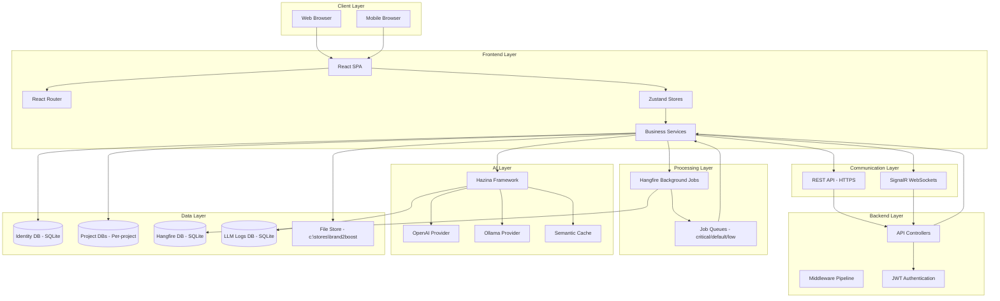
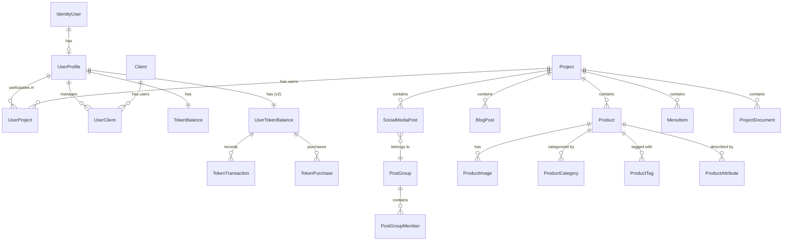
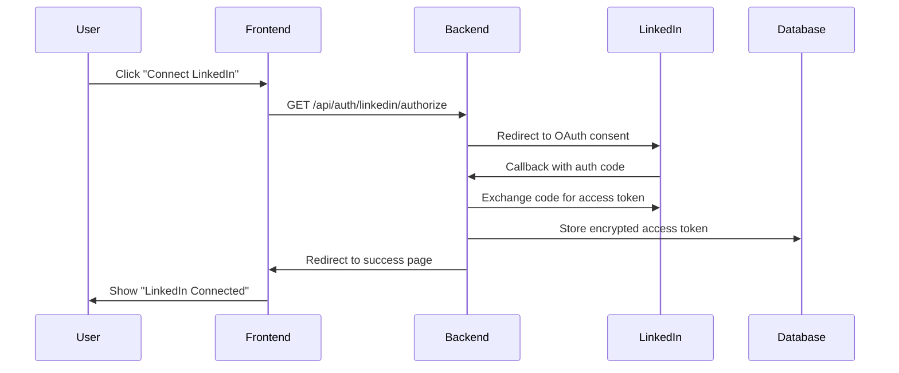
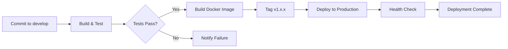

# Brand2Boost / client-manager - System Architecture

**Project:** client-manager (Brand2Boost SaaS)
**Type:** Promotion and Brand Development Platform
**Status:** Active Development
**Last Updated:** 2026-01-25
**Tags:** #client-manager #architecture #saas #brand2boost

---

## 📋 Table of Contents

1. [System Overview](#system-overview)
2. [Technology Stack](#technology-stack)
3. [Architecture Layers](#architecture-layers)
4. [Project Structure](#project-structure)
5. [Frontend Architecture](#frontend-architecture)
6. [Backend Architecture](#backend-architecture)
7. [Database Architecture](#database-architecture)
8. [Real-Time Communication](#real-time-communication)
9. [Background Processing](#background-processing)
10. [AI & LLM Integration](#ai--llm-integration)
11. [External Integrations](#external-integrations)
12. [Security Architecture](#security-architecture)
13. [Deployment Architecture](#deployment-architecture)
14. [Development Workflow](#development-workflow)
15. [Key Features](#key-features)

---

## 🎯 System Overview

### Purpose

**Brand2Boost** is a comprehensive AI-powered SaaS platform for promotion and brand development. The platform helps businesses:

- **Generate brand assets** - Logos, color schemes, typography, brand profiles
- **Create content** - Blog posts, social media posts, content calendars
- **Manage multi-platform presence** - 9 social media platforms + WordPress + Medium
- **Automate workflows** - Scheduled publishing, background jobs, AI-driven suggestions
- **Track performance** - Analytics, ROI calculations, engagement metrics
- **Optimize costs** - Token management, model routing, semantic caching

### Target Users

- **Entrepreneurs** - Building brand presence from scratch
- **Marketing Teams** - Managing multiple client brands
- **SMBs** - Automating content creation and social media
- **Agencies** - White-label brand development services

### Core Value Proposition

**AI-powered brand development at scale with:**
- Multi-stage content refinement for quality
- Cost optimization through intelligent model routing
- Real-time collaboration via SignalR
- Background job processing for long-running tasks
- Comprehensive analytics and ROI tracking

### Repository Architecture

Multi-repository development environment:

```
C:\projects\
├── client-manager\          # Main application (this repo)
│   ├── ClientManagerAPI\    # .NET 8 Web API
│   └── ClientManagerFrontend\  # React 19 + TypeScript SPA
├── hazina\                  # AI framework (separate repo)
│   ├── Core\               # LLM providers, registry
│   └── Tools\              # Reusable AI services
└── stores\brand2boost\      # Data storage (gitignored)
    ├── identity.db         # User authentication DB
    ├── hangfire.db         # Background jobs DB
    ├── semantic-cache.db   # LLM response cache
    ├── llm-logs.db         # LLM usage logs
    └── p-{projectId}\      # Per-project data folders
```

---

## 🛠️ Technology Stack

### Backend Stack

| Technology | Version | Purpose |
|------------|---------|---------|
| **.NET** | 8.0 | Modern C# application framework |
| **ASP.NET Core** | 8.0 | Web API and middleware |
| **Entity Framework Core** | 9.0.12 | Database ORM with migrations |
| **SQLite** | 3.x | File-based database (development) |
| **Hangfire** | 1.8.22 | Background job processing |
| **SignalR** | 1.2.0 | Real-time WebSocket communication |
| **Serilog** | 10.0.0 | Structured logging |
| **StackExchange.Redis** | 2.10.1 | Caching layer (optional) |

### Frontend Stack

| Technology | Version | Purpose |
|------------|---------|---------|
| **React** | 19.0.0 | UI framework |
| **TypeScript** | 5.5.3 | Type-safe JavaScript |
| **Vite** | 5.4.1 | Build tool and dev server |
| **React Router** | 7.12.0 | Client-side routing |
| **Zustand** | 4.5.0 | State management |
| **TanStack Query** | 5.90.18 | Server state management |
| **Tailwind CSS** | 3.4.19 | Utility-first CSS framework |
| **shadcn/ui** | Latest | Component library (Radix UI) |
| **Framer Motion** | 12.26.2 | Animations |

### AI & ML Stack

| Technology | Purpose |
|------------|---------|
| **Hazina Framework** | Unified LLM abstraction layer |
| **OpenAI GPT-4** | Primary LLM for content generation |
| **OpenAI DALL-E** | Image generation |
| **text-embedding-3-small** | Vector embeddings (512 dimensions) |
| **Ollama** | Local LLM deployment option |
| **Anthropic Claude** | Alternative LLM provider (future) |

### Integration & Infrastructure

| Technology | Purpose |
|------------|---------|
| **Stripe** | Payment processing (EUR) |
| **MPesa** | Payment processing (KES - Kenya) |
| **Sentry** | Error monitoring and crash reporting |
| **GitHub Actions** | CI/CD pipelines |
| **Docker** | Containerization |
| **Swagger/OpenAPI** | API documentation |
| **DocFX** | C# API documentation generation |

---

## 🏗️ Architecture Layers

### High-Level Architecture



### Request Flow Patterns

#### Pattern 1: Synchronous API Request
```
User Action → React Component → API Service → HTTP POST → Controller →
Business Service → Database → HTTP Response → State Update → UI Render
```

#### Pattern 2: Async Background Task
```
User Action → API Request → Controller → Background Job Enqueue →
Immediate HTTP Response → (Background) Hangfire → Service → LLM API →
SignalR Notification → WebSocket → State Update → UI Update
```

#### Pattern 3: Real-Time Streaming
```
User Sends Message → Chat API → LLM Streaming → SignalR Hub →
WebSocket Stream → React Hook → Progressive UI Update
```

---

## 📁 Project Structure

### Solution Structure

```
C:\Projects\client-manager\
├── ClientManagerAPI\                    # .NET 8 Web API
│   ├── Controllers\                     # API endpoints (49 controllers)
│   ├── Services\                        # Business logic layer
│   │   ├── BackgroundTasks\            # Async orchestration
│   │   ├── Caching\                    # Semantic cache
│   │   ├── ComponentRegistry\          # Component type system
│   │   ├── Import\                     # Social media import
│   │   ├── Interfaces\                 # Service contracts
│   │   ├── LicenseManager\             # Licensing logic
│   │   ├── Lifecycle\                  # Startup/shutdown
│   │   ├── ModelRouting\               # LLM provider routing
│   │   ├── Optimization\               # Performance optimization
│   │   ├── ProductCatalog\             # Product management
│   │   ├── Resilience\                 # Retry/circuit breaker
│   │   ├── RestaurantMenu\             # Menu extraction
│   │   ├── SemanticCache\              # LLM response caching
│   │   ├── Strategies\                 # Content strategies
│   │   └── Workflow\                   # Approval workflows
│   ├── Models\                          # Data models and DTOs
│   │   ├── Analysis\                   # Brand analysis models
│   │   ├── Auth\                       # Authentication models
│   │   ├── Blog\                       # Blog post models
│   │   ├── Chat\                       # Chat message models
│   │   ├── Content\                    # Content generation
│   │   ├── Demo\                       # Demo session models
│   │   ├── Import\                     # Import error tracking
│   │   ├── LicenseManager\             # License models
│   │   ├── Payments\                   # Payment models
│   │   ├── ProductCatalog\             # Product models
│   │   ├── Requests\                   # API request DTOs
│   │   ├── Responses\                  # API response DTOs
│   │   ├── RestaurantMenu\             # Menu models
│   │   ├── Subscription\               # Subscription models
│   │   ├── Token\                      # Token system models
│   │   └── WebScraping\                # Web scraping models
│   ├── Data\                            # Database context
│   │   ├── IdentityDbContext.cs        # Main EF Core context
│   │   └── SeedData\                   # Database seeders
│   ├── Migrations\                      # EF Core migrations (38 migrations)
│   ├── Jobs\                            # Hangfire background jobs
│   ├── Middleware\                      # ASP.NET middleware
│   ├── Infrastructure\                  # Infrastructure services
│   ├── HealthChecks\                    # Health monitoring
│   ├── Swagger\                         # API documentation
│   ├── Custom\                          # Custom implementations
│   ├── Configuration\                   # Config files (JSON)
│   ├── Tools\                           # AI agent tools
│   ├── Attributes\                      # Custom attributes
│   ├── Filters\                         # Action filters
│   ├── Extensions\                      # Extension methods
│   └── Program.cs                       # Application entry point (1508 lines)
│
├── ClientManagerFrontend\               # React SPA
│   ├── src\
│   │   ├── components\                  # React components (organized by feature)
│   │   │   ├── actions\                # AI action suggestions
│   │   │   ├── activity\               # Activity timeline
│   │   │   ├── approval\               # Approval workflows
│   │   │   ├── branding\               # Brand management
│   │   │   ├── chat\                   # Chat interface
│   │   │   ├── client\                 # Client management
│   │   │   ├── common\                 # Shared components
│   │   │   ├── containers\             # Page containers
│   │   │   ├── content\                # Content creation
│   │   │   ├── demo\                   # Demo mode
│   │   │   ├── examples\               # Example components
│   │   │   ├── layout\                 # Layout components
│   │   │   ├── layouts\                # Layout containers
│   │   │   ├── legal\                  # Legal pages
│   │   │   ├── license-manager\        # License UI
│   │   │   ├── menu\                   # Restaurant menu
│   │   │   ├── mobile\                 # Mobile-optimized
│   │   │   ├── modals\                 # Modal dialogs
│   │   │   ├── panels\                 # Side panels
│   │   │   ├── products\               # Product catalog
│   │   │   ├── providers\              # React context providers
│   │   │   ├── roi\                    # ROI dashboard
│   │   │   ├── routing\                # Route components
│   │   │   ├── scheduling\             # Smart scheduling
│   │   │   ├── search\                 # Search components
│   │   │   ├── settings\               # Settings UI
│   │   │   ├── shared\                 # Shared UI components
│   │   │   ├── social\                 # Social media UI
│   │   │   ├── ui\                     # shadcn/ui components
│   │   │   ├── view\                   # View components
│   │   │   └── workflow\               # Workflow UI
│   │   ├── services\                    # API client layer (26 services)
│   │   ├── hooks\                       # Custom React hooks (30+ hooks)
│   │   ├── stores\                      # Zustand state stores
│   │   │   ├── authStore.ts            # Authentication state
│   │   │   ├── projectStore.ts         # Project state
│   │   │   └── chat.ts                 # Chat state (centralized)
│   │   ├── types\                       # TypeScript definitions
│   │   ├── utils\                       # Utility functions
│   │   ├── lib\                         # Library code
│   │   ├── constants\                   # Constants and config
│   │   ├── contexts\                    # React contexts
│   │   ├── machines\                    # XState state machines
│   │   ├── i18n\                        # Internationalization
│   │   ├── App.tsx                      # Application root (1042 lines)
│   │   └── main.tsx                     # Entry point
│   ├── public\                          # Static assets
│   ├── vite.config.ts                   # Vite configuration
│   ├── tailwind.config.js               # Tailwind config
│   └── tsconfig.json                    # TypeScript config
│
├── ClientManagerAPI.Tests\              # Unit tests
├── ClientManagerAPI.IntegrationTests\   # Integration tests
├── .github\workflows\                    # CI/CD pipelines (17 workflows)
├── docs\                                 # Documentation
│   └── apidoc\                          # DocFX API documentation
├── .vscode\                              # VS Code settings
├── .config\                              # Development configs
└── README.md                             # Project README

```

### Key Directories

#### Backend Key Directories

- **Controllers** - 49 controllers handling API endpoints (REST + SignalR)
- **Services** - Business logic layer with 60+ services
- **Models** - 100+ data models and DTOs
- **Migrations** - 38 EF Core migrations tracking schema evolution
- **Jobs** - Hangfire background jobs (token reset, post publishing, cleanup)
- **Middleware** - Rate limiting, error handling, CORS, authentication

#### Frontend Key Directories

- **components** - 200+ React components organized by feature domain
- **services** - 26 API client services (axios-based)
- **hooks** - 30+ custom React hooks for reusable logic
- **stores** - Zustand state management (auth, project, chat)
- **types** - TypeScript type definitions for type safety
- **utils** - Helper functions and utilities

---

## 🎨 Frontend Architecture

### React Component Architecture

**Design Philosophy:**
- **Feature-based organization** - Components grouped by domain (chat, branding, social)
- **Atomic Design** - ui/ contains primitives, higher folders contain compositions
- **Lazy loading** - Route-based code splitting for performance
- **Accessibility-first** - Radix UI primitives for WCAG compliance

### State Management Strategy

#### 1. Local Component State (useState)
```typescript
// Used for: UI state, forms, toggles
const [isOpen, setIsOpen] = useState(false)
```

#### 2. Global State (Zustand)
```typescript
// Used for: Auth, project selection, chat state
// C:\Projects\client-manager\ClientManagerFrontend\src\stores\authStore.ts
// C:\Projects\client-manager\ClientManagerFrontend\src\stores\projectStore.ts
// C:\Projects\client-manager\ClientManagerFrontend\src\stores\chat.ts

// Example: Chat Store (centralized, deduplicated)
export const useChatStore = create<ChatStore>()(
  devtools(
    (set, get) => ({
      messages: [],
      loadingState: { type: 'idle' },
      connectionStatus: 'initializing',

      addMessage: (msg) => {
        set((state) => ({
          messages: deduplicateMessages([...state.messages, msg])
        }))
      },

      // ... other actions
    })
  )
)
```

#### 3. Server State (TanStack Query)
```typescript
// Used for: API data fetching, caching, invalidation
const { data, isLoading, error } = useQuery({
  queryKey: ['projects', projectId],
  queryFn: () => projectsApi.getProject(projectId)
})
```

#### 4. State Machines (XState)
```typescript
// Used for: Complex workflows (interview agent, approval flows)
// C:\Projects\client-manager\ClientManagerFrontend\src\machines\
```

### Routing Architecture

**Strategy:** URL-based state synchronization

```typescript
// Route structure
/                              → Landing page (unauthenticated)
/login, /register              → Authentication
/p-{projectId}/                → Project workspace (authenticated)
/p-{projectId}/chat            → Chat interface
/p-{projectId}/calendar        → Content calendar
/p-{projectId}/social          → Social media management
/p-{projectId}/blog            → Blog view
/p-{projectId}/settings        → Project settings
```

**Features:**
- **Automatic project extraction** - URL params sync with store state
- **Protected routes** - Authentication wrapper via `<ProtectedRoute>`
- **Lazy loading** - Code splitting reduces initial bundle size by 50-60%

### API Client Layer

**Location:** `C:\Projects\client-manager\ClientManagerFrontend\src\services\`

**Pattern:** Axios-based service modules with TypeScript interfaces

```typescript
// Example: services/auth.ts
export const authApi = {
  login: async (email: string, password: string) => {
    const response = await axios.post('/api/auth/login', { email, password })
    return response.data
  },

  logout: async () => {
    await axios.post('/api/auth/logout')
  }
}
```

**Services:**
- `auth.ts` - Authentication (login, register, OAuth)
- `chat.ts` - Chat API with SignalR
- `projects.ts` - Project CRUD
- `activity.ts` - Activity timeline
- `analysis.ts` - Brand analysis generation
- `socialMediaPost.ts` - Social media management
- `blog.ts` - Blog post management
- `tokenBalance.ts` - Token system
- `payment.ts` - Stripe/MPesa integration
- `documents.ts` - Document upload/management
- And 16 more...

### Component Library

**UI Components:** shadcn/ui (Radix UI primitives + Tailwind)

**Key Components:**
- `Button`, `Input`, `Select`, `Dialog`, `Toast` - Primitives
- `MainLayout` - Main application layout with sidebar
- `ChatWindow` - Real-time chat interface
- `ContentCalendar` - Full-screen calendar view
- `ActivityTimeline` - Activity feed
- `MultiPlatformPostCreator` - Multi-platform post creation
- `DragUploadArea` - Drag-and-drop file upload
- `TokenPurchaseModal` - Payment UI

### Performance Optimizations

**Bundle Optimization:**
```javascript
// vite.config.ts
optimizeDeps: {
  include: ['react', 'react-dom', 'react-router-dom', '@tanstack/react-query', 'zustand']
}

// Lazy loading
const BlogView = lazy(() => import('./components/view/blog'))
const ContentCalendar = lazy(() => import('./components/content/ContentCalendar'))
```

**Result:** Initial bundle reduced by 50-60%, <1s HMR feedback loop

---

## ⚙️ Backend Architecture

### Layered Architecture

```
Controllers Layer (API Endpoints)
      ↓
Service Layer (Business Logic)
      ↓
Repository Pattern (Data Access) - Implicit via EF Core DbContext
      ↓
Database Layer (EF Core + SQLite)
```

### API Controllers (49 Controllers)

**Key Controllers:**

| Controller | Lines | Purpose |
|------------|-------|---------|
| `ChatController` | 2700+ | Chat messaging, LLM agent orchestration, streaming |
| `AnalysisController` | 3300+ | Brand analysis generation (field-based system) |
| `ActivityController` | 1200+ | Activity timeline and notifications |
| `SocialMediaPostController` | 1500+ | Social media post CRUD and publishing |
| `AuthController` | 1600+ | Authentication (JWT, OAuth, external providers) |
| `UploadedDocumentsController` | 1300+ | Document upload and processing |
| `ProjectsController` | 550+ | Project management |
| `ContentController` | 1500+ | Content generation and refinement |
| `BlogController` | 550+ | Blog post management |
| `PaymentController` | 900+ | Stripe/MPesa payment processing |
| `TokenBalanceController` | 280+ | Token system management |
| `SocialImportController` | 1400+ | WordPress/social media import |

**Design Pattern:** REST API with action-based routing

```csharp
[ApiController]
[Route("api/[controller]")]
[Authorize] // JWT authentication required
public class ProjectsController : AppControllerBase
{
    private readonly IProjectService _projectService;
    private readonly IdentityDbContext _context;

    [HttpGet]
    public async Task<IActionResult> GetProjects([FromQuery] bool includeInactive = false)
    {
        // ... implementation
    }
}
```

### Service Layer Pattern

**Design Philosophy:**
- **Single Responsibility** - Each service handles one domain
- **Dependency Injection** - All services registered in Program.cs
- **Interface-based** - Services implement contracts (e.g., `ITokenBalanceService`)
- **Scoped/Singleton** - Appropriate lifetime per service type

**Key Services:**

| Service | Purpose | Lifetime |
|---------|---------|----------|
| `BrandFragmentService` | Brand data management (fragment-based) | Scoped |
| `ChatService` | LLM agent orchestration with tools | Scoped |
| `ImageSetGenerationService` | DALL-E image generation | Scoped |
| `BlogGenerationService` | Multi-stage blog post generation | Scoped |
| `ProgressiveRefinementService` | Iterative content quality improvement | Scoped |
| `ContentQualityScorer` | AI-powered quality metrics | Scoped |
| `SmartSchedulingService` | Optimal posting time prediction | Scoped |
| `SocialMediaPublishingService` | Multi-platform publishing | Scoped |
| `SocialMediaMetricsService` | Analytics and engagement tracking | Scoped |
| `TokenBalanceService` | Token balance CRUD and transactions | Scoped |
| `TokenManagementService` | Token usage tracking and limits | Scoped |
| `SemanticCacheService` | LLM response caching | Scoped |
| `BackgroundTaskOrchestrator` | Async job orchestration | Singleton |
| `ComponentTypeRegistry` | Component data type compatibility | Singleton |
| `LLMProviderFactory` | LLM client creation and routing | Scoped |

**Example Service Implementation:**

```csharp
// C:\Projects\client-manager\ClientManagerAPI\Services\Interfaces\ITokenBalanceService.cs
public interface ITokenBalanceService
{
    Task<UserTokenBalance> GetOrCreateBalanceAsync(string userId);
    Task<bool> DeductTokensAsync(string userId, int amount, string operation, string? projectId = null);
    Task AddTokensAsync(string userId, int amount, string source);
    Task ResetDailyTokensAsync(string userId, int allowance);
}

// C:\Projects\client-manager\ClientManagerAPI\Services\TokenBalanceService.cs
public class TokenBalanceService : ITokenBalanceService
{
    private readonly IdentityDbContext _context;
    private readonly ILogger<TokenBalanceService> _logger;

    public TokenBalanceService(IdentityDbContext context, ILogger<TokenBalanceService> logger)
    {
        _context = context;
        _logger = logger;
    }

    public async Task<bool> DeductTokensAsync(string userId, int amount, string operation, string? projectId = null)
    {
        var balance = await GetOrCreateBalanceAsync(userId);

        if (balance.CurrentBalance < amount)
        {
            _logger.LogWarning("Insufficient tokens for user {UserId}", userId);
            return false;
        }

        // Deduct tokens
        balance.CurrentBalance -= amount;
        balance.TotalTokensSpent += amount;
        balance.LastUpdated = DateTime.UtcNow;

        // Record transaction
        _context.TokenTransactionsV2.Add(new TokenTransaction
        {
            UserId = userId,
            Amount = -amount,
            OperationType = operation,
            ProjectId = projectId,
            Timestamp = DateTime.UtcNow
        });

        await _context.SaveChangesAsync();
        return true;
    }

    // ... other methods
}
```

### Dependency Injection Setup

**Location:** `C:\Projects\client-manager\ClientManagerAPI\Program.cs`

**Pattern:** Service registration in `Program.cs` with appropriate lifetimes

```csharp
// Example registrations
builder.Services.AddScoped<ITokenBalanceService, TokenBalanceService>();
builder.Services.AddScoped<IProjectService, ProjectService>();
builder.Services.AddSingleton<IBackgroundTaskOrchestrator, BackgroundTaskOrchestrator>();
builder.Services.AddScoped<BrandFragmentService>();
builder.Services.AddScoped<BlogGenerationService>();
```

**Service Categories:**
- **Scoped** - Per HTTP request (database-dependent services)
- **Singleton** - Application lifetime (caches, registries, factories)
- **Transient** - New instance per request (stateless utilities)

### Middleware Pipeline

**Order:** (Top executes first)

1. **Sentry Error Handling** - Global exception capture
2. **HTTPS Redirection** - Force HTTPS in production
3. **Static Files** - Serve frontend build artifacts
4. **CORS** - Cross-origin resource sharing
5. **Authentication** - JWT token validation
6. **Authorization** - Role-based access control
7. **Rate Limiting** - Request throttling (100 req/60s)
8. **Routing** - Endpoint routing
9. **Endpoints** - Controller action execution

**Custom Middleware:**
- `RateLimitingMiddleware` - Protects against abuse
- `ErrorHandlingMiddleware` - Structured error responses
- `RequestLoggingMiddleware` - Audit trail

---

## 🗄️ Database Architecture

### Database Strategy

**Multi-Database Architecture:**

1. **Identity DB** - `C:\stores\brand2boost\identity.db` (SQLite)
   - User authentication (ASP.NET Core Identity)
   - Business entities (projects, clients, tokens, payments)
   - System-wide data (templates, packages, subscriptions)

2. **Per-Project DBs** - `C:\stores\brand2boost\p-{projectId}\social.db` (SQLite)
   - Project-specific social media data
   - Brand fragments and documents
   - Project analytics

3. **Hangfire DB** - `C:\stores\brand2boost\hangfire.db` (SQLite)
   - Background job persistence
   - Job state and history

4. **LLM Logs DB** - `C:\stores\brand2boost\llm-logs.db` (SQLite)
   - LLM request/response logging
   - Cost tracking and analytics

5. **Semantic Cache DB** - `C:\stores\brand2boost\semantic-cache.db` (SQLite)
   - Cached LLM responses (vector similarity)

### Schema Overview (Identity DB)

**Core Entities:**



**Tables (60+ tables):**

#### Identity & Users
- `AspNetUsers` - Identity users (email, password hash)
- `AspNetRoles` - Roles (ADMIN, USER, MANAGER)
- `UserProfiles` - Extended user data (avatar, preferences)
- `UserClients` - User-client associations (many-to-many)
- `UserProjects` - User-project associations (many-to-many)

#### Projects & Content
- `ProjectsDb` - Projects (name, description, settings)
- `ProjectDocuments` - Uploaded documents (PDFs, images, text)
- `SocialMediaPosts` - Social media posts (9 platforms)
- `BlogPosts` - Blog posts with content calendar
- `ContentTemplates` - Reusable content templates
- `ContentQualityScores` - AI quality metrics

#### Social Media
- `PostGroups` - Grouped posts for cross-platform campaigns
- `PostGroupMembers` - Post-group associations
- `PostLinks` - Relationships between posts (original, variation)

#### Products & Menus
- `Product` - Product catalog items
- `ProductImages`, `ProductCategories`, `ProductTags`, `ProductAttributes`
- `ProductIntegrations` - E-commerce platform connections
- `MenuItem` - Restaurant menu items
- `MenuCategories`, `MenuItemImages`, `MenuItemAllergens`, `MenuItemDietaryTags`
- `MenuSourceDocuments` - Original menu PDFs/images
- `MenuCardTemplates` - Menu card designs

#### Token System
- `UserTokenBalance` - Current token balance (v2)
- `TokenTransaction` - Token usage audit trail
- `TokenPurchase` - Token purchase history
- `TokenPackages` - Available token packages
- `AdminTokenAdjustment` - Manual token adjustments

#### Payments & Subscriptions
- `Payments` - Payment records (Stripe, MPesa)
- `UserSubscriptions` - Subscription status
- `SubscriptionPurchases` - Subscription purchase history
- `TokenPackagePurchases` - One-time token purchases

#### Workflows & Approvals
- `ApprovalRequests` - Content approval requests
- `ApprovalActions` - Approval action history

#### Analytics & ROI
- `OptimalPostingTimes` - AI-predicted best posting times
- `ROICostTracking` - Cost tracking per project
- `ROIEngagementValues` - Engagement value calculations
- `ROISummaries` - Monthly ROI summaries

#### AI Dynamic Actions
- `ActionCategories` - Action groupings (quick-actions, analysis, content)
- `ActionDefinitions` - Available actions (upload-document, generate-logo)
- `ActionSuggestions` - AI-suggested next actions
- `ChatActiveActions` - Active action buttons per chat

#### License & Demo
- `CompanyDocuments` - License documents
- `CompanyDocumentExtractions` - Extracted license data
- `DemoSessions` - Demo mode sessions

#### Error Tracking
- `ImportErrorLog` - Social import errors (no FK constraints for audit)
- `HangfireAuditLog` - Background job audit trail

### Migration Strategy

**Location:** `C:\Projects\client-manager\ClientManagerAPI\Migrations\`

**Pattern:** EF Core Code-First migrations

**Current State:** 38 migrations from initial schema to latest

**Key Migrations:**
- `20250201000730_initial` - Initial schema
- `20250405094258_roles` - Role system
- `20260103215337_AddTokenSystem` - Token management v2
- `20260117110402_CreateContentTemplatesAndBlogPosts` - Content system
- `20260119015322_AddProjectDocumentEntity` - Document management
- `20260121111849_AddActionCategories` - AI dynamic actions
- `20260123204825_AddHangfireAuditLog` - Job audit trail

**Migration Workflow:**
```bash
# Add new migration
dotnet ef migrations add MigrationName --context IdentityDbContext

# Preview SQL
dotnet ef migrations script --context IdentityDbContext

# Apply migration
dotnet ef database update --context IdentityDbContext

# Check for pending model changes (CRITICAL before commits)
dotnet ef migrations has-pending-model-changes --context IdentityDbContext
```

**HARD RULE:** Never commit code without its migration. A PR that causes `PendingModelChangesWarning` is a CRITICAL FAILURE.

### Indexes & Performance

**Strategy:** Composite indexes for common query patterns

```csharp
// Example: Fast lookup by user + date range
entity.HasIndex(e => new { e.UserId, e.CreatedAt });

// Example: Fast filtering by project + status
entity.HasIndex(e => new { e.ProjectId, e.Status });

// Example: Unique constraint
entity.HasIndex(e => new { e.UserId, e.ProjectId }).IsUnique();
```

**Total Indexes:** 150+ across all tables

---

## 🔄 Real-Time Communication

### SignalR Architecture

**Hub:** `MyHub` - Main SignalR hub for real-time communication

**Location:** `C:\Projects\client-manager\ClientManagerAPI\Custom\MyHub.cs`

**Connection Pattern:**

```csharp
[Authorize] // JWT authentication required
public class MyHub : Hub
{
    // Client joins project and session groups
    public async Task JoinProject(string projectId, string sessionId)
    {
        // Add to project group (project-wide broadcasts)
        await Groups.AddToGroupAsync(Context.ConnectionId, $"project:{projectId}");

        // Add to session group (session-specific streaming)
        await Groups.AddToGroupAsync(Context.ConnectionId, $"session:{sessionId}");

        await Clients.Caller.SendAsync("JoinedProject", new { projectId, sessionId, success = true });
    }

    public async Task LeaveProject(string projectId, string sessionId)
    {
        await Groups.RemoveFromGroupAsync(Context.ConnectionId, $"project:{projectId}");
        await Groups.RemoveFromGroupAsync(Context.ConnectionId, $"session:{sessionId}");
    }
}
```

**Group Strategy:**

1. **Project Groups** - `project:{projectId}`
   - Broadcast to all users/tabs in a project
   - Use case: Analysis field updates, new posts, system notifications

2. **Session Groups** - `session:{sessionId}`
   - Send to specific browser tab
   - Use case: LLM streaming responses, progress updates
   - **Critical:** Each browser tab has unique sessionId to prevent message crossover

### Frontend SignalR Integration

**Location:** `C:\Projects\client-manager\ClientManagerFrontend\src\services\signalRBridge.ts`

**Connection Lifecycle:**

```typescript
// 1. Establish connection
const connection = new HubConnectionBuilder()
  .withUrl('/signalr-hub', {
    accessTokenFactory: () => getAuthToken()
  })
  .withAutomaticReconnect()
  .build()

// 2. Join project and session groups
await connection.invoke('JoinProject', projectId, sessionId)

// 3. Listen for messages
connection.on('ReceiveMessage', (message) => {
  chatStore.addMessage(message)
})

// 4. Listen for streaming chunks
connection.on('StreamChunk', (chunk) => {
  chatStore.updateStreamContent(chunk.content)
})

// 5. Leave when unmounting
await connection.invoke('LeaveProject', projectId, sessionId)
await connection.stop()
```

**SignalR Events:**

| Event Name | Direction | Purpose |
|------------|-----------|---------|
| `ReceiveMessage` | Server → Client | New chat message |
| `StreamChunk` | Server → Client | LLM streaming chunk |
| `StreamComplete` | Server → Client | Streaming finished |
| `AnalysisFieldChanged` | Server → Client | Brand analysis updated |
| `NewActionSuggestions` | Server → Client | AI suggested actions |
| `ImageGenerationProgress` | Server → Client | Image gen progress % |
| `DocumentProcessed` | Server → Client | Document upload complete |
| `PostPublished` | Server → Client | Social post published |
| `JoinedProject` | Server → Client | Confirmation of group join |

---

## ⏰ Background Processing

### Hangfire Architecture

**Purpose:** Persistent, retryable background job processing

**Configuration:**
```json
{
  "Hangfire": {
    "DatabasePath": "c:\\stores\\brand2boost\\hangfire.db",
    "WorkerCount": 4,
    "Queues": ["critical", "default", "low"],
    "DashboardTitle": "Brand2Boost Background Jobs"
  }
}
```

**Job Types:**

#### 1. Recurring Jobs (Scheduled)

| Job | Schedule | Queue | Purpose |
|-----|----------|-------|---------|
| `ResetDailyTokensAsync` | Daily at midnight UTC | critical | Reset user daily token allowance |
| `PublishScheduledPostsAsync` | Every minute | default | Publish scheduled social posts |
| `CleanupOldDataAsync` | Weekly | low | Remove old transactions (90+ days) |

#### 2. Background Jobs (On-Demand)

| Job | Queue | Purpose |
|-----|-------|---------|
| `ProcessEmbeddingsAsync` | default | Generate vector embeddings for uploaded files |
| `GenerateDocumentAsync` | default | Create PDF/DOCX documents asynchronously |
| `GenerateImageSetAsync` | default | DALL-E image generation (10-30s) |
| `ImportWordPressContentAsync` | default | Fetch and import WordPress posts |

**Job Attributes:**

```csharp
[AutomaticRetry(Attempts = 3, DelaysInSeconds = new[] { 60, 300, 900 })]
[Queue("critical")]
public async Task ResetDailyTokensAsync()
{
    // Critical job: retry 3x with exponential backoff
}
```

**Dashboard Access:**
- **URL:** `https://localhost:54501/hangfire`
- **Auth:** Admin role required
- **Features:** Job monitoring, manual triggers, retry failed jobs

### Background Task Orchestrator

**Purpose:** Unified interface for async task management

**Location:** `C:\Projects\client-manager\ClientManagerAPI\Services\BackgroundTasks\`

**Interface:**

```csharp
public interface IBackgroundTaskOrchestrator
{
    Task<string> EnqueueAsync<TInput, TOutput>(
        string taskType,
        TInput input,
        Func<TInput, IProgress<int>, CancellationToken, Task<TOutput>> handler,
        Action<TOutput> onComplete,
        Action<int>? onProgress = null);
}
```

**Usage Example:**

```csharp
// OLD: Blocking HTTP request
var image = await dalleService.GenerateAsync(prompt); // Blocks for 10-30s
return Ok(image);

// NEW: Async with callback
var taskId = await _orchestrator.EnqueueAsync(
    "image-generation",
    new ImageGenerationTaskInput { Prompt = prompt, ProjectId = projectId },
    async (input, progress, ct) =>
    {
        progress.Report(10);
        var image = await dalleService.GenerateAsync(input.Prompt);
        progress.Report(100);
        return image;
    },
    result =>
    {
        // Notify client via SignalR
        _hub.Clients.Group($"project:{projectId}")
            .SendAsync("ImageGenerationComplete", result);
    },
    percent => _hub.Clients.Group($"project:{projectId}")
        .SendAsync("ImageGenerationProgress", percent)
);

return Ok(new { taskId, status = "generating" }); // Immediate response
```

**Benefits:**
- Non-blocking HTTP requests (immediate responses)
- Progress tracking via `IProgress<int>`
- Cancellation support via `CancellationToken`
- Automatic retry logic (via Hangfire)
- SignalR notification callbacks

---

## 🤖 AI & LLM Integration

### Hazina Framework Integration

**Hazina** is a separate framework repo providing unified LLM abstraction.

**Repository:** `C:\projects\hazina\`

**Architecture:**

```
Hazina Framework
├── Core\
│   ├── LLMs\                           # LLM provider abstractions
│   │   ├── Registry\                   # Provider registry
│   │   └── Providers\                  # OpenAI, Ollama, Anthropic
│   ├── AI\                             # AI utilities
│   │   └── Compression\                # Context compression
│   └── Observability\
│       └── LLMLogs\                    # LLM logging and cost tracking
└── Tools\
    ├── Foundation\                     # Core services
    │   ├── Hazina.Tools.AI.Agents\    # Agent orchestration
    │   ├── Hazina.Tools.Core\         # Core utilities
    │   ├── Hazina.Tools.Data\         # Data access
    │   └── Hazina.Tools.Models\       # Shared models
    ├── Services\                       # Reusable AI services
    │   ├── Hazina.Tools.Services.Chat\          # Chat agents
    │   ├── Hazina.Tools.Services.Embeddings\    # Vector embeddings
    │   ├── Hazina.Tools.Services.Images\        # Image generation
    │   ├── Hazina.Tools.Services.Social\        # Social media
    │   ├── Hazina.Tools.Services.WordPress\     # WordPress integration
    │   ├── Hazina.Tools.Services.GoogleDrive\   # Google Drive
    │   ├── Hazina.Tools.Services.Store\         # File storage
    │   ├── Hazina.Tools.Services.Intake\        # Interview agent
    │   ├── Hazina.Tools.Services.Prompts\       # Prompt management
    │   ├── Hazina.Tools.Services.DataGathering\ # Data extraction
    │   └── Hazina.Tools.Services.Web\           # Web search
    └── Common\
        ├── Hazina.Tools.Common.Models\          # Common DTOs
        └── Hazina.Tools.Common.Infrastructure.AspNetCore\ # ASP.NET helpers
```

**Integration Pattern:**

client-manager references Hazina projects directly (project references, not NuGet):

```xml
<!-- ClientManagerAPI.local.csproj -->
<ProjectReference Include="..\..\hazina\src\Tools\Foundation\Hazina.Tools.Core\Hazina.Tools.Core.csproj" />
<ProjectReference Include="..\..\hazina\src\Tools\Services\Hazina.Tools.Services.Chat\Hazina.Tools.Services.Chat.csproj" />
<ProjectReference Include="..\..\hazina\src\Tools\Services\Hazina.Tools.Services.Embeddings\Hazina.Tools.Services.Embeddings.csproj" />
<!-- ... 20+ project references -->
```

**Benefits:**
- Real-time changes to Hazina immediately available in client-manager
- Shared AI services across projects
- Centralized LLM provider management

### LLM Provider Factory

**Purpose:** Create LLM clients based on configuration

**Location:** `C:\Projects\client-manager\ClientManagerAPI\Services\LLMProviderFactory.cs`

**Supported Providers:**

| Provider | Status | Models |
|----------|--------|--------|
| **OpenAI** | ✅ Active | gpt-4o, gpt-4o-mini, gpt-3.5-turbo, text-embedding-3-small, dall-e-3 |
| **Ollama** | ✅ Active | llama3.2, mistral, codellama, nomic-embed-text (local) |
| **Anthropic** | 🔜 Future | claude-sonnet-4-20250514, claude-3-haiku-20240307 |

**Factory Pattern:**

```csharp
public interface ILLMProviderFactory
{
    ILLMClient CreateClient();                    // Default provider
    ILLMClient CreateProvider(string providerId); // Specific provider
    ILLMClient CreateClientWithLogging();         // With observability
    ILLMProvider CreateProviderForModelRouting(string providerName); // For routing
    string CurrentProvider { get; }
    bool IsUsingLocalEndpoint { get; }
    ProviderRegistry Registry { get; }
}
```

**Configuration:**

```json
{
  "LocalEndpoints": {
    "UseLocalEndpoints": false,
    "ChatEndpoint": "http://85.215.217.154:5555",
    "ImageEndpoint": null
  },
  "OpenAI": {
    "ApiKey": "configuration:ApiSettings:OpenApiKey",
    "Model": "gpt-4o-mini",
    "EmbeddingModel": "text-embedding-3-small",
    "ImageModel": "gpt-image",
    "TtsModel": "tts-1"
  },
  "Ollama": {
    "Endpoint": "http://85.215.217.154:5555",
    "Model": "phi3:mini",
    "EmbeddingModel": "nomic-embed-text"
  }
}
```

### Model Routing Service

**Purpose:** Route requests to optimal LLM model based on cost/quality tradeoffs

**Location:** `C:\Projects\client-manager\ClientManagerAPI\Services\ModelRouting\`

**Routing Strategy:**

```
Simple Requests (greetings, tests) → gpt-4o-mini (cheap)
Medium Complexity (content generation) → gpt-4o (balanced)
High Complexity (brand strategy, analysis) → gpt-4 (quality)
```

**Configuration:** `C:\Projects\client-manager\ClientManagerAPI\Configuration\model-routing.config.json`

### Semantic Caching

**Purpose:** Reduce LLM API costs by caching similar responses

**Strategy:** Vector similarity-based cache (cosine similarity)

**Location:** `C:\Projects\client-manager\ClientManagerAPI\Services\SemanticCache\`

**Database:** `C:\stores\brand2boost\semantic-cache.db`

**How It Works:**

1. Hash incoming prompt → Generate embedding (512D vector)
2. Search cache for similar embeddings (cosine similarity > 0.95)
3. If match found → Return cached response (0 tokens used)
4. If no match → Call LLM → Cache response with TTL (7 days default)

**Configuration:**

```json
{
  "SemanticCache": {
    "Provider": "Sqlite",
    "TtlDays": 7,
    "Sqlite": {
      "DatabasePath": "c:\\stores\\brand2boost\\semantic-cache.db"
    }
  }
}
```

**Cache Hit Rate:** Measured via `LLMLogging` (stored in llm-logs.db)

### LLM Logging & Cost Tracking

**Purpose:** Track all LLM requests for cost analysis and debugging

**Location:** Hazina framework - `Hazina.Observability.LLMLogs`

**Database:** `C:\stores\brand2boost\llm-logs.db`

**Logged Data:**
- Request messages (user prompts)
- Response content (LLM outputs)
- Token usage (input tokens, output tokens, total)
- Cost estimates (USD)
- Provider and model used
- Timestamp and duration

**Configuration:**

```json
{
  "LLMLogging": {
    "Enabled": true,
    "DatabasePath": "c:\\stores\\brand2boost\\llm-logs.db",
    "RetentionDays": 30,
    "LogRequestMessages": true,
    "LogResponseData": true,
    "EstimateCosts": true
  }
}
```

**View Logs:** `HealthController` exposes `/api/health/llm-logs` endpoint

---

## 🔌 External Integrations

### Social Media Platforms (9 Platforms)

**Integration Architecture:** OAuth 2.0 → Platform API → Hazina Social Service → client-manager

| Platform | OAuth | Posting | Import | Analytics |
|----------|-------|---------|--------|-----------|
| **LinkedIn** | ✅ | ✅ | ✅ | ✅ |
| **Facebook** | ✅ | ✅ | ✅ | ✅ |
| **Instagram** | ✅ | ✅ | ✅ | ✅ |
| **Twitter/X** | ✅ | ✅ | ✅ | ✅ |
| **TikTok** | ✅ | ✅ | ✅ | ✅ |
| **Bluesky** | ✅ | ✅ | ✅ | ✅ |
| **Pinterest** | ✅ | ✅ | ✅ | ✅ |
| **Snapchat** | ✅ | ✅ | 🔜 | 🔜 |
| **Reddit** | ✅ | ✅ | 🔜 | 🔜 |

**OAuth Configuration:**
```json
{
  "LinkedInOAuth": {
    "ClientId": "${LINKEDIN_CLIENT_ID}",
    "ClientSecret": "${LINKEDIN_CLIENT_SECRET}",
    "RedirectUri": "https://localhost:5173/auth/linkedin/callback",
    "Scopes": ["openid", "profile", "email"]
  }
  // ... similar for other platforms
}
```

**Flow:**



### Content Management Systems

| Platform | Integration | Purpose |
|----------|-------------|---------|
| **WordPress** | ✅ REST API + OAuth | Import blog posts, pages, products |
| **Medium** | ✅ API | Import Medium articles |
| **Blogger** | ✅ API | Import blog content |

**WordPress Integration Features:**
- **Import:** Fetch posts, pages, products with metadata
- **Content Storage:** Unified content model (title, body, excerpt, featured image)
- **Calendar Display:** Show imported content as historical posts
- **AI Inspiration:** Use imported content to inspire new posts

### Payment Gateways

| Provider | Status | Markets | Features |
|----------|--------|---------|----------|
| **Stripe** | ✅ Active | Global (EUR) | Card payments, subscriptions, webhooks |
| **MPesa** | ✅ Active | Kenya (KES) | Mobile money, STK push |

**Token Packages:**

| Package | Tokens | Price (EUR) | Price (KES) |
|---------|--------|-------------|-------------|
| Starter | 100,000 | €10.00 | KES 1,350 |
| Professional | 500,000 | €40.00 | KES 5,400 |
| Enterprise | 2,000,000 | €120.00 | KES 16,200 |

### Google Services

| Service | Purpose |
|---------|---------|
| **Google Drive** | Document storage and sync |
| **Google Ads** | Ad campaign management (future) |
| **BigQuery** | Analytics and data warehouse |

### Other Integrations

- **Sentry** - Error monitoring and crash reporting
- **ClickUp** - Task management (via agent automation)
- **GitHub** - CI/CD and version control

---

## 🔒 Security Architecture

### Authentication

**Strategy:** JWT-based authentication with OAuth2 social login

**Identity System:** ASP.NET Core Identity

**Supported Auth Methods:**

1. **Email/Password** - Traditional login
2. **OAuth Providers:**
   - Google OAuth
   - LinkedIn OAuth
   - Facebook OAuth
   - Microsoft OAuth (Azure AD)

**JWT Configuration:**

```csharp
builder.Services.AddAuthentication(options =>
{
    options.DefaultAuthenticateScheme = JwtBearerDefaults.AuthenticationScheme;
    options.DefaultChallengeScheme = JwtBearerDefaults.AuthenticationScheme;
})
.AddJwtBearer(options =>
{
    options.TokenValidationParameters = new TokenValidationParameters
    {
        ValidateIssuer = true,
        ValidateAudience = true,
        ValidateLifetime = true,
        ValidateIssuerSigningKey = true,
        ValidIssuer = configuration["Jwt:Issuer"],
        ValidAudience = configuration["Jwt:Audience"],
        IssuerSigningKey = new SymmetricSecurityKey(
            Encoding.UTF8.GetBytes(configuration["AuthOptions:JwtKey"]))
    };
});
```

**Token Payload:**
```json
{
  "sub": "user-id",
  "email": "user@example.com",
  "role": "USER",
  "exp": 1738000000
}
```

### Authorization

**Role-Based Access Control (RBAC):**

| Role | Permissions |
|------|-------------|
| **ADMIN** | Full system access, user management, Hangfire dashboard |
| **USER** | Standard user access, project CRUD, content generation |
| **MANAGER** | Team management, client management, approval workflows |

**Enforcement:**

```csharp
[Authorize(Roles = "ADMIN")]
[HttpGet("admin/users")]
public async Task<IActionResult> GetAllUsers()
{
    // Only admins can access
}
```

### Data Protection

**Secrets Management:**

1. **Development:** `appsettings.Secrets.json` (gitignored)
2. **Production:** Environment variables with `${VAR}` substitution

**Sensitive Data:**
- API keys (OpenAI, Stripe, OAuth secrets)
- JWT signing key
- Database connection strings
- Payment webhook secrets

**Secret Scanning:**
- **Gitleaks** - Pre-commit hook prevents secret commits
- **Baseline file** - `.secrets.baseline` for approved patterns

**Encryption:**
- HTTPS/TLS for all communication
- Password hashing via ASP.NET Core Identity (PBKDF2)
- OAuth tokens encrypted at rest

### CORS Configuration

**Strategy:** Environment-based allowed origins

```csharp
// Development
builder.Services.AddCors(options =>
{
    options.AddDefaultPolicy(policy =>
    {
        policy.WithOrigins(
            "https://localhost:5173",
            "http://localhost:5173"
        )
        .AllowAnyMethod()
        .AllowAnyHeader()
        .AllowCredentials(); // Required for SignalR
    });
});
```

**Production:**
- `https://app.brand2boost.com`
- Configured via `ApiSettings:ApiCorsOrigin` environment variable

### Rate Limiting

**Implementation:** Custom middleware

**Limits:** 100 requests per 60 seconds (per client)

**Client Identification:**
1. User ID (if authenticated)
2. API Key (if provided)
3. IP Address (fallback)

**Headers:**
```
X-RateLimit-Limit: 100
X-RateLimit-Remaining: 47
X-RateLimit-Reset: 2026-01-25T12:34:56Z
```

**Response (when exceeded):**
```json
{
  "error": "Rate limit exceeded",
  "retryAfter": 42,
  "limit": 100,
  "window": 60
}
```

---

## 🚀 Deployment Architecture

### Environments

| Environment | URL | Database | Purpose |
|-------------|-----|----------|---------|
| **Development** | `https://localhost:5173` | SQLite (local files) | Local development |
| **Production** | `https://app.brand2boost.com` | PostgreSQL (planned) | Live system |

### Build Process

#### Backend Build

```bash
cd ClientManagerAPI
dotnet restore
dotnet build -c Release
dotnet publish -c Release -o ./publish

# Output: ./publish/ contains deployable artifacts
```

**Key Files:**
- `ClientManagerAPI.dll` - Compiled API
- `appsettings.json` - Base configuration
- `appsettings.Production.json` - Production overrides
- `web.config` - IIS configuration (if using IIS)

#### Frontend Build

```bash
cd ClientManagerFrontend
npm install
npm run build

# Output: ./dist/ contains static files
```

**Build Output:**
- `dist/index.html` - SPA entry point
- `dist/assets/` - Bundled JS/CSS (code-split chunks)
- `dist/stats.html` - Bundle size visualization

**Bundle Size:**
- Initial load: ~800KB (gzipped)
- Lazy-loaded chunks: ~100-250KB each
- Performance budget: 1MB max initial, 500KB max chunk

### Docker Deployment

**Dockerfile:** `C:\Projects\client-manager\ClientManagerAPI\Dockerfile`

**Multi-stage build:**

```dockerfile
# Stage 1: Build backend
FROM mcr.microsoft.com/dotnet/sdk:8.0 AS backend-build
WORKDIR /src
COPY . .
RUN dotnet restore
RUN dotnet publish -c Release -o /app/publish

# Stage 2: Build frontend
FROM node:18 AS frontend-build
WORKDIR /src
COPY ClientManagerFrontend/package*.json ./
RUN npm install
COPY ClientManagerFrontend/ ./
RUN npm run build

# Stage 3: Runtime
FROM mcr.microsoft.com/dotnet/aspnet:8.0
WORKDIR /app
COPY --from=backend-build /app/publish .
COPY --from=frontend-build /src/dist ./wwwroot
EXPOSE 80 443
ENTRYPOINT ["dotnet", "ClientManagerAPI.dll"]
```

**Docker Compose:** Multi-service orchestration

```yaml
version: '3.8'
services:
  api:
    build: .
    ports:
      - "5000:80"
      - "5001:443"
    environment:
      - DATABASE_URL=${DATABASE_URL}
      - OPENAI_API_KEY=${OPENAI_API_KEY}
    volumes:
      - ./stores:/stores

  # Future: PostgreSQL, Redis, etc.
```

### CI/CD Pipeline

**Platform:** GitHub Actions

**Workflows:** (17 workflows in `.github/workflows/`)

| Workflow | Trigger | Purpose |
|----------|---------|---------|
| `backend-build.yml` | Push to develop/main | Build and validate API |
| `backend-test.yml` | Push, PR | Run unit + integration tests |
| `frontend-build.yml` | Push to develop/main | Build React app |
| `frontend-test.yml` | Push, PR | Run Vitest + Playwright tests |
| `docker-build.yml` | Push to main | Build Docker images |
| `deploy-production.yml` | Tag v*.*.* | Deploy to production |
| `deploy-docs.yml` | Push to main | Generate and publish DocFX docs |
| `codeql.yml` | Schedule (weekly) | Security code analysis |
| `dependency-scan.yml` | Schedule (daily) | Dependency vulnerability scan |
| `secret-scan.yml` | Push, PR | Scan for committed secrets |
| `pr-size-check.yml` | PR | Warn if PR >500 lines |

**Deployment Flow:**



### Environment Configuration

**Strategy:** Environment variable substitution with fallback defaults

**Pattern:** `${VAR_NAME:default_value}`

```json
{
  "ConnectionStrings": {
    "DefaultConnection": "${DATABASE_URL}"
  },
  "ApiSettings": {
    "OpenApiKey": "${OPENAI_API_KEY}",
    "GeminiApiKey": "${GEMINI_API_KEY}"
  }
}
```

**Variable Sources (priority order):**
1. Environment variables with `BRAND2BOOST_` prefix
2. `appsettings.Secrets.json` (gitignored)
3. `appsettings.json` (base config)
4. Default values (fallback)

### Monitoring

**Error Tracking:** Sentry

```csharp
builder.WebHost.UseSentry(options =>
{
    options.Dsn = builder.Configuration["Sentry:Dsn"];
    options.Environment = builder.Environment.EnvironmentName;
    options.TracesSampleRate = builder.Environment.IsProduction() ? 0.1 : 1.0;
    options.AttachStacktrace = true;
    options.SendDefaultPii = false; // PII protection
});
```

**Logging:** Serilog (Console + File)

```
log/brand2boost-2026-01-25.log
log/brand2boost-2026-01-24.log
...
```

**Health Checks:**

```
GET /health        → Comprehensive health report
GET /health/ready  → Kubernetes readiness probe
GET /health/live   → Kubernetes liveness probe
```

**Health Check Endpoints:**
- Hangfire status (servers, queued jobs, failed jobs)
- SignalR hub accessibility
- File system read/write
- Database connectivity

---

## 🎯 Key Features

### 1. AI-Powered Brand Analysis

**Field-Based System:** 100+ brand analysis fields

**Categories:**
- Brand Identity (brand-profile, mission, vision, values)
- Visual Identity (logo, color-scheme, typography)
- Voice & Tone (tone-of-voice, narrative, tagline)
- Market Positioning (target-audience, usps, competitor-analysis)
- Content Strategy (content-pillars, themes, messaging)

**Generation Flow:**

```
User Request → ChatController → AnalysisController →
LLM Provider → Progressive Refinement (3 stages) →
Quality Scoring → Fragment Storage → SignalR Notification → UI Update
```

**Progressive Refinement:**

```
Stage 1 (Triage): gpt-4o-mini → Quick draft (500 tokens)
Stage 2 (Targeted): gpt-4o → Refined version (1200 tokens)
Stage 3 (Full): gpt-4 → Final quality output (2000 tokens)
```

### 2. Multi-Platform Social Media Management

**Workflow:**

```
Content Creation → Preview → Schedule → Background Publishing →
Platform API → Status Update → Analytics Tracking
```

**Features:**
- **Multi-platform posting** - One post, 9 platforms
- **Smart scheduling** - AI-predicted optimal posting times
- **Post grouping** - Cross-platform campaigns
- **Post linking** - Track variations and reposts
- **Hashtag management** - Platform-specific hashtag strategies
- **Media handling** - Image upload and optimization
- **Draft/Schedule/Publish** - Workflow states
- **Retry logic** - Automatic retry on publish failure

**Publishing Service:**

```csharp
// C:\Projects\client-manager\ClientManagerAPI\Services\SocialMediaPublishingService.cs
public async Task<PublishResult> PublishPostAsync(SocialMediaPost post)
{
    // 1. Validate post (required fields, character limits)
    // 2. Platform-specific formatting (hashtags, mentions)
    // 3. Upload media to platform
    // 4. Publish post via platform API
    // 5. Store external ID and URL
    // 6. Return result (success/error)
}
```

### 3. Content Generation Pipeline

**Multi-Stage Content Creation:**

```
User Input → LLM Generation → Quality Scoring →
Progressive Refinement → Brand Alignment Check →
Approval Workflow (optional) → Publish
```

**Content Types:**
- **Blog Posts** - Long-form articles (1000-2000 words)
- **Social Posts** - Platform-optimized (140-5000 chars)
- **Content Hooks** - Attention-grabbing openings
- **Image Captions** - Accessibility and SEO
- **Product Descriptions** - E-commerce content

**Quality Scoring System:**

```csharp
// C:\Projects\client-manager\ClientManagerAPI\Services\ContentQualityScorer.cs
public class ContentQualityScore
{
    public double OverallScore { get; set; }       // 0.0 - 1.0
    public double CoherenceScore { get; set; }     // Logical flow
    public double BrandAlignmentScore { get; set; } // Matches brand voice
    public double LengthScore { get; set; }        // Appropriate length
    public double GrammarScore { get; set; }       // Grammar quality
    public string Feedback { get; set; }           // AI recommendations
}
```

### 4. Interview Agent

**Purpose:** Structured AI-driven conversations for brand information gathering

**Location:** Hazina framework - `Hazina.Tools.Services.Intake`

**Interview Types:**

| Interview | Questions | Purpose |
|-----------|-----------|---------|
| **Onboarding** | 9 questions | Initial brand setup (name, industry, audience, personality, colors, goals) |
| **Content Planning** | 8 questions | Content strategy (type, platforms, messaging, tone) |
| **Brand Refresh** | 6 questions | Update positioning (current/desired perception, keep/change) |

**Trigger Phrases:**
- "Help me set up my brand"
- "Start onboarding"
- "Help me plan content"
- "Refresh my brand"

**State Management:** XState state machine

**Features:**
- Adaptive follow-up questions based on responses
- State persistence and resume capability
- Data extraction to brand fragments
- Interview summaries with AI insights

### 5. Chat-Accessible AI Tools (9 Tools)

**Natural Language Interface:** Users can ask questions in chat to access analytics

| Tool | Trigger Query Examples | Response |
|------|------------------------|----------|
| **Performance Analytics** | "Show me my performance last month" | Engagement metrics, charts |
| **Best Time to Post** | "When should I post for best engagement?" | Optimal posting times per platform |
| **Platform Comparison** | "Compare my Instagram vs LinkedIn" | Side-by-side metrics |
| **Engagement Trends** | "Show engagement trends this quarter" | Trend analysis, growth rate |
| **Content Preview** | "Preview this for Twitter: [content]" | Platform-specific preview |
| **Content Validation** | "Validate this post before publishing" | Quality score, recommendations |
| **Account Status** | "Check my connected accounts" | OAuth connection health |
| **Failed Posts** | "Show me failed posts" | Posts with publish errors |
| **Retry Failed** | "Retry failed posts" | Re-attempt publishing |

**Implementation:**

```csharp
// C:\Projects\client-manager\ClientManagerAPI\Tools\
// AI agent tools registered with Hazina chat orchestrator
public class PerformanceAnalyticsTool : IAgentTool
{
    public string Name => "performance_analytics";
    public string Description => "Get social media performance metrics for a date range";

    public async Task<string> ExecuteAsync(string projectId, Dictionary<string, object> parameters)
    {
        // Fetch analytics from database
        // Format as human-readable response
        // Return to chat agent for display
    }
}
```

### 6. Token Management System

**Purpose:** Cost control and usage tracking for LLM API calls

**Token Economy:**

| Action | Token Cost | Refill |
|--------|-----------|--------|
| Chat message (simple) | 100-500 tokens | Daily allowance |
| Chat message (complex) | 500-2000 tokens | Daily allowance |
| Blog post generation | 2000-5000 tokens | Purchase packages |
| Image generation | 1000 tokens | Purchase packages |
| Brand analysis field | 500-1500 tokens | Daily allowance |

**Daily Allowance:**
- **Regular Users:** 1,000 tokens/day (auto-reset at midnight UTC)
- **Admin Users:** 10,000 tokens/day

**Purchase Packages:** Stripe/MPesa (see Payment Gateways section)

**Token Tracking:**

```csharp
// Before LLM call
var hasTokens = await _tokenService.DeductTokensAsync(userId, estimatedTokens, "chat-message", projectId);
if (!hasTokens)
{
    return Unauthorized(new { error = "Insufficient tokens" });
}

// After LLM call (actual usage)
var actualTokens = response.Usage.TotalTokens;
var refund = estimatedTokens - actualTokens;
if (refund > 0)
{
    await _tokenService.AddTokensAsync(userId, refund, "token-refund");
}
```

### 7. Product Catalog & E-Commerce Integration

**Purpose:** Import and manage product catalogs from e-commerce platforms

**Supported Platforms:**
- WooCommerce (WordPress)
- Shopify (future)
- BigCommerce (future)

**Product Model:**

```csharp
public class Product
{
    public string Id { get; set; }
    public string ProjectId { get; set; }
    public string Name { get; set; }
    public string Description { get; set; }
    public decimal? Price { get; set; }
    public string SKU { get; set; }
    public string Platform { get; set; }        // "woocommerce", "shopify"
    public string ExternalId { get; set; }      // ID in external system
    public string Status { get; set; }          // "draft", "published", "archived"

    // Relationships
    public List<ProductImage> Images { get; set; }
    public List<ProductCategory> Categories { get; set; }
    public List<ProductTag> Tags { get; set; }
    public List<ProductAttribute> Attributes { get; set; }
}
```

**Use Cases:**
- Import product catalog from WooCommerce
- Generate product descriptions with AI
- Create social media posts promoting products
- Track product-related content performance

### 8. Restaurant Menu Digitization

**Purpose:** Extract menu items from PDF/image menus using OCR + AI

**Workflow:**

```
Upload Menu PDF/Image → OCR (Tesseract) → Text Extraction →
AI Parsing (GPT-4) → Structured Menu Items →
Menu Card Generation (QuestPDF) → Export PDF/DOCX
```

**Menu Models:**

```csharp
public class MenuItem
{
    public string Name { get; set; }
    public string Description { get; set; }
    public decimal? Price { get; set; }
    public MenuCategory Category { get; set; }
    public List<MenuItemImage> Images { get; set; }
    public List<MenuItemAllergen> Allergens { get; set; }
    public List<MenuItemDietaryTag> DietaryTags { get; set; }
    public bool IsAvailable { get; set; }
    public bool IsFeatured { get; set; }
    public int SortOrder { get; set; }
}
```

**Features:**
- Hierarchical categories (appetizers → soups, salads)
- Allergen tracking (dairy, gluten, nuts, etc.)
- Dietary tags (vegan, vegetarian, halal, kosher)
- Menu card template system
- PDF/DOCX export

### 9. License Management

**Purpose:** Extract and manage software licenses from company documents

**Workflow:**

```
Upload License Document → Text Extraction (PdfPig/Tesseract) →
AI Parsing → License Extraction → Compliance Tracking
```

**Use Cases:**
- Track software license expiration dates
- Extract license keys and credentials
- Compliance reporting
- Renewal reminders

### 10. Demo Mode

**Purpose:** Allow users to try Brand2Boost without signup

**Features:**
- **Temporary accounts** - Auto-created demo user + project
- **Limited functionality** - Restricted token usage, feature access
- **Conversion flow** - Convert demo to real account (preserves data)
- **Automatic cleanup** - Demo sessions expire after 24 hours

**Demo Session Model:**

```csharp
public class DemoSession
{
    public string SessionId { get; set; }
    public string DemoUserId { get; set; }
    public string DemoProjectId { get; set; }
    public DateTime CreatedAt { get; set; }
    public DateTime ExpiresAt { get; set; }
    public bool ConvertedToRealAccount { get; set; }
    public string? RealUserId { get; set; }
}
```

### 11. Approval Workflows

**Purpose:** Multi-user approval process for content before publishing

**Workflow:**

```
Content Creator → Submit for Approval → Approver Notified →
Review → Approve/Reject/Request Changes →
(If Approved) → Auto-publish or return to creator
```

**Models:**

```csharp
public class ApprovalRequest
{
    public string Id { get; set; }
    public string RequesterId { get; set; }    // User who submitted
    public string ApproverId { get; set; }     // User who must approve
    public string ProjectId { get; set; }
    public string ContentType { get; set; }    // "blog-post", "social-post"
    public string ContentId { get; set; }
    public string Status { get; set; }         // "pending", "approved", "rejected"
    public string? RejectionReason { get; set; }
    public DateTime CreatedAt { get; set; }
    public DateTime? ReviewedAt { get; set; }
}

public class ApprovalAction
{
    public string Id { get; set; }
    public string ApprovalRequestId { get; set; }
    public string UserId { get; set; }
    public string Action { get; set; }         // "approved", "rejected", "requested_changes"
    public string? Comment { get; set; }
    public DateTime CreatedAt { get; set; }
}
```

### 12. ROI Tracking & Analytics

**Purpose:** Measure return on investment for content marketing

**Metrics:**

```csharp
public class ROISummary
{
    public string Month { get; set; }           // "2026-01"
    public decimal TotalCostsUSD { get; set; }  // Platform fees + LLM costs + labor
    public decimal TotalValueUSD { get; set; }  // Engagement value
    public decimal ROIPercentage { get; set; }  // (Value - Cost) / Cost * 100
    public int PostsPublished { get; set; }
    public decimal AvgValuePerPost { get; set; }
    public decimal TimeSavedHours { get; set; } // Automation benefit
}
```

**Value Calculation:**

```
Engagement Value = (Likes × $0.10) + (Shares × $0.50) +
                   (Comments × $0.25) + (Clicks × $1.00)
```

**Cost Tracking:**

```csharp
public class ROICostTracking
{
    public string CostType { get; set; }  // "llm-api", "platform-fee", "labor"
    public decimal CostUSD { get; set; }
    public string ReportingMonth { get; set; }
    public string ProjectId { get; set; }
    public string? Description { get; set; }
}
```

---

## 🔄 Development Workflow

### Local Development Setup

**Prerequisites:**
- .NET 8 SDK
- Node.js 18+
- Git
- Visual Studio 2022 or VS Code
- PowerShell (for tooling)

**Initial Setup:**

```bash
# 1. Clone repositories
cd C:\projects
git clone <client-manager-url> client-manager
git clone <hazina-url> hazina

# 2. Backend setup
cd client-manager/ClientManagerAPI
cp appsettings.Secrets.example.json appsettings.Secrets.json
# Edit appsettings.Secrets.json with your API keys

dotnet restore
dotnet ef database update --context IdentityDbContext
dotnet run

# 3. Frontend setup (in new terminal)
cd ../ClientManagerFrontend
npm install
npm run dev

# 4. Access application
# Frontend: https://localhost:5173
# Backend: https://localhost:54501
# Swagger: https://localhost:54501/swagger
# Hangfire: https://localhost:54501/hangfire
```

### Development Tools

**User runs from Visual Studio (NOT command line):**
- Backend: Visual Studio 2022 with debugger
- Frontend: npm run dev in terminal

**Claude Agent Access:**
- **Agentic Debugger Bridge** - `localhost:27183` - Control Visual Studio via HTTP API
- **Browser MCP** - Frontend debugging via browser automation

### Branch Strategy

**Main Branches:**
- `develop` - Development branch (base for features)
- `main` - Production branch (deployed to live)

**Feature Branches:**
- `feature/feature-name` - New features
- `fix/bug-name` - Bug fixes
- `refactor/refactor-name` - Refactoring

**Agent Branches:**
- `agent-XXX-feature-name` - Claude agent work (worktree-based)

**Workflow:**

```
develop → feature/x → PR → develop → main → production
```

### Cross-Repository Dependencies

**Pattern:** client-manager depends on Hazina

**Sync Strategy:**

1. Make changes in Hazina
2. Test in client-manager (via project references)
3. Create Hazina PR and merge
4. Create client-manager PR (links to Hazina PR)
5. Merge order: Hazina first, then client-manager

**Dependency Tracking:** `C:\scripts\_machine\pr-dependencies.md`

### Testing Strategy

#### Backend Tests

```bash
# Unit tests
cd ClientManagerAPI.Tests
dotnet test

# Integration tests
cd ClientManagerAPI.IntegrationTests
dotnet test

# Coverage report
dotnet test --collect:"XPlat Code Coverage"
```

**Test Projects:**
- `ClientManagerAPI.Tests` - Unit tests (services, controllers)
- `ClientManagerAPI.IntegrationTests` - Integration tests (database, external APIs)

#### Frontend Tests

```bash
cd ClientManagerFrontend

# Unit tests (Vitest)
npm run test
npm run test:ui        # UI for test debugging
npm run test:coverage  # Coverage report

# E2E tests (Playwright)
npm run test:e2e
npm run test:e2e:ui       # Interactive UI
npm run test:e2e:headed   # Show browser
npm run test:e2e:debug    # Debug mode
```

**Test Tools:**
- **Vitest** - Unit testing (React Testing Library)
- **Playwright** - E2E testing (multi-browser)
- **MSW** - API mocking (Mock Service Worker)
- **Storybook** - Component visual testing

#### Manual Testing

**Admin Credentials (Development):**
- Username: `wreckingball`
- Password: `Th1s1sSp4rt4!`

**Change credentials in production!**

#### Automated Browser Testing (Playwright MCP)

**NEW (2026-01-26):** Claude Code can autonomously test the application using Playwright MCP integration.

**Access URLs:**
- Frontend: `https://localhost:5173`
- Backend API: `https://localhost:54501`
- Swagger: `https://localhost:54501/swagger`
- Hangfire Dashboard: `https://localhost:54501/hangfire`

**Capabilities:**
- ✅ Launch browser and navigate to application
- ✅ Capture page snapshots (YAML accessibility tree)
- ✅ Monitor console messages (errors, warnings, logs)
- ✅ Track network requests (API calls, 401 errors)
- ✅ Take screenshots for documentation/regression testing
- ✅ Interact with UI elements (click, type, fill forms)
- ✅ Run E2E test scenarios autonomously

**Example Usage:**
```javascript
// Claude can run Playwright commands via MCP
await page.goto('https://localhost:5173');
await page.click('button:has-text("Sign In")');
await page.fill('input[name="username"]', 'wreckingball');
```

**Expected Console Notices (Development):**
- ⚠️ Sentry DSN not configured (expected)
- ❌ API 401 errors when backend not running or user not authenticated:
  - `/api/language/user`
  - `/api/actionsuggestions/categories`
  - `/api/actionsuggestions/actions`

**Landing Page Structure (Validated 2026-01-26):**
- Complete marketing site: Features, How It Works, Pricing, Testimonials
- Pricing tiers: Free (0€), Basic (10€), Standard (20€), Premium (50€)
- CTAs: "Get Started Free", "Sign In"
- Navigation: Features, How It Works, Pricing links

**Integration:** Playwright MCP tools available in Claude Code CLI for autonomous testing workflows

---

## 📊 System Integration Points

### Hazina Framework Dependencies

**Project References (22 references):**

```xml
<!-- Foundation -->
<ProjectReference Include="..\..\hazina\src\Tools\Foundation\Hazina.Tools.Core\" />
<ProjectReference Include="..\..\hazina\src\Tools\Foundation\Hazina.Tools.Data\" />
<ProjectReference Include="..\..\hazina\src\Tools\Foundation\Hazina.Tools.Models\" />
<ProjectReference Include="..\..\hazina\src\Tools\Foundation\Hazina.Tools.Extensions\" />
<ProjectReference Include="..\..\hazina\src\Tools\Foundation\Hazina.Tools.AI.Agents\" />

<!-- Services -->
<ProjectReference Include="..\..\hazina\src\Tools\Services\Hazina.Tools.Services\" />
<ProjectReference Include="..\..\hazina\src\Tools\Services\Hazina.Tools.Services.Chat\" />
<ProjectReference Include="..\..\hazina\src\Tools\Services\Hazina.Tools.Services.Embeddings\" />
<ProjectReference Include="..\..\hazina\src\Tools\Services\Hazina.Tools.Services.Images\" />
<ProjectReference Include="..\..\hazina\src\Tools\Services\Hazina.Tools.Services.Social\" />
<ProjectReference Include="..\..\hazina\src\Tools\Services\Hazina.Tools.Services.WordPress\" />
<ProjectReference Include="..\..\hazina\src\Tools\Services\Hazina.Tools.Services.GoogleDrive\" />
<ProjectReference Include="..\..\hazina\src\Tools\Services\Hazina.Tools.Services.Store\" />
<ProjectReference Include="..\..\hazina\src\Tools\Services\Hazina.Tools.Services.Intake\" />
<ProjectReference Include="..\..\hazina\src\Tools\Services\Hazina.Tools.Services.Prompts\" />

<!-- LLMs -->
<ProjectReference Include="..\..\hazina\src\Core\LLMs\Hazina.LLMs.Registry\" />
<ProjectReference Include="..\..\hazina\src\Core\LLMs.Providers\Hazina.LLMs.Ollama\" />

<!-- Observability -->
<ProjectReference Include="..\..\hazina\src\Core\Observability\Hazina.Observability.LLMLogs\" />
```

**Benefits:**
- Shared AI capabilities across projects
- Real-time development (no NuGet publish delay)
- Consistent LLM provider abstraction
- Centralized observability

### Component Type System

**Purpose:** Runtime validation of component-data compatibility

**Registry:** `ComponentTypeRegistry`

**Registered Components:**

| Component | Compatible Data Types |
|-----------|----------------------|
| `ItemsList` | `core-values`, `usps`, `benefits`, `features` |
| `TagsList` | `tone-of-voice`, `keywords`, `tags` |
| `ColorScheme` | `color-scheme`, `brand-colors` |
| `ImageSet` | `logo`, `product-images`, `gallery` |
| `Typography` | `typography`, `fonts` |

**Usage:**

```csharp
// Check if component can render data type
var canHandle = await _registry.CanHandleDataTypeAsync("ItemsList", "core-values");
// Returns: true

// Get all compatible components for a data type
var components = await _registry.GetComponentsForDataTypeAsync("logo");
// Returns: ["ImageSet", "ImageGallery"]

// Get example data for testing
var example = await _registry.GetExampleDataAsync("ColorScheme");
```

---

## 🎨 Design Patterns & Best Practices

### 1. Fragment-Based Brand Storage

**Concept:** Store brand data as semantic fragments instead of rigid fields

**Location:** Hazina framework - `HazinaStore`

**Structure:**

```
C:\stores\brand2boost\p-{projectId}\
├── brand\
│   ├── brand-profile.txt
│   ├── color-scheme.json
│   ├── tone-of-voice.txt
│   ├── target-audience.txt
│   └── ...
├── documents\
│   ├── logo-requirements.pdf
│   └── brand-guidelines.docx
└── social.db
```

**Benefits:**
- Flexible schema (add fields without migrations)
- Natural language storage (LLM-friendly)
- Version control (file-based history)
- Easy backup and sync

### 2. Progressive Refinement

**Concept:** Multi-stage content generation with increasing quality

**Stages:**

```
Triage (gpt-4o-mini, 500 tokens) → Quick draft, identify intent
    ↓ (if quality score < 0.7)
Targeted (gpt-4o, 1200 tokens) → Refined version with brand alignment
    ↓ (if quality score < 0.85)
Full (gpt-4, 2000 tokens) → Final quality output
```

**Cost Optimization:**
- Simple requests: 1 stage only (500 tokens)
- Complex requests: 2-3 stages (500 + 1200 = 1700 tokens vs 2000 direct)
- Quality guarantee: Always meets threshold

### 3. Session-Based SignalR Routing

**Problem:** Multiple browser tabs → Message crossover in streaming responses

**Solution:** Session-specific groups

```
Browser Tab 1 → sessionId: abc123 → Group: "session:abc123"
Browser Tab 2 → sessionId: def456 → Group: "session:def456"

LLM streaming for Tab 1 → Send to "session:abc123" only
```

**Implementation:**

```csharp
// Server: Send streaming chunk to specific session
await _hub.Clients.Group($"session:{sessionId}")
    .SendAsync("StreamChunk", new { content = chunk });

// Client: Receive only messages for this session
connection.on('StreamChunk', (data) => {
    chatStore.updateStreamContent(data.content)
})
```

### 4. Centralized State Management (Frontend)

**Problem:** Distributed state → Message duplication, race conditions

**Solution:** Zustand chat store with centralized deduplication

**Pattern:**

```typescript
// OLD: State scattered across components
const [messages, setMessages] = useState([])      // ChatWindow
const [streamContent, setStreamContent] = useState('')  // StreamHandler
const [loading, setLoading] = useState(false)     // LoadingIndicator

// NEW: Centralized store
export const useChatStore = create<ChatStore>()({
  messages: [],
  streamingState: { isStreaming: false, content: '' },
  loadingState: { type: 'idle' },

  addMessage: (msg) => {
    set((state) => ({
      messages: deduplicateMessages([...state.messages, msg])
    }))
  }
})

// Automatic deduplication on every state update
function deduplicateMessages(messages: Message[]): Message[] {
  const seen = new Map<string, Message>()
  for (const msg of messages) {
    const key = getMessageKey(msg)
    if (!seen.has(key)) seen.set(key, msg)
  }
  return Array.from(seen.values())
}
```

### 5. Environment Variable Substitution

**Pattern:** `${VAR_NAME:default_value}` in appsettings.json

**Implementation:**

```csharp
// C:\Projects\client-manager\ClientManagerAPI\Program.cs
static void SubstituteEnvironmentVariables(IConfiguration configuration)
{
    foreach (var kvp in configuration.AsEnumerable())
    {
        var value = kvp.Value;
        if (value != null && value.Contains("${"))
        {
            var newValue = Regex.Replace(value, @"\$\{([^}:]+)(?::([^}]*))?\}", match =>
            {
                var varName = match.Groups[1].Value;
                var defaultValue = match.Groups[2].Success ? match.Groups[2].Value : match.Value;

                var envValue = Environment.GetEnvironmentVariable(varName);
                return envValue ?? defaultValue;
            });

            configuration[kvp.Key] = newValue;
        }
    }
}
```

**Example:**

```json
{
  "ApiSettings": {
    "OpenApiKey": "${OPENAI_API_KEY:sk-default-key}"
  }
}
```

If `OPENAI_API_KEY` env var exists → Use it
Otherwise → Use `sk-default-key`

---

## 📈 Performance & Scalability

### Frontend Performance

**Optimizations:**

1. **Code Splitting** - Lazy load routes (50-60% initial bundle reduction)
2. **Bundle Analysis** - `rollup-plugin-visualizer` tracks bundle size
3. **Performance Budget** - Max 1MB initial, 500KB per chunk
4. **Image Optimization** - Lazy loading, responsive images
5. **Virtual Scrolling** - `react-virtuoso` for long lists
6. **Memoization** - React.memo for expensive components
7. **Pre-bundling** - Vite optimizes dependencies (react, react-dom, zustand)

**Result:** <1 second hot module reload (HMR) feedback loop

### Backend Performance

**Optimizations:**

1. **Database Indexing** - 150+ indexes for common queries
2. **Connection Pooling** - EF Core connection pool (max 100 connections)
3. **Query Batching** - EF Core batch size 100
4. **Async/Await** - All I/O operations async
5. **Response Caching** - Memory cache for frequently accessed data
6. **Semantic Caching** - LLM response cache (vector similarity)
7. **Background Jobs** - Offload long-running tasks (Hangfire)
8. **Rate Limiting** - Protect against abuse (100 req/60s)

**Resilience:**

```csharp
// Polly retry policies for external APIs
builder.Services.AddHttpClient<ISocialMediaClient>()
    .AddPolicyHandler(Policy
        .Handle<HttpRequestException>()
        .WaitAndRetryAsync(3, retryAttempt =>
            TimeSpan.FromSeconds(Math.Pow(2, retryAttempt))));
```

### Scalability Considerations

**Current State:** Single-server deployment (SQLite)

**Future Scaling Path:**

1. **Database Migration:** SQLite → PostgreSQL
   - Supports horizontal read replicas
   - Better concurrent write performance
   - Cloud-native (Azure PostgreSQL, AWS RDS)

2. **Cache Layer:** Redis for distributed caching
   - Session storage
   - Semantic cache (replace SQLite)
   - SignalR backplane (multi-server)

3. **Horizontal Scaling:** Multiple API servers
   - Load balancer (nginx, Azure Load Balancer)
   - Stateless API design (already implemented)
   - SignalR sticky sessions or Redis backplane

4. **Background Job Scaling:** Hangfire worker nodes
   - Separate worker servers
   - Queue-based distribution
   - Auto-scaling based on queue depth

5. **CDN:** Static asset distribution
   - CloudFlare, Azure CDN, AWS CloudFront
   - Frontend bundle caching
   - Image optimization and delivery

---

## 🔍 Troubleshooting

### Common Issues

#### API Not Starting

**Symptoms:** Application crashes on startup

**Checklist:**
1. Verify `appsettings.Secrets.json` exists with valid API keys
2. Check database path is accessible: `c:\stores\brand2boost\identity.db`
3. Ensure .NET 8 SDK installed: `dotnet --version`
4. Check port 54501 not in use: `netstat -ano | findstr 54501`
5. Review fatal.log: `C:\Projects\client-manager\ClientManagerAPI\fatal.log`

#### Frontend Not Connecting to API

**Symptoms:** API calls fail with CORS or 404 errors

**Checklist:**
1. Verify API is running: `https://localhost:54501/health`
2. Check CORS settings in `appsettings.json` → `ApiSettings:ApiCorsOrigin`
3. Verify `.env` file in frontend: `VITE_API_URL=https://localhost:54501`
4. Check browser console for CORS errors
5. Verify HTTPS certificates: `npm run prepare-cert`

#### SignalR Connection Failed

**Symptoms:** Real-time updates not working, chat messages not streaming

**Checklist:**
1. Verify JWT token is valid (check browser localStorage)
2. Check SignalR hub URL: `https://localhost:54501/signalr-hub`
3. Review browser console for WebSocket errors
4. Verify `AllowCredentials()` in CORS config (required for SignalR)
5. Check firewall/antivirus blocking WebSocket connections

#### Hangfire Jobs Not Running

**Symptoms:** Background tasks stuck in queue

**Checklist:**
1. Access Hangfire dashboard: `https://localhost:54501/hangfire`
2. Check worker count: Should be 4 active workers
3. Verify database: `c:\stores\brand2boost\hangfire.db` accessible
4. Review job errors in dashboard
5. Check server logs for exceptions

#### Database Migration Errors

**Symptoms:** `PendingModelChangesWarning` at runtime

**Resolution:**

```bash
# 1. Check for pending changes
dotnet ef migrations has-pending-model-changes --context IdentityDbContext

# 2. Create migration if needed
dotnet ef migrations add PendingModelChanges --context IdentityDbContext

# 3. Review migration SQL
dotnet ef migrations script --context IdentityDbContext

# 4. Apply migration
dotnet ef database update --context IdentityDbContext
```

**CRITICAL:** Never commit code without its migration!

---

## 📚 Related Documentation

### Project Documentation

- **README.md** - Project overview and quick start
- **ARCHITECTURE_IMPROVEMENTS.md** - Recent architectural changes
- **WORDPRESS_INTEGRATION_DESIGN.md** - WordPress import design
- **AI_DYNAMIC_ACTIONS_IMPLEMENTATION_PLAN.md** - Dynamic actions system
- **HANGFIRE_SECURITY_IMPLEMENTATION.md** - Background job security
- **API_VERSIONING_GUIDE.md** - API versioning strategy
- **MIDDLEWARE_GUIDE.md** - Custom middleware documentation
- **SECRETS_SETUP.md** - Secret configuration guide

### API Documentation

**DocFX Generated Docs:**
- **Location:** `C:\Projects\client-manager\docs\apidoc\index.html`
- **Auto-generated:** From XML documentation comments
- **Regenerate:** `dotnet docfx build docfx.json`

**Swagger/OpenAPI:**
- **Dev URL:** `https://localhost:54501/swagger`
- **Production:** Disabled (security)

### External References

- **Hazina Framework:** `C:\Projects\hazina\README.md`
- **Claude Agent Docs:** `C:\scripts\CLAUDE.md`
- **Definition of Done:** `C:\scripts\_machine\DEFINITION_OF_DONE.md`
- **Zero Tolerance Rules:** `C:\scripts\GENERAL_ZERO_TOLERANCE_RULES.md`

---

## 🎯 Architecture Decision Records

### ADR-001: SQLite for Development, PostgreSQL for Production

**Decision:** Use SQLite in development, plan PostgreSQL migration for production

**Rationale:**
- SQLite: Zero-config, file-based, perfect for local development
- PostgreSQL: Better concurrency, cloud-native, production-ready

**Migration Path:** Defined, not yet executed (current prod uses SQLite)

### ADR-002: Hazina as Separate Framework Repository

**Decision:** Keep Hazina as separate repo with project references

**Rationale:**
- Reusable across multiple projects
- Independent versioning and evolution
- Faster development (no NuGet publish delay)

**Tradeoff:** Cross-repo PR dependencies require careful merge order

### ADR-003: Fragment-Based Brand Storage

**Decision:** Store brand data as semantic fragments (files) instead of rigid database schema

**Rationale:**
- Flexibility: Add fields without migrations
- LLM-friendly: Natural language storage
- Version control: Git tracks changes

**Tradeoff:** Requires file I/O, not ideal for complex queries

### ADR-004: Zustand Over Redux for Frontend State

**Decision:** Use Zustand for global state management

**Rationale:**
- Minimal boilerplate (vs Redux)
- Excellent TypeScript support
- DevTools integration
- Hook-based API (React-friendly)

**Alternative Considered:** Redux Toolkit (too verbose for this project size)

### ADR-005: Session-Based SignalR Groups

**Decision:** Use session-specific groups for streaming, project groups for broadcasts

**Rationale:**
- Prevents message crossover in multi-tab scenarios
- Enables targeted streaming to specific browser tab
- Maintains project-wide broadcast capability

**Implementation:** Each tab generates unique sessionId on mount

---

## 📊 System Metrics

### Codebase Statistics

**Backend (C#):**
- Controllers: 49 files (~30,000 lines)
- Services: 60+ files (~25,000 lines)
- Models: 100+ files (~15,000 lines)
- Total: ~70,000 lines of C# code

**Frontend (TypeScript/TSX):**
- Components: 200+ files (~40,000 lines)
- Services: 26 files (~8,000 lines)
- Hooks: 30+ files (~5,000 lines)
- Total: ~55,000 lines of TypeScript code

**Database:**
- Tables: 60+ tables
- Indexes: 150+ indexes
- Migrations: 38 migrations
- Current DB size: ~45 MB (development with test data)

**Dependencies:**
- Backend NuGet packages: ~50 packages
- Frontend npm packages: ~100 packages
- Hazina project references: 22 references

### Performance Benchmarks

**Frontend:**
- Initial load: <3 seconds (cold start)
- Route transition: <100ms (lazy loading)
- HMR update: <1 second (development)
- Bundle size: ~800KB gzipped

**Backend:**
- Average API response: <100ms (cached)
- Database query: <50ms (indexed queries)
- LLM API call: 2-10 seconds (streaming)
- Image generation: 10-30 seconds (background job)

**Background Jobs:**
- Daily token reset: ~5 seconds (100 users)
- Scheduled post publishing: ~2 seconds per post
- Embeddings generation: ~3 seconds per document

---

## 🔮 Future Enhancements

### Planned Improvements

**From ARCHITECTURE_IMPROVEMENTS.md:**

1. ✅ **Background Task Orchestrator** - Implemented (2026-01-16)
2. ✅ **Component Type Registry** - Implemented (2026-01-16)
3. ✅ **Health Checks** - Implemented (2026-01-16)
4. 🔜 **Split ChatController** - Into MessageController, ChatAgentController, AttachmentController
5. 🔜 **Add Application Insights** - Telemetry and APM
6. 🔜 **Prometheus Metrics** - Time-series metrics export
7. 🔜 **Response Caching** - HTTP cache headers for generated content

### Roadmap Items

**From planning docs:**

- **Multi-tenancy** - Agency mode (white-label for multiple brands)
- **Advanced Analytics** - Competitor tracking, sentiment analysis
- **A/B Testing** - Test multiple post variations
- **Content Calendar Templates** - Pre-built content plans
- **Team Collaboration** - Role-based workflows, comments, approvals
- **Mobile App** - React Native mobile client
- **AI Voice & Video** - TTS, video generation
- **Marketplace** - Template marketplace, plugin system

---

## 👥 Contributors & Ownership

**Project Owner:** Brand2Boost Development Team

**Primary Developer:** Martien de Jong (via Claude Code autonomous agents)

**Architecture Evolution:**
- Original concept: December 2024
- Initial implementation: January 2025
- Major refactoring: January 2026
- Current version: 1.0.7

**Continuous Improvement:** Claude agents learn from sessions and update documentation

---

## 📞 Support & Resources

### Getting Help

**Documentation:**
- This architecture doc (comprehensive system overview)
- `README.md` - Quick start and setup
- `docs/apidoc/` - Generated API documentation
- `C:\scripts\CLAUDE.md` - Agent operation manual

**Debugging:**
- Serilog logs: `C:\Projects\client-manager\ClientManagerAPI\log\brand2boost-{date}.log`
- Fatal errors: `C:\Projects\client-manager\ClientManagerAPI\fatal.log`
- Browser console: Frontend errors and warnings
- Sentry dashboard: Production error tracking

**Development Tools:**
- Swagger UI: `https://localhost:54501/swagger`
- Hangfire Dashboard: `https://localhost:54501/hangfire`
- Health Check: `https://localhost:54501/health`

### Contact

For support and questions, contact the development team.

---

## 📄 License & Legal

**License:** Proprietary - All rights reserved

**Security:**
- Change default admin credentials in production
- Rotate JWT signing key regularly
- Review and update OAuth redirect URIs for production domains
- Enable secret scanning in CI/CD
- Regular dependency updates for security patches

---

**Document Version:** 1.0
**Last Updated:** 2026-01-25
**Maintained By:** Expert #41 - client-manager Project Expert
**Next Review:** 2026-02-01 (or when major architectural changes occur)

---

## 🔗 Cross-References

**Related Knowledge Base Articles:**

- **[C:\scripts\_machine\knowledge-base\04-EXTERNAL-SYSTEMS\clickup\integration.md](../04-EXTERNAL-SYSTEMS/clickup/integration.md)** - ClickUp task management integration
- **[C:\scripts\_machine\knowledge-base\04-EXTERNAL-SYSTEMS\github\workflows.md](../04-EXTERNAL-SYSTEMS/github/workflows.md)** - GitHub Actions CI/CD workflows
- **User preferences:** `C:\scripts\_machine\PERSONAL_INSIGHTS.md`
- **Development principles:** `C:\scripts\_machine\SOFTWARE_DEVELOPMENT_PRINCIPLES.md`
- **Definition of Done:** `C:\scripts\_machine\DEFINITION_OF_DONE.md`

**Hazina Framework Docs:**
- Hazina repository: `C:\Projects\hazina\README.md`
- LLM providers: `C:\Projects\hazina\src\Core\LLMs\`
- Tool services: `C:\Projects\hazina\src\Tools\Services\`
