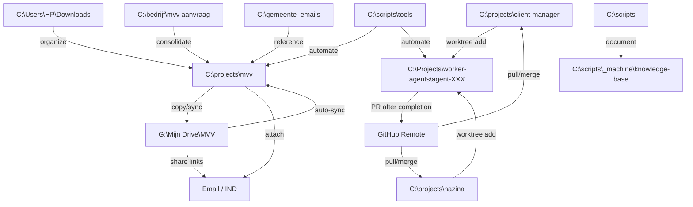

# Folder Network Map

**Purpose:** Document folder relationships, data flows, and workflows
**Last Updated:** 2026-01-30 (Added: Art Revisionist Senufo case structure)

---

## How to Read This Map

Each folder entry documents:
- **Purpose** - What this folder is for
- **Sources** - Where files in this folder come from
- **Destinations** - Where files from this folder go to
- **Related Folders** - Other folders in the same workflow
- **Workflows** - Common operations/processes
- **Sync Status** - Cloud sync, backup status
- **Access Patterns** - How often accessed, by whom/what

---

## C:\projects\mvv\

**Purpose:** MVV (Machtiging tot Voorlopig Verblijf) aanvraag documentatie - Sofy & Martien (sep-dec 2024)

**Sources:**
- `C:\Users\HP\Downloads` - Initiële downloads (formulieren, emails)
- Email attachments - IND communicatie
- Scans - CamScanner gescande documenten
- Manual creation - Markdown templates, checklists

**Destinations:**
- `G:\Mijn Drive\MVV` - Google Drive sync (automated via Google Drive Desktop)
- Email - Naar IND, gemeente Meppel
- Print/scan - Fysieke documenten

**Related Folders:**
- `C:\bedrijf\mvv aanvraag` - Backup/gescande documenten
- `C:\gemeente_emails` - Gerelateerde gemeente communicatie
- `C:\Users\HP\Downloads` - Nieuwe formulieren/documenten

**Workflows:**
1. **Document intake:** Download → C:\Users\HP\Downloads → kopieer naar C:\projects\mvv
2. **Google Drive upload:** Kopieer naar G:\Mijn Drive\MVV (auto-sync)
3. **Email workflow:** Selecteer bestanden → attach → email naar IND
4. **Scan workflow:** Print → scan → CamScanner → upload naar mvv folders

**Sync Status:**
- ✅ Google Drive Desktop - `G:\Mijn Drive\MVV` (bidirectional sync)
- ❌ No git tracking (contains private documents)
- ❌ No automatic backup

**Access Patterns:**
- High activity: Sep-Dec 2024 (initial application)
- Low activity: Jan 2025+ (waiting for response)
- Accessed by: User manually, Claude for file organization

**Key Files:**
- `7108 (1).pdf` - Ingevulde relatieverklaring (275KB)
- `Toelichting tardieve geboorteakte en naamverschil moeder – Nanana Mayiani Mpoe.pdf` - Tardieve naamverklaring
- `CHECKLIST_IND_VEREISTEN.md` - Checklist van vereisten
- `ACTIEPLAN.md` - Actiepunten
- Templates - Markdown templates voor verklaringen

**Notes:**
- User initially lost files, found in Downloads + Google Drive
- Use Google Drive Desktop sync for uploads (no OAuth needed)

---

## G:\Mijn Drive\MVV\

**Purpose:** Cloud-synced MVV documentation (Google Drive)

**Sources:**
- `C:\projects\mvv` - Local working directory
- Google Drive web interface - Direct uploads from browser
- Mobile uploads - Photos, scans from phone

**Destinations:**
- Shared access - Google Drive sharing links
- Download to other devices
- Email attachments - Direct from Google Drive

**Related Folders:**
- `C:\projects\mvv` - Local mirror/working copy
- `C:\bedrijf\mvv aanvraag` - Related local folder

**Workflows:**
1. **Auto-sync:** Google Drive Desktop monitors changes, syncs bidirectionally
2. **Web access:** Browse at drive.google.com
3. **Share workflow:** Right-click → Get link → Share

**Sync Status:**
- ✅ Google Drive Desktop - Real-time bidirectional sync
- ✅ Cloud backup - Automatic via Google Drive

**Access Patterns:**
- Accessed from: Desktop (G:\ drive), Web interface, Mobile app
- Shared with: Potentially IND, gemeente (via links)

**Notes:**
- Mounted as `G:\Mijn Drive` on Windows
- Automatically syncs changes within seconds

---

## C:\Users\HP\Downloads\

**Purpose:** Browser download staging area

**Sources:**
- Web browsers (Chrome, Edge, etc.)
- Email attachments saved locally
- Web services (ClickUp, Google Drive downloads)

**Destinations:**
- `C:\projects\mvv` - MVV documents
- `C:\projects\client-manager` - Project files
- `C:\scripts\tools` - Tool updates, scripts
- Delete after organizing - Temporary staging

**Workflows:**
1. **Document download:** Browser → Downloads → organize to project folders
2. **Cleanup:** Review weekly, move/delete old files

**Access Patterns:**
- Very high activity - Primary download location
- Accessed by: All applications, user, Claude for file organization

**Notes:**
- Temporary staging area - files should be moved to permanent locations
- Contains: `7108 (1).pdf`, `7108.pdf`, client secrets, various downloads

---

## C:\bedrijf\mvv aanvraag\

**Purpose:** Business-related MVV application documents

**Sources:**
- Scans - CamScanner documents
- Manual organization - Backup copies

**Destinations:**
- `C:\projects\mvv` - Consolidation
- Archive - Long-term storage

**Related Folders:**
- `C:\projects\mvv` - Primary working directory
- `G:\Mijn Drive\MVV` - Cloud sync

**Key Files:**
- `CamScanner 06-08-2025 12.44.pdf` (755KB) - Scanned document

**Notes:**
- Secondary location, should consolidate with C:\projects\mvv

---

## C:\gemeente_emails\

**Purpose:** Email communications with gemeente Meppel

**Sources:**
- Email client - Saved email attachments
- IND communications
- Gemeente Meppel responses

**Related Folders:**
- `C:\projects\mvv` - Related MVV documents

**Key Files:**
- `7145 machtigingsformulier ind.pdf` (160KB)
- `email_index.txt` - Index of emails

**Workflows:**
- Email → save attachment → gemeente_emails folder
- Reference during MVV application

**Notes:**
- Contains official correspondence
- Keep for administrative record

---

## C:\scripts\

**Purpose:** Claude agent control plane and automation tools

**Sources:**
- Claude sessions - Generated/updated files
- Git repository - Machine_agents repo
- Manual creation - User-created tools/docs

**Destinations:**
- Git remote - GitHub (Machine_agents repo)
- Execution - PowerShell/Python scripts run from here

**Related Folders:**
- `C:\scripts\_machine` - Machine-specific state
- `C:\scripts\tools` - Automation tools
- `C:\scripts\.claude\skills` - Auto-discoverable skills

**Workflows:**
1. **Session startup:** Read docs, load knowledge base
2. **Tool execution:** Run scripts from tools/
3. **Documentation updates:** Update CLAUDE.md, reflection.log.md
4. **Git workflow:** Commit + push changes end of session

**Sync Status:**
- ✅ Git repository - Regular commits and pushes
- ✅ GitHub remote - Machine_agents

**Access Patterns:**
- Very high activity - Used every Claude session
- Accessed by: Claude agent, user for manual runs

---

## C:\projects\client-manager\

**Purpose:** Brand2Boost SaaS application (frontend + backend + docs)

**Sources:**
- Git repository - client-manager repo (develop branch)
- Development work - Code edits in worktrees
- Package managers - npm, NuGet

**Destinations:**
- Git remote - GitHub
- Production deployment - Azure/hosting
- `C:\Projects\worker-agents\agent-XXX\client-manager` - Worktrees for feature work

**Related Folders:**
- `C:\projects\hazina` - Framework dependency
- `C:\Projects\worker-agents\agent-XXX\client-manager` - Development worktrees
- `C:\stores\brand2boost` - Configuration and data store

**Workflows:**
1. **Feature Development Mode:** Allocate worktree → edit in worktree → commit → PR → release worktree
2. **Active Debugging Mode:** Edit directly in C:\projects\client-manager (on current branch)
3. **Build:** Visual Studio or `dotnet build`
4. **Run:** Visual Studio (F5) or npm start (frontend)

**Sync Status:**
- ✅ Git repository - Tracked, regular commits
- ✅ Base repo always on `develop` branch after PR

**Access Patterns:**
- Very high activity - Active development
- Accessed by: Claude agent (worktrees), user (Visual Studio), build systems

**Notes:**
- NEVER edit directly in C:\projects\client-manager during Feature Development Mode
- ALWAYS use worktrees for feature work
- Keep base repo on develop branch

---

## C:\projects\hazina\

**Purpose:** Hazina framework (dependencies for client-manager)

**Sources:**
- Git repository - hazina repo (develop branch)
- Development work - Framework updates

**Destinations:**
- Git remote - GitHub
- NuGet packages - Published to NuGet
- `C:\Projects\worker-agents\agent-XXX\hazina` - Worktrees for framework updates

**Related Folders:**
- `C:\projects\client-manager` - Consumes Hazina framework
- `C:\Projects\worker-agents\agent-XXX\hazina` - Development worktrees

**Workflows:**
1. **Framework updates:** Edit in worktree → commit → PR → NuGet publish → update client-manager reference
2. **Cross-repo coordination:** Track dependencies in pr-dependencies.md

**Sync Status:**
- ✅ Git repository - Tracked, regular commits
- ✅ Base repo always on `develop` branch

**Notes:**
- Often paired with client-manager worktrees
- Cross-repo PR dependencies tracked in C:\scripts\_machine\pr-dependencies.md

---

## C:\Projects\worker-agents\agent-XXX\

**Purpose:** Isolated worktree seats for feature development (zero-tolerance protocol)

**Sources:**
- `C:\projects\client-manager` - Base repo (git worktree add)
- `C:\projects\hazina` - Base repo (git worktree add)

**Destinations:**
- Git remote - PRs after feature completion
- Release → mark seat FREE in worktrees.pool.md

**Related Folders:**
- `C:\projects\client-manager` - Base repository
- `C:\projects\hazina` - Base repository
- `C:\scripts\_machine\worktrees.pool.md` - Seat allocation tracking

**Workflows:**
1. **Allocation:** Run `worktree-allocate.ps1` → mark BUSY in pool
2. **Development:** Work exclusively in agent-XXX folder
3. **Completion:** Commit → push → create PR
4. **Release:** Run `worktree-release-all.ps1` → mark FREE in pool

**Sync Status:**
- ✅ Git worktrees - Linked to base repos
- ✅ Tracked in worktrees.pool.md

**Access Patterns:**
- High activity during feature development
- Accessed by: Claude agent (exclusive), build/test systems

**Notes:**
- One agent per seat (avoid conflicts)
- ALWAYS release after PR creation
- Track allocation in C:\scripts\_machine\worktrees.pool.md

---

## C:\stores\brand2boost\

**Purpose:** Configuration and data store for Brand2Boost application

**Sources:**
- Application configuration - Settings, secrets
- User data - Generated content, cache

**Destinations:**
- Application runtime - Loaded by client-manager
- Backup - Manual/automated backups

**Related Folders:**
- `C:\projects\client-manager` - Application that reads this store

**Access Patterns:**
- Medium activity - Read during app startup/runtime
- Accessed by: client-manager application

**Notes:**
- Contains sensitive data (API keys, secrets)
- Keep out of git repository

---

## Template for New Folders

Copy this template when documenting a new folder:

```markdown
## FOLDER_PATH

**Purpose:**

**Sources:**
-

**Destinations:**
-

**Related Folders:**
-

**Workflows:**
1.

**Sync Status:**
-

**Access Patterns:**
-

**Key Files:**
-

**Notes:**
-
```

---

## Network Visualization (Mermaid)



---

## Usage Guidelines

**When to Update This Map:**
1. **New folder created** - Add entry with template
2. **Workflow changes** - Update workflow section
3. **New sync discovered** - Update sync status
4. **Relationships change** - Update sources/destinations/related folders

**How Claude Uses This:**
- **File operations** - Check sources/destinations before moving files
- **Workflow execution** - Follow documented workflows
- **Troubleshooting** - Understand folder relationships
- **User questions** - Explain where files come from/go to

**Maintenance:**
- Review quarterly for accuracy
- Archive/remove obsolete folders
- Update visualization as network grows
