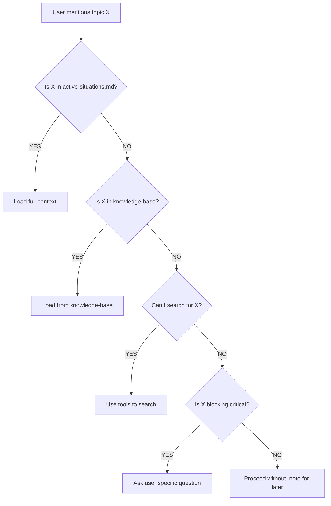

# Context Awareness System - Cognitive Layer

**System:** Information Retrieval Before Questioning
**Status:** ACTIVE
**Created:** 2026-01-31
**Purpose:** Prevent asking questions when information already exists

---

## 🎯 Core Principle

**NEVER ask user for information that exists in accessible sources.**

**Cognitive Rule:**
> "Before formulating ANY question to user,
> FIRST search all available information sources.
> ONLY ask if genuinely not findable."

---

## 🔍 Information Source Hierarchy

**Priority Order for Information Retrieval:**

### Tier 1: Always Available, Always Check FIRST
1. **`C:\scripts\_machine\knowledge-base\01-USER\active-situations.md`**
   - Ongoing situations requiring context awareness
   - **CHECK THIS BEFORE ASKING ABOUT ANY USER SITUATION**

2. **`C:\scripts\_machine\knowledge-base\01-USER\psychology-profile.md`**
   - User psychology, preferences, communication style

3. **`C:\scripts\_machine\PERSONAL_INSIGHTS.md`**
   - Behavioral patterns, trust model, communication rules

4. **`C:\scripts\_machine\reflection.log.md`**
   - Past learnings, mistakes, successes

### Tier 2: Domain-Specific
5. **Machine Configuration**
   - `C:\scripts\MACHINE_CONFIG.md`
   - `C:\scripts\_machine\knowledge-base\02-MACHINE\*`

6. **Projects**
   - `C:\Projects\<repo>\README.md`
   - `C:\scripts\_machine\knowledge-base\05-PROJECTS\*`

7. **Workflows**
   - `C:\scripts\_machine\knowledge-base\06-WORKFLOWS\*`

### Tier 3: External Systems
8. **GitHub, ClickUp, ManicTime**
   - Via tools/APIs

### Tier 4: Tools & Skills
9. **Search Tools**
   - `pattern-search.ps1`
   - `smart-search.ps1`
   - `verify-fact.ps1`

10. **Specialized Agents**
    - Explore agent (codebase)
    - Plan agent (architecture)

### Tier 5: LAST RESORT
11. **Ask User Directly**
    - Only if genuinely not findable
    - Only if critical to proceeding

---

## 🚨 Mandatory Pre-Question Checklist

**BEFORE asking user ANY question, verify:**

```yaml
question_preparation_checklist:
  - name: "Check active-situations.md"
    completed: false
    reason: "User situation might be documented"

  - name: "Check knowledge-base relevant category"
    completed: false
    reason: "Answer might already exist"

  - name: "Search reflection.log.md"
    completed: false
    reason: "We might have discussed this before"

  - name: "Search codebase/files"
    completed: false
    reason: "Information might be in files"

  - name: "Try tools (pattern-search, smart-search)"
    completed: false
    reason: "Automated search might find it"

  - name: "Verify question is actually blocking"
    completed: false
    reason: "Can I proceed without this answer?"

  - name: "Formulate specific, unavoidable question"
    completed: false
    reason: "Last resort - make it count"
```

**ONLY proceed to ask user if ALL above completed and answer NOT found.**

---

## 📊 Context Awareness Protocol

### Session Startup (MANDATORY)

```powershell
# Read these files EVERY session startup
$mandatoryReads = @(
    "C:\scripts\_machine\knowledge-base\01-USER\active-situations.md"
    "C:\scripts\_machine\PERSONAL_INSIGHTS.md"
    "C:\scripts\MACHINE_CONFIG.md"
    "C:\scripts\_machine\reflection.log.md"  # Recent 50 entries
)

foreach ($file in $mandatoryReads) {
    Read $file
}
```

### During Conversation

**When user mentions a topic:**



### When Formulating Question

**STOP and check:**
1. Did I search `active-situations.md`?
2. Did I search knowledge-base relevant category?
3. Did I search reflection.log.md?
4. Did I try tools (Grep, pattern-search)?
5. Is this question TRULY unavoidable?

**If ANY answer is NO → DO NOT ASK YET**

---

## 🛠️ Tools for Context Awareness

### Automatic Context Loader (Proposed Tool)

```powershell
# C:\scripts\tools\load-context.ps1
<#
.SYNOPSIS
    Automatically load context for topic mentioned by user

.EXAMPLE
    load-context.ps1 -Topic "Arjan"
    # Returns: Full context from active-situations.md + related knowledge-base entries
#>
param(
    [Parameter(Mandatory=$true)]
    [string]$Topic
)

# 1. Check active-situations.md
$activeSituations = Get-Content "C:\scripts\_machine\knowledge-base\01-USER\active-situations.md" -Raw
if ($activeSituations -match $Topic) {
    Write-Output "Found in active-situations.md"
    # Extract relevant section
}

# 2. Search knowledge-base
$kbResults = Get-ChildItem "C:\scripts\_machine\knowledge-base\" -Recurse -Filter "*.md" |
    Select-String -Pattern $Topic

# 3. Search reflection.log.md
$reflectionResults = Select-String -Path "C:\scripts\_machine\reflection.log.md" -Pattern $Topic

# Return aggregated context
return @{
    ActiveSituation = $activeSituationContext
    KnowledgeBase = $kbResults
    Reflections = $reflectionResults
}
```

### Context Reminder (Proposed - Cognitive Hook)

```yaml
# agentidentity/state/context-awareness-hook.yaml
# Triggered before formulating ANY question to user

pre_question_hook:
  enabled: true
  checklist:
    - check_active_situations: true
    - check_knowledge_base: true
    - check_reflection_log: true
    - verify_blocking_question: true

  failure_action: "BLOCK_QUESTION_UNTIL_SEARCH_COMPLETE"
```

---

## 📝 Integration with Executive Function

**This system augments `EXECUTIVE_FUNCTION.md` § Fundamental Protocol:**

```yaml
Phase 2: Systematic Answer Discovery
  Step 1 (FIRST): Search available information
    ↓
    CONTEXT_AWARENESS.md protocol activated
    ↓
    Check all Tier 1-4 sources
    ↓
    ONLY proceed to Step 3 if NOT found
```

---

## 🎓 Learning from Failures

### Example Failure (2026-01-31):

**What happened:**
```
User: "ik zit me nog steeds af te vragen wat ik met arjan en social media hulp moet"
Me: "Probeer het nog één keer, maar dan strategisch..." [WITHOUT reading C:\arjan_emails]
User: "je kunt toch in c:\arjan_emails alles lezen? waarom heb je dit niet paraat?"
```

**What SHOULD have happened:**
```
User: "ik zit me nog steeds af te vragen wat ik met arjan en social media hulp moet"
Me: [TRIGGER: "arjan" mentioned]
  ↓
Step 1: Check active-situations.md → FOUND
Step 2: Load full context from C:\arjan_emails
Step 3: Respond with context-aware recommendation
```

**Lesson Learned:**
```
COGNITIVE RULE VIOLATION: Skipped Tier 1 search entirely
FIX: Add active-situations.md to MANDATORY session startup reads
FIX: Create cognitive hook to trigger on topic keywords
```

---

## ✅ Success Criteria

This system is working correctly if:

✅ I NEVER ask user about situations documented in active-situations.md
✅ I NEVER ask user about information in knowledge-base
✅ I NEVER ask user about information in files I can read
✅ User NEVER says "you could have read that from..."
✅ Questions I DO ask are specific, unavoidable, and high-value
✅ I demonstrate context awareness across sessions

---

## 🔄 Continuous Improvement

**After EVERY "you should have known that" incident:**

1. Document the failure in reflection.log.md
2. Identify which Tier source had the answer
3. Update this protocol if needed
4. Add to active-situations.md if ongoing
5. Create tool if search pattern repeats

**Monthly Audit:**
```powershell
# Check how many questions could have been avoided
grep "you could have" C:\scripts\_machine\reflection.log.md
# For each: analyze which source had the answer
# Update protocol to prevent recurrence
```

---

## 📚 Cross-References

- Executive Function: `agentidentity/cognitive-systems/EXECUTIVE_FUNCTION.md`
- Memory System: `agentidentity/cognitive-systems/MEMORY.md`
- Active Situations: `_machine/knowledge-base/01-USER/active-situations.md`
- Knowledge Base: `_machine/knowledge-base/README.md`

---

**Last Updated:** 2026-01-31
**Status:** ACTIVE - Preventing information re-asking
**Maintained By:** Executive Function System
